# C++基础

## const
### 基础知识
1. const对象必须初始化。初始化时，赋予的值是不是const都可以，因为常量特征仅在执行时改变其值才会发挥作用。const对象仅在文件内有效。（C++ primer 5th P54）
2. 顶层const：对象本身是个常量，例如常量指针。  底层const：指针所指向的对象是一个常量。此外，声明引用的const(const int &r)都是底层const。（C++ primer 5th P57-58）
### 与引用
1. 不能让一个非常量引用指向一个常量对象。但允许一个常量引用(const int &r)绑定非常量的对象、字面值或一般表达式。对常量的引用可能引用一个并非const的对象。
### 与指针
1. 指向常量的指针(pointer to const)(const int *ptrToConst)不能用于改变其所指对象的值。同样的，不能让一个非常量指针指向常量。
2. 常量指针(const pointer)(int *const cptr)必须初始化，初始化后，地址本身不能改变。
### constexpr
1. 常量表达式：编译时就可确定结果的表达式。
2. 字面值类型：算数类型、引用、指针等。它们是声明constexpr用到的类型。
3. 将变量声明为constexpr类型以便编译器验证变量值是否为一个常量表达式。
4. constexpr指针初始值必须是nullptr或0，或存于某个固定地址的对象。
```cpp
constexpr int mf = 20;
constexpr int *p = nullptr;  //p是一个指向整数的常量指针，是顶层指针
const int *q = nullptr; //qq是一个指向整数常量的指针，是底层指针
```
### 类型别名
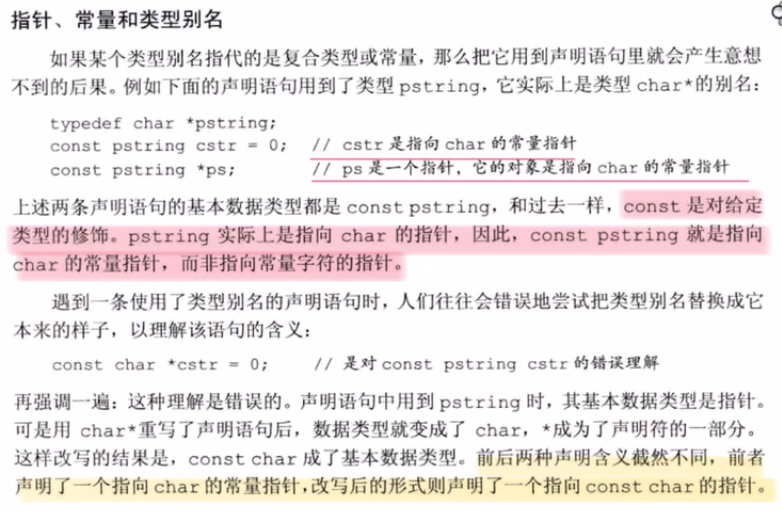
### auto类型说明符
auto会忽略掉顶层const，而decltype不会忽略。
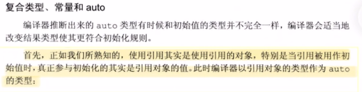
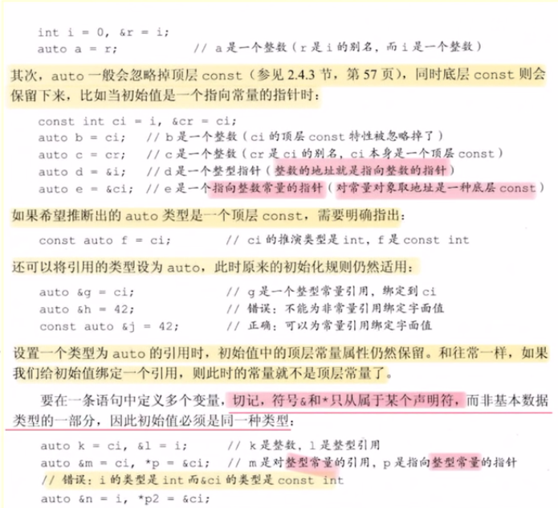
### decltype
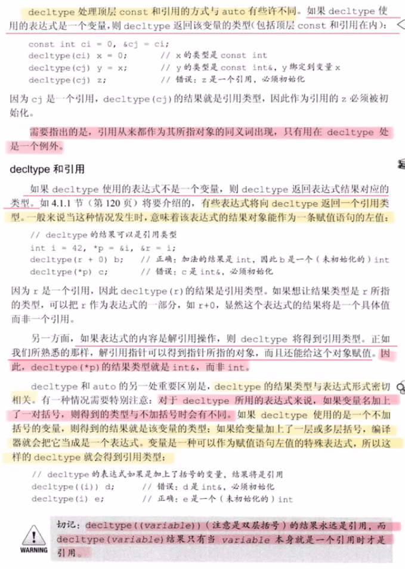
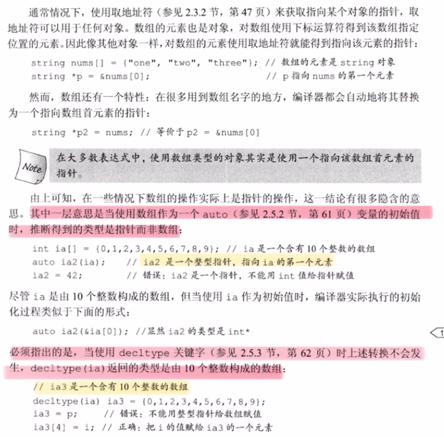
### 优先级
1. const用于修饰它左侧的内容（类型 int、指针 *），当const处于最左端时，它修饰右边的内容
### 与类和函数
1. const 修饰类成员函数，其目的是防止成员函数修改被调用对象的值，如果我们不想修改一个调用对象的值，所有的成员函数都应当声明为 const 成员函数。
**注意**：const 关键字不能与 static 关键字同时使用，因为 static 关键字修饰静态成员函数，静态成员函数不含有 this 指针，即不能实例化，const 成员函数必须具体到某一实例。
1. const修饰函数的三种用法：修饰返回值（当函数的返回值为引用时，避免被调用者修改），修饰函数参数（防止传递的参数在函数内部被修改），修饰类的成员函数（也称为**常量成员函数**， const修饰成员函数，根本上是修饰了this 指针）
   
## 指针
1. - 指针数组：int *ptrs[10] 包含十个指向int的指针的数组
   - 数组指针：int (*Parray)[10] 指向包含10个int元素的数组的指针
   - 判断复杂数组声明的方法：从数组名字开始，从内向外读。上例中，从Parray开始，*表示它是一个指针，然后[10]说明它指向大小为10的数组的指针，最后是int，说明了数组中元素是int。

## 引用
### 左值引用与右值引用
#### 左值引用与const
引用是变量的别名，由于右值没有地址，无法被修改，所以左值引用无法指向右值。但const左值引用可以指向右值。
```cpp
int &ref_a = 5 //编译失败
const int &ref_a = 5; //成功
```
这是因为const左值引用不会修改指向值，因此可以指向右值，这也是为什么要使用```const value_type&```作为函数参数的原因之一，例如```std::vector```的```push_back```：
```cpp
void push_back(const value_type& val);
```
如果没有```const```，```vec.push_back(5)```这样的代码就无法编译通过了。

#### 右值引用
https://zhuanlan.zhihu.com/p/335994370
右值引用可以指向右值，不能指向左值，右值引用的标志为```&```

#### 利用 ```std::move``` 使右值引用指向左值
```cpp
int a = 5; // a是个左值
int &ref_a_left = a; // 左值引用指向左值
int &&ref_a_right = std::move(a); // 通过std::move将左值转化为右值，可以被右值引用指向
 
cout << a; // 打印结果：5
```
```std::move```是一个非常有迷惑性的函数，不理解左右值概念的人们往往以为它能把一个变量里的内容移动到另一个变量，但事实上```std::move```移动不了什么，唯一的功能是把左值强制转化为右值，让右值引用可以指向左值。其实现等同于一个类型转换：`static_cast<T&&>(lvalue)`。 所以，单纯的```std::move(xxx)```不会有性能提升。

同样的，右值引用能指向右值，本质上也是把右值提升为一个左值，并定义一个右值引用通过`std::move`指向该左值：
```cpp
int &&ref_a = 5;
ref_a = 6; 
 
等同于以下代码：
 
int temp = 5;
int &&ref_a = std::move(temp);
ref_a = 6;
```

#### 左值引用、右值引用本身是左值还是右值？
被声明出来的左、右值引用都是左值。 因为被声明出的左右值引用是有地址的，也位于等号左边。

右值引用既可以是左值也可以是右值，如果有名称则为左值，否则是右值。

或者说：作为函数返回值的 `&&` 是右值，直接声明出来的 `&&` 是左值。 这同样也符合对左值，右值的判定方式：其实引用和普通变量是一样的，`int &&ref = std::move(a)`和 `int a = 5`没有什么区别，等号左边就是左值，右边就是右值。

最后，从上述分析中我们得到如下结论：

- 从性能上讲，左右值引用没有区别，传参使用左右值引用都可以避免拷贝。
- 右值引用可以直接指向右值，也可以通过std::move指向左值；而左值引用只能指向左值(const左值引用也能指向右值)。
- 作为函数形参时，右值引用更灵活。虽然const左值引用也可以做到左右值都接受，但它无法修改，有一定局限性。

#### 右值引用和std::move的应用场景
1. 实现移动语义，避免深拷贝

#### 完美转发 `std::forward`
和`std::move`一样，它的兄弟`std::forward`也充满了迷惑性，虽然名字含义是转发，但他并不会做转发，同样也是做类型转换.

与move相比，forward更强大，move只能转出来右值，forward都可以。

> `std::forward<T>(u)`有两个参数：`T`与 `u`。
a. 当T为左值引用类型时，u将被转换为T类型的左值； 
b. 否则u将被转换为T类型右值。

## 函数
### 返回数组指针
(C++ primer 5th P205)
```cpp
// 使用类型别名
typedef int arrT[10];
using arrT int[10];
arrT* func(int i); //func返回指向含有十个元素的数组的指针

// 不使用类型别名
int (*func(int i))[10]; //func返回指向含有十个元素的数组的指针

// 使用尾置返回类型
auto func(int i) -> int(*)[10];

// 使用decltype
int odd[] = {1,3,5,7,9};
decltype(odd) *func(int i);
```
### 函数重载
1. 当向函数传递实参时，形参中的顶层const被忽略了。因此，函数重载时，顶层const与没有顶层const的形参是一样的，不能重载。
### constexpr函数
1. 函数的返回类型盒所有形参类型都是字面值类型
2. 函数体中必须有且仅有一条return语句
3. constexpr函数不一定返回常量表达式
### 函数指针
 ```cpp
bool func(int i,int j); // 函数声明
bool (*pf)(int i,int j ); // 对应的未初始化的函数指针，即使用指针替换了函数名，括号是必须的
 ```
1. 当把函数名作为值赋予给一个函数指针时，该函数直接自动转换为指针，无需取地址符
2. 可以直接使用指向函数的指针调用该函数，无需提前解引用指针
3. 可以为函数指针赋予nullptr或0，表示该指针没有指向任何一个函数
4. 当定义了指向重载函数的指针时，编译器通过指针类型决定使用哪个函数，指针类型必须与重载函数中的某一个**精准匹配**
5. 函数指针可以用作函数形参，但不能定义函数类型的形参（当形参类型为函数时，它实际上会自动转换为指向函数的指针，因此仍是函数指针类型）。因为本小节的条目1，所以可以直接把函数作为实参使用，它会自动的转为指针。
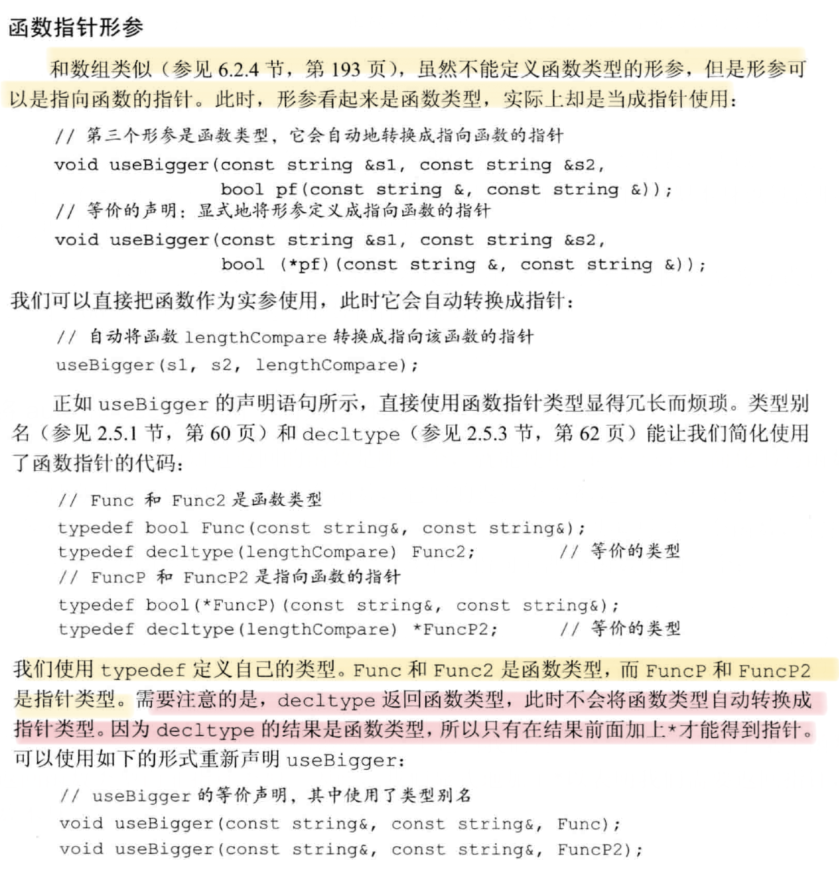
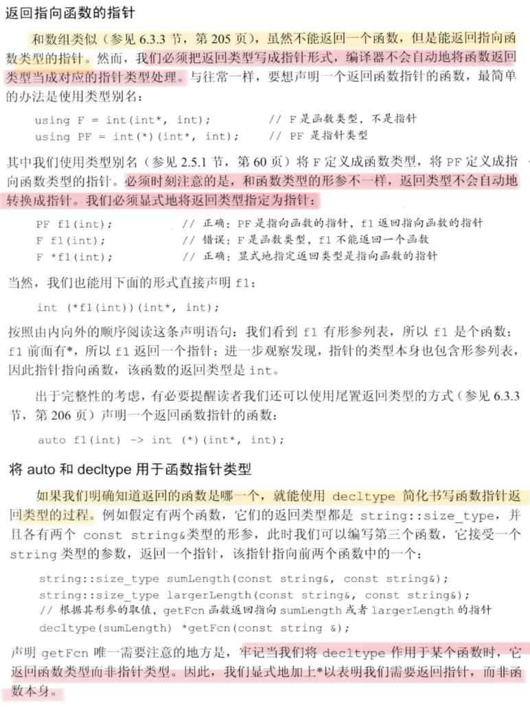
# C++面向对象
## 类的基础用法
### 类的声明
 ```cpp
class Screen; // 类的前向声明，定义前是不完全类型
 ```
不完全类型只能：定义指向这种类型的指针或引用，声明（但不能定义）以不完全类型作为参数或返回类型的函数
### this指针
1. 成员函数通过叫做this的隐式参数来访问调用它的对象。当调用一个成员函数时，使用请求该函数的对象地址初始化this。this形参是隐式定义的，在成员函数中自定义名为this的参数或变量是非法的。
2. 在成员函数内部访问对象的成员时，无需成员访问符，因为this所指的正是这个对象。任何对类成员的直接访问都会被看做this的隐式引用。
3. 默认情况下，this类型是**指向类类型非常量版本的常量指针**(`class_name *const this`, 顶层const)。因此不能赋予this指针一个常量对象，这导致不能在常量对象上调用非常量成员函数。
4. const成员函数（常量成员函数）：紧跟在参数列表后的const表示this是一个指向常量的指针(例如：`string SalesData::isBookNum(int n) const;`)，此时，this指针的类型是**指向类类型常量版本的常量指针**(`const class_name *const this`, 既是顶层const，也是底层const)。因为，this指向常量，因此常量成员函数不能修改它的对象的内容。**常量对象、常量对象的引用或指针都只能调用常量成员函数**（不能把底层const指针赋给非常量指针），而非常量对象即可调用常量成员函数，也可调用普通成员函数。
### 构造函数
1. 构造函数可以有多个，但参数数量或类型必须有所区别。
2. 默认构造函数：类通过它来控制默认初始化过程，它无需任何实参。编译器创建的默认构造函数(未定义构造函数的时候才会创建)被称作合成的默认构造函数。对于一个普通的类，必须定义它的默认构造函数。如果我们需要默认的初始化行为，则在参数列表后面写上`=default`来要求编译器生成构造函数。
3. 如果成员是const、引用或属于某种未提供默认构造函数的类类型，则**必须通过构造函数初始化列表**进行初始化。
4. 成员初始化顺序与它们在类定义中出现的顺序一致。构造函数初始化列表中的顺序不会影响实际初始化的顺序。
5. 如果一个构造函数未所有参数都提供默认实参，则它实际上也定义了默认构造函数。此时再定义其他默认构造函数，编译器报错：多个默认构造函数。
6. 委托构造函数：使用所在类的其他构造函数执行它自己应做的初始化过程。委托构造函数的初始化列表只有一个唯一的入口：类名本身。
#### 默认构造函数的作用
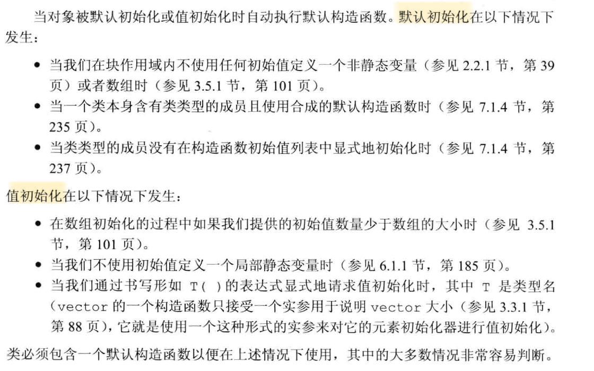
### 类的静态成员
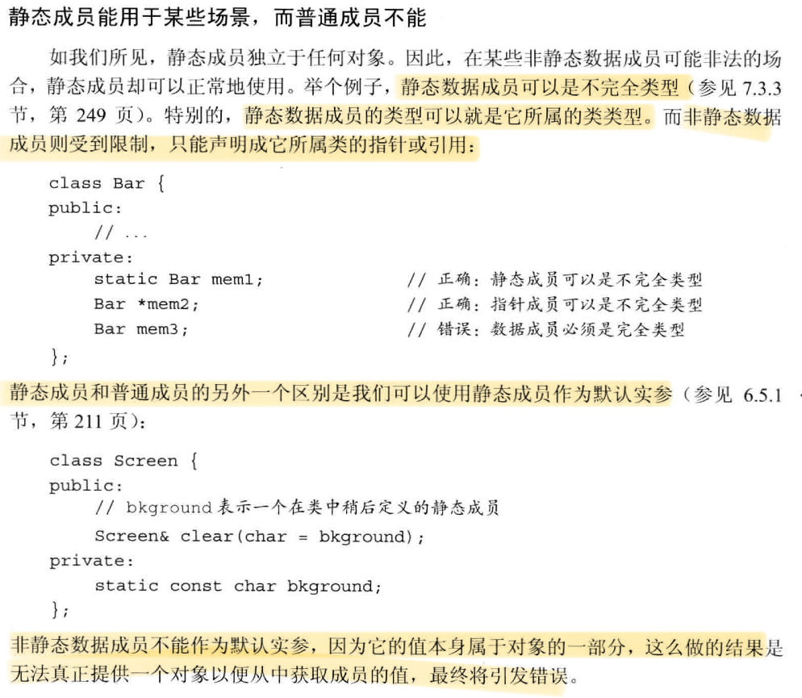
#### 声明
在成员的声明前加上关键字`static`，使其与类关联在一起。

类的静态成员存于对象之外，对象中不包含与静态数据成员有关的数据。静态成员函数也不与对象绑定在一起，也**不包含this指针**，因此其不能声明为const的，也不能在函数体中使用this指针（对调用成员函数的隐式使用也有效）。
#### 使用
使用作用域运算符直接访问静态成员。
 ```cpp
double r;
r = Account::rate();
 ```
也可以使用类的对象、引用或指针访问静态成员。
#### 定义
既可以在类内，也可以在类外定义静态成员函数。在类外定义时，不能重复使用static关键词，它只能出现在类内的声明中。

静态数据成员不属于任何对象，因此它不是由类的构造函数初始化的。一般来说，不能在类内初始化它。必须在类的外部定义和初始化每个静态数据成员。和其他对象一样，一个静态数据成员只能定义一次。

与全局变量类似，静态数据成员定义在任何函数之外。因此它们的生命周期为整个程序。
 ```cpp
double Account::interestRate = initRate(); // 定义并初始化一个静态成员
 ```

上文说过：一般来说，不能在类内初始化它。但是，可以为静态成员提供**const整数类型**的类内初始化，但静态成员必须是字面值常量类型的constexpr。初始值必须是常量表达式。
C++ primer 5th P271：即使一个常量静态数据成员在类内被初始化了，也应在类外定义一下该成员，但不能再指定一个初始值（一个静态数据成员只能定义一次）。
 ```cpp
static constexpr int period = 30; // period是常量表达式
static const int period = 30; // 与上一行同义

constexpr int Account::period; // 在类外定义，防止错误
 ```

### 类的作用域
类的定义过程：1. 首先，编译成员的声明； 2. 直到类全部可见后才编译函数体。
因此，成员函数可以使用类中定义的任何名字。但上面的规则只适用成员函数体中的使用的名字。声明中使用的名字（返回类型、参数类型）都必须保证在使用前可见。

在类中，成员如果使用外层作用域的某个名字，且该名字代表一种类型(例如: `typdef double Money`),则类不能在之后重新定义该名字。

成员函数中使用的名字解析过程：
1. 在成员函数内查找该名字的声明。只有在**函数使用之前**的声明才被考虑。
2. 若未找到，则：在类内的所有成员中查找。
3. 若未找到，则：在**成员函数定义之前**的作用域查找。（当成员函数定义在类外时，不仅要考虑类定义之前的全局作用域中的声明，还要考虑在成员函数定义之前的全局作用域中的声明）
### 友元
1. 令其他类或函数称为一个类的友元，则它们可以访问该类的非公有成员。使用方法为：在函数声明前加上`friend`关键字。
2. 友元声明只能出现在类定义的内部。友元不受访问控制级别的约束。友元在类内声明后，还应在类外专门再对函数进行一次声明。因为，类中的友元声明仅仅影响访问权限，并非真正的声明。
3. 重载函数的名字相同，但它们是不同的函数，因此需要分别对其进行友元声明。
4. 友元函数能定义在类的内部，它是隐式内联的。但即便如此，也需要在类外声明该函数（在声明前，该函数无法被调用，但在类的内部的作用域中是可见的，详见C++ primer 5th P252）
### 其他特性
1. 类可以自定义某个类型在类中的别名（`typedef, using`），同时类型名字盒其他成员一样存在访问限制，可以是public或private。
2. 可变数据成员：在变量的声明中加入`mutable`关键字。它永远不会是const，即使它是const对象的成员。因此，一个const成员函数可以改变一个可变成员的值。
3. 类内初始化时，只能用`=`或`{}`，不能使用`()`。
4. 一个const成员函数如果以引用的形式返回*this，则它的返回类型为常量引用。
5. 通过区分成员函数是否为const的，可以对其进行重载（因为this是隐藏的形参，const成员函数的指针是顶层和底层const，可以进行区分）。当const成员函数返回自身的this指针时，函数的返回值应为**常量引用**（`const class_name &func() const{};`,注意第一个const与&）
### 隐式的类类型转换
如果构造函数只接受一个实参，则它实际上定义了转换为此类类型的隐式转换机制，有时把这类构造函数称作转换构造函数。
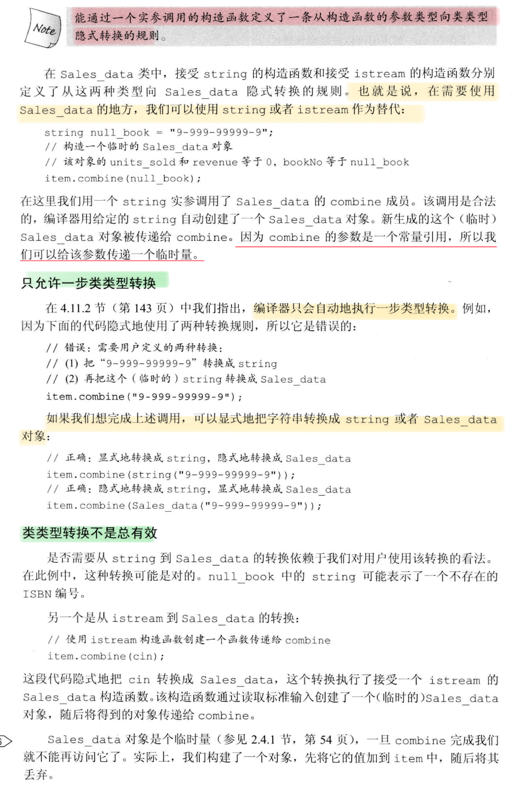
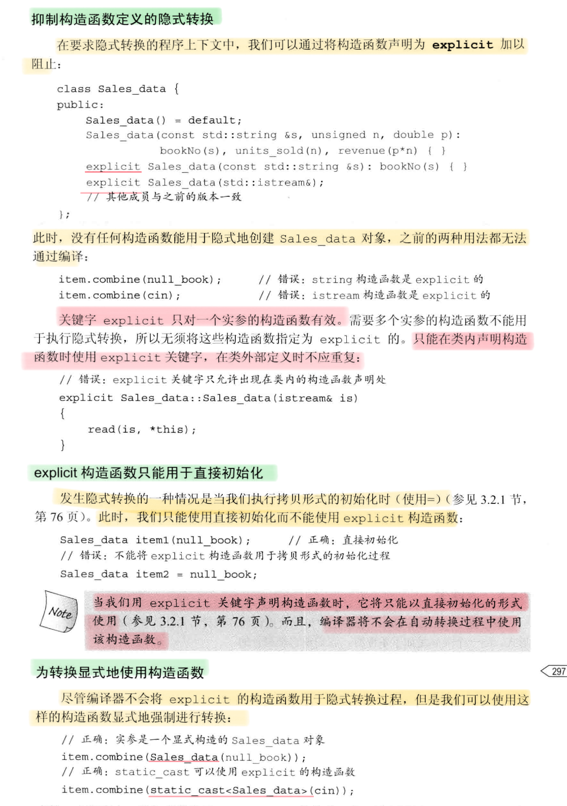
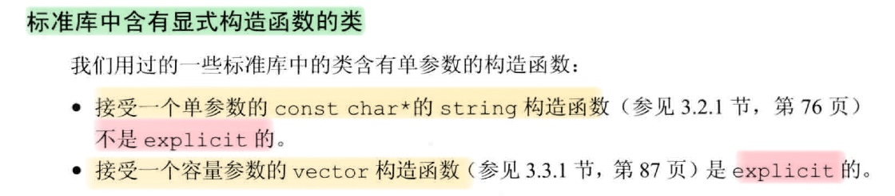
因为string类可以接受const char*类型的值来进行拷贝初始化，而vector不接受一个int类型的值来进行拷贝初始化。
### 聚合类与字面值常量类
C++ primer 5th P266-268
## 多态与虚函数
[C++之多态性](https://blog.csdn.net/studyhardi/article/details/90815766?spm=1001.2101.3001.6650.5&utm_medium=distribute.pc_relevant.none-task-blog-2%7Edefault%7EBlogCommendFromBaidu%7ERate-5.pc_relevant_default&depth_1-utm_source=distribute.pc_relevant.none-task-blog-2%7Edefault%7EBlogCommendFromBaidu%7ERate-5.pc_relevant_default&utm_relevant_index=10)
[C++ 多态的实现及原理](https://www.cnblogs.com/cxq0017/p/6074247.html)
[C++虚函数和虚函数表原理](https://blog.csdn.net/u012630961/article/details/81226351)
[虚函数实现原理](https://blog.csdn.net/wanghaobo920/article/details/7674631?spm=1001.2101.3001.6661.1&utm_medium=distribute.pc_relevant_t0.none-task-blog-2%7Edefault%7ECTRLIST%7ERate-1.pc_relevant_antiscanv2&depth_1-utm_source=distribute.pc_relevant_t0.none-task-blog-2%7Edefault%7ECTRLIST%7ERate-1.pc_relevant_antiscanv2&utm_relevant_index=1)
1. 多态是利用虚函数与虚函数表来实现的，通过指向对象的指针来调用类中的函数时，系统会根据指针指向的对象的类（而不是该指针定义时的类型）来决定调用哪个函数（父类的方法为虚函数）；该过程是通过对象中一个指向虚函数表的指针来实现调用的，也称为“晚绑定” （要让编译器采用晚绑定，就要在基类中声明函数时使用virtual关键字，这样的函数我们就称之为虚函数，一旦某个函数在基类中声明为virtual，那么在所有的派生类中该函数都是virtual，而不需要再显式地声明为virtual)
2. 压制多态可以使用域操作符来实现
```c++
class Base{
public:
    virtual void f1(){
        cout<<"base:f1()";
    }
};
class Derive:public Base{
public:
    void f1(){
        cout<<"derive:f1()";
    }
};
int main(){
   Derive* bp=new Derive();
   bp->Base::f1();//base:f1()
   bp->f1();//derive:f1()
   return 0;
}
```
1. 多继承情况下，派生类中有多个虚函数表，虚函数的排列方式和继承的顺序一致。派生类重写函数将会覆盖所有虚函数表的同名内容，**派生类自定义新的虚函数将会在第一个类（按照派生类的继承顺序，而不是成员初始化列表中的顺序）的虚函数表的后面进行扩充。** [C++继承中构造顺序](https://blog.csdn.net/tangjienihaoma/article/details/84526995)


# 工程实践
## 结构体踩坑！！！
[C语言内存对齐详解](https://www.cnblogs.com/wuyudong/p/memory-alignment.html)
为了提高CPU的存储速度，编译器对一些变量的起始地址做了“对齐”处理。在默认情况下，编译器规定各成员变量存放的起始地址相对于结构的起始地址的偏移量必须为该变量的类型所占用的字节数的倍数。
- char              偏移量必须为sizeof(char)即1的倍数
- int                偏移量必须为sizeof(int)即4的倍数
- float             偏移量必须为sizeof(float)即4的倍数
- double          偏移量必须为sizeof(double)即8的倍数
- short            偏移量必须为sizeof(short)即2的倍数
各成员变量在存放的时候根据在结构中出现的顺序依次申请空间，同时按照上面的对齐方式调整位置，空缺的字节编译器会自动填充。同时编译器为了确保结构的大小为结构的字节边界数（即该结构中占用最大空间的类型所占用的字节数）的倍数，所以在为最后一个成员变量申请空间后，还会根据需要自动填充空缺的字节。
## 异或运算
异或运算：位运算的一种
相同为0 不同为1
可以理解为无进位相加
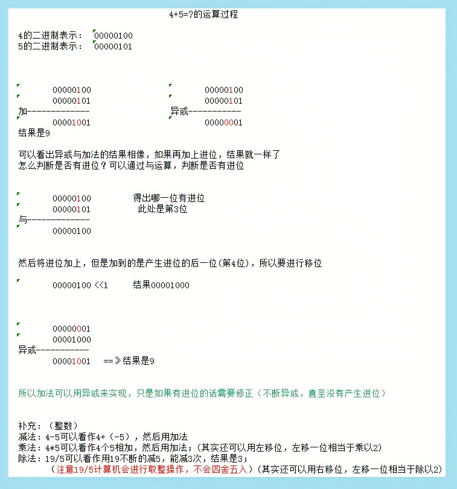