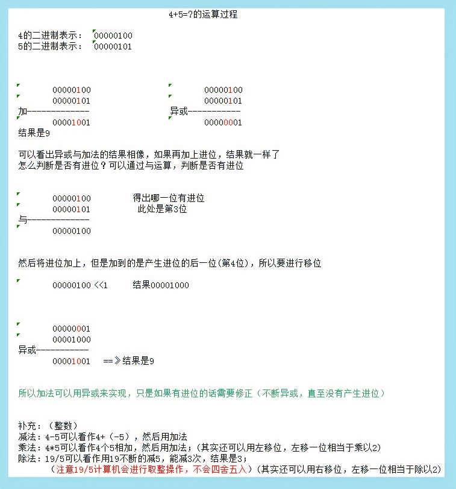

# 工程实践
## 结构体踩坑！！！
[C语言内存对齐详解](https://www.cnblogs.com/wuyudong/p/memory-alignment.html)
为了提高CPU的存储速度，编译器对一些变量的起始地址做了“对齐”处理。在默认情况下，编译器规定各成员变量存放的起始地址相对于结构的起始地址的偏移量必须为该变量的类型所占用的字节数的倍数。
- char              偏移量必须为sizeof(char)即1的倍数
- int                偏移量必须为sizeof(int)即4的倍数
- float             偏移量必须为sizeof(float)即4的倍数
- double          偏移量必须为sizeof(double)即8的倍数
- short            偏移量必须为sizeof(short)即2的倍数
各成员变量在存放的时候根据在结构中出现的顺序依次申请空间，同时按照上面的对齐方式调整位置，空缺的字节编译器会自动填充。同时编译器为了确保结构的大小为结构的字节边界数（即该结构中占用最大空间的类型所占用的字节数）的倍数，所以在为最后一个成员变量申请空间后，还会根据需要自动填充空缺的字节。
## 异或运算
异或运算：位运算的一种
相同为0 不同为1
可以理解为无进位相加
