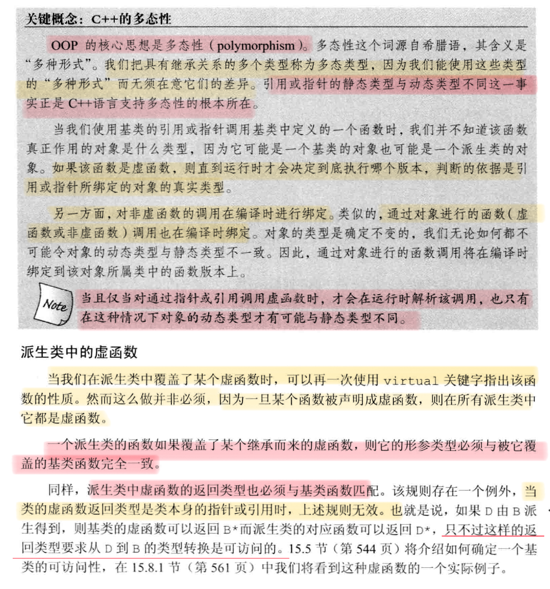
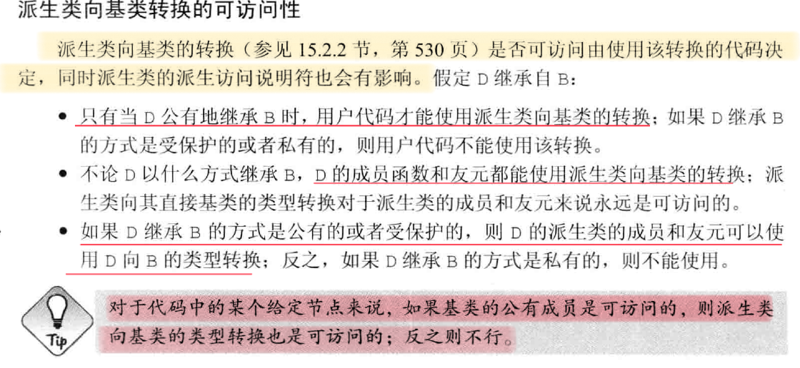
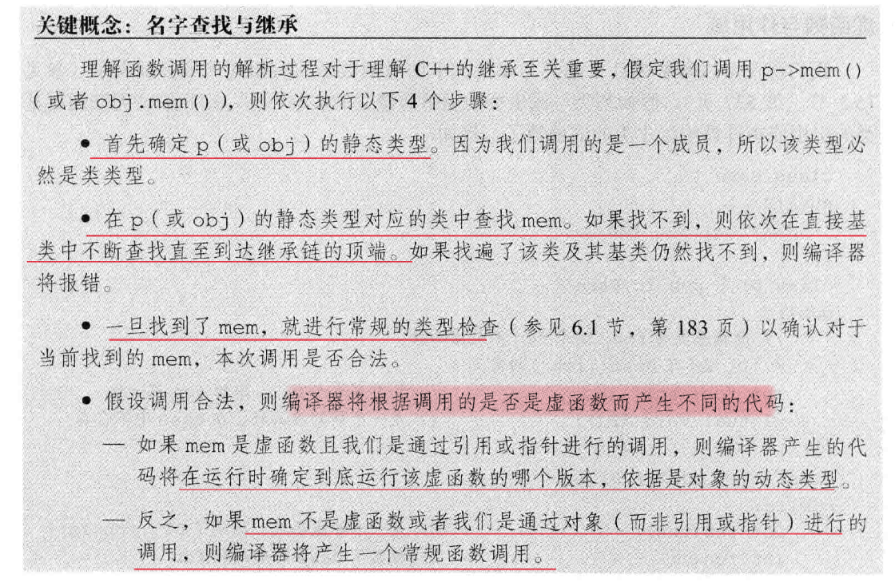
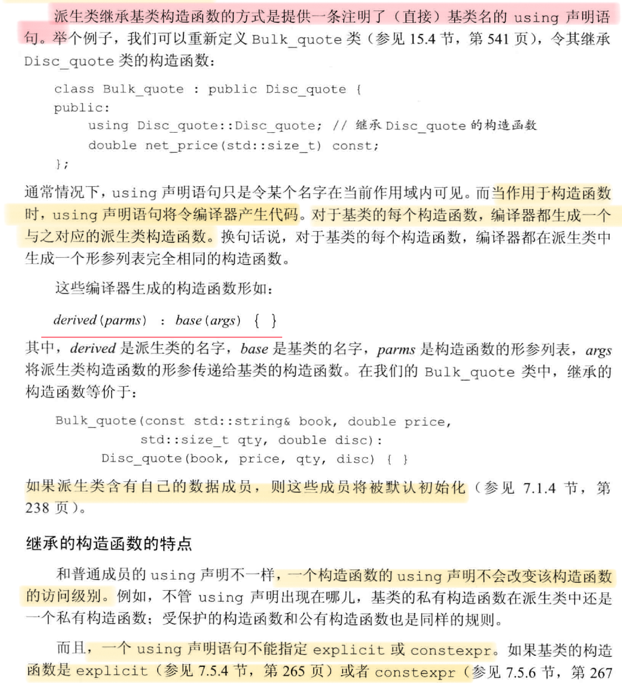
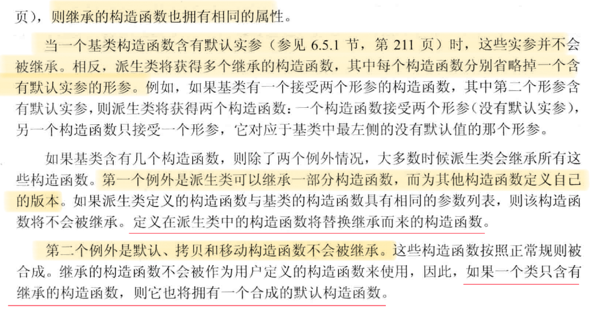
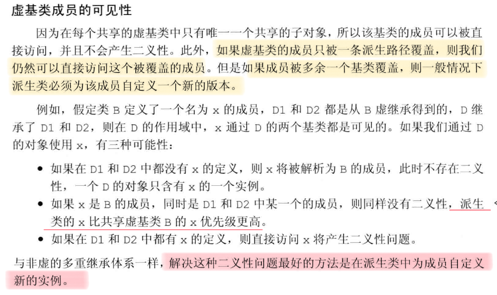
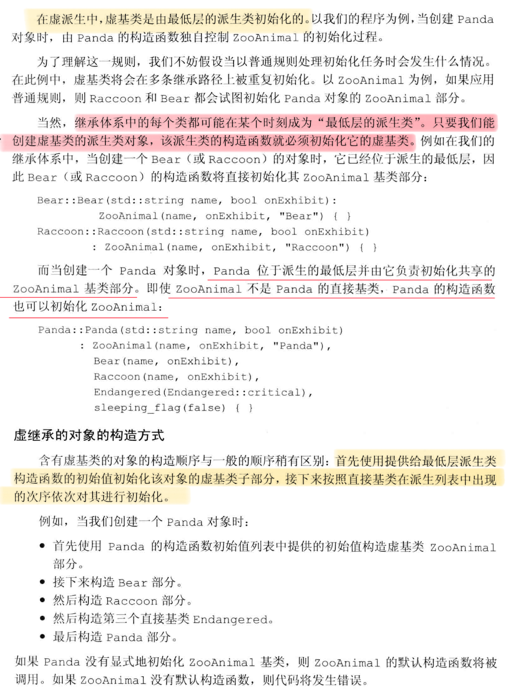
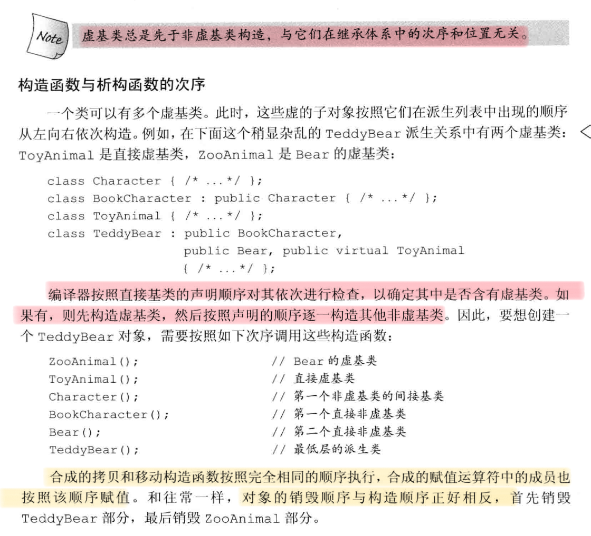

# OOP
## 基类与派生类
### 一些须知
1. 基类通常都应该定义一个虚析构函数，即使该函数不执行任何实际操作。
2. 每个类控制它自己的成员初始化过程。首先初始化基类的部分，然后按照声明的顺序初始化派生类成员。派生类应该通过调用基类的构造函数初始化从基类继承的成员，而不是自己初始化它们。
3. 基类的静态成员在整个继承体系中只存在成员的唯一定义。静态成员遵守通用的访问控制规则。
4. 派生类的声明包含类名但不包含它的派生列表。如果想将某个类做基类，则该类必须已经定义而非仅仅声明。
5. 在类名后面使用`final`关键词(`class Quote final{};`)，防止该类被继承。

### 类型转换与继承
1. 在派生类对象中含有与基类对应的组成部分，这是继承的关键所在。
2. 存在派生类到基类的自动类型转换，例如，将派生类对象的引用或指针用在需要基类引用或指针的地方。智能指针也支持这种转换，因此可以将一个派生类对象的指针存在一个积累的智能指针里。
3. 不存在基类到派生类的自动类型转换。但当基类中含有一或多个虚函数，可以使用`dynamic_cast`请求一个类型转换，其安全检查在运行时执行。如果已知基类到派生类的类型转换是安全的，可以使用`static_cast`强制覆盖掉编译器的检查工作。
4. 派生类到基类的自动类型转换只对指针或引用有效，在派生类类型和基类类型之间不存在这样的转换。当我们用一个派生类对象为一个基类对象初始化或赋值时，只有派生类对象中的基类部分会被拷贝、移动或赋值（使用基类中对应的函数，需要进行参数类型转换），它的派生类部分将被忽略掉。
5. 区分变量或表达式的**静态类型与动态类型**：静态类型在编译时已知，它是变量声明时的类型或表达式生成的类型。动态类型是变量或表达式表示的内存中的对象的类型，直到运行时才可知。
6. 如果表达式既不是引用也不是指针，那它的动态类型永远与静态类型一致。基类的指针或引用的静态类型可能与其动态类型不一致。

## 虚函数

1. 基类在成员函数声明之前加上`virtual`将其定义为虚函数，任何构造函数之外的非静态函数都可以是虚函数，`virtual`只能出现在类内部的声明，而不能出现在类外部的定义。
2.  使用`override`关键词在虚函数后面(`void func() const & overide{};`)，以显式的注明该函数覆盖了它继承的虚函数，使用它可以避免虚函数被错误的覆盖而定义出的新函数。
3. 在虚函数名后面使用`final`关键词(`void func() const & final{};`)，防止该函数被派生类覆盖。
4. 虚函数可以有默认实参。如果调用函数使用了默认实参，则实参值由调用的**静态类型**决定。即。通过基类的引用或指针调用派生类的函数时，传入派生类函数的默认实参将是基类函数定义的。
5. 使用作用域运算符强迫执行虚函数的某个特定版本(basePoint->Quote::func(42)，这会执行Quote的func函数)。通常，只有成员函数（比如，当派生类的虚函数调用它覆盖的基类的虚函数版本时）或友元的代码才需要使用作用域运算符来回避虚函数的机制。如果派生类虚函数调用基类版本而不使用`::`，会导致无限递归。

## 抽象基类
1. 在函数体的位置（声明语句的分号前）书写`=0`将一个虚函数说明为纯虚函数，`=0`只能出现在类内部的虚函数声明处。一个纯虚函数无需定义，但可以为其定义，必须定义在类的外部。
2. 含有（或未经覆盖直接继承）的纯虚函数的类是抽象基类，不能直接创建抽象基类的对象。
3. 派生类构造函数只初始化它的直接基类。


## 访问控制与继承
### 受保护的成员
一个类使用protected关键字来声明那些希望与派生类分享但是不能被其他公共访问使用的成员。
1. 和私有成员类似，受保护的成员对于类的用户来说是不可访问的。
2. 和公有成员类似，受保护的成员对于派生类的成员和友元来说是可访问的
3. 派生类的成员和友元只能访问派生类对象中的基类部分的受保护成员，对于普通基类对象中的成员不具有特殊的访问权限，即不能使用基类类型的对象直接访问基类的受保护成员。

### 公有、私有、受保护继承
1. 某个类对其继承而来的成员的访问权限收到两个因素影响：a. 在基类中该成员的访问说明符； b. 在派生类的派生列表中的访问说明符。
2. 派生访问说明符对于派生类的成员及友元能否访问其直接基类的成员没什么影响，对基类成员的访问权限只与基类的访问说明符有关。
3. 派生访问说明符的目的是控制派生类用户（包含派生类的派生类在内）对于基类成员的访问权限。用户使用时，如果继承是公有的，则成员遵循原有的访问说明符；如果继承是私有的，则不能访问基类的所有成员；如果继承是保护的，则只有派生类中的成员和友元可以访问那些继承而来的成员(继承体系中包含基类的都可以，但继承关系中不能使用private，例如派生类的派生类、派生类的派生类的派生类，这里的*只有*是为了说明用户不能访问)。

### 派生类向基类转换的可访问性


### 友元与继承
1. 友元关系不能继承，一个类的友元在访问其派生类或其基类时不具备特殊性。即友元关系只对声明的那个类有效，每个类负责控制各自成员的访问权限。
2. 对基类的访问权限由基类本身控制，即使对于派生类的基类部分也如此。因此，当基类的友元去访问基类的派生类中的由基类控制的部分时（即，基类对象内嵌在其派生类对象中的部分），该部分的访问权限取决于基类的访问权限。见下例：
```cpp
class Base{
    friend class Pal;
protected:
    int prot_mem;
};

class Pub_Sneaky:public Base{
private:
    int j;
};

class Prot_Sneaky:protected Base{
private:
    int j;
};
class Pal{
public:
    int f(Pub_Sneaky s){return s.prot_mem;} 
    // 可以访问，因为prot_mem是基类的成员，是基类内嵌在派生类的部分。

    int f1(Prot_Sneaky s){return s.prot_mem;} 
    // 错误，不可访问，因为是protected继承。如果是private继承，同样不可访问。因为这段代码对于派生类来说，属于用户代码。
};
 ```
### 改变个别成员的可访问性
通过使用using声明，可以改变派生类继承的某个名字的访问级别，更改后的访问权限将由using声明之前的访问说明符来决定。

派生类只能为那些它可以访问的名字提供using声明。
```cpp
class Base{
protected:
    int prot_mem;
};

class Sneaky:private Base{
public:
    using Base::prot_mem; //该成员变为公有的
};
 ```
### 默认的继承保护机制
1. class关键字定义的派生类默认是私有继承的。
2. struct关键字定义的派生类默认是公有继承的。

## 继承中的类作用域

1. 编译时的名字查找：一个对象、引用或指针的静态类型决定了该对象的那些成员是可见的，即使静态类型与动态类型可能不一致，但是编译时能使用哪些成员是由静态类型决定的。
2. 派生类的成员将隐藏同名的基类成员。可以通过作用域运算符来使用一个隐藏的基类成员，作用域运算符将覆盖掉原有的查找规则。
3. 名字查找先于类型检查，声明在内层作用域的函数不会重载外层作用域的函数，因此定义在派生类中的函数也不会重载基类的成员。如果派生类的成员与基类的成员重名，则派生类将在其作用域隐藏基类成员，即使两者形参列表不一致。
4. 如果基类与派生类的虚函数接受的实参不同，那就无法通过基类的引用或指针调用派生类的虚函数了。即，名字查找时，由于参数不同，调用的实际函数不同。
5. 如果派生类要覆盖基类的重载函数，通常为了保证所有重载版本可见,只能全部覆盖或不覆盖。这时，可使用`using`声明把该函数的所有重载实例添加到派生类作用域中。但基类函数中的每个实例在派生类中必须是可访问的。

## 构造函数与拷贝控制
### 虚析构函数
1. 定义虚析构函数，以动态分配继承体系中的对象。
2. 基类的析构函通常不遵守三五准则。
3. 如果一个类定义了析构函数，即使它通过`=default`使用了合成的版本，编译器也不会为这个类合成移动操作。
### 合成拷贝控制与继承
1. 合成的拷贝控制成员负责使用直接基类对应的操作对一个对象的直接基类部分进行初始化、赋值或销毁的操作。
2. 因为基类定义的虚析构函数，因此基类通常不含有合成的移动操作，因此派生类中也没有合成的移动操作。如果确实需要移动操作，首先应在基类中`=default`显式的定义合成的移动操作版本，也应显式定义拷贝操作。
3. 派生类中删除的拷贝控制与基类的关系：详见C++ primer 5th P553

### 派生类的拷贝控制成员
1. 在默认情况下，基类默认构造函数初始化派生类对象的基类部分。如果想拷贝或移动基类部分，则必须在派生类的构造函数初始值列表中显式的使用基类的拷贝或移动构造函数。如果没有显式的使用基类的拷贝或移动构造函数，则基类部分会被默认初始化，而非拷贝。
2. 当派生类定义了拷贝或移动操作，该操作负责拷贝或移动包括基类部分成员在内的整个对象。
3. 与构造函数和赋值运算符不同，析构函数只需要销毁派生类自己分配的资源。派生类的基类部分是自动销毁的，而不需要派生类的析构函数参与。
4. 对象销毁的顺序与其创建的顺序相反，派生类析构函数首先执行，然后是基类的析构函数，以此类推。
5. 如果构造函数和析构函数调用了某个虚函数，则执行与构造函数或析构函数所属类型相对应的虚函数版本。
### 继承的构造函数



## 多重继承与虚继承
### 多重继承
在派生类的派生列表中可以包含多个基类，每个基类包含一个可选的访问说明符。在某个给定的派生列表中，同一个基类只能出现一次。

在多重继承关系中，派生类的对象包含每个基类的子对象。

构造一个派生类的对象将同时构造并初始化它的所有基类值对象，派生类的构造函数只能初始化它的直接基类,基类的构造顺序与派生列表中的基类出现顺序保持一致。

允许派生类从它的一个或几个基类中继承构造函数（利用using）。如果一个类从它的多个基类继承了相同的构造函数（形参列表完全一致），则必须为该构造函数定义它自己的版本。

多重继承的派生类如果定义了自己拷贝/赋值构造函数和赋值运算符，则必须在完整的对象上执行拷贝、移动和赋值操作。只有当派生类使用的是合成的成员时，才会自动对其类部分执行这些操作。在合成的拷贝控制成员中，每个基类分别使用自己的对应成员隐式的完成对应的操作。
### 多重继承的类型查找
与单继承类似，对象、指针和引用的静态类型决定了我们能使用哪些成员。
### 多重继承的类作用域
在多重继承中，名字的查找过程（沿着继承体系自底向上进行，直到找到所需的名字，派生类的名字将隐藏基类的同名名字）在所有直接基类中同时进行。如果多个名字在多个基类中都被找到，则产生了二义性。

可以使用前缀限定符或在派生类中定义新版本来解决该问题。
### 虚继承
虚继承的目的是令某个类做出声明，承诺愿意共享它的基类，共享的基类子对象称为虚基类。在这种机制下，不论虚基类在继承体系中出现了多少次，在派生类中都只包含唯一一个共享的虚基类子对象。

虚派生只影响从指定了虚基类的派生类中进一步派生出的类，不会影响派生类本身。

在派生列表中添加关键词`virtual`来指定虚基类。`virtual`表明了一种愿望，即在后续的派生类中共享虚基类的同一份实例，至于什么样的类能够作为虚基类没有特殊规定。如果某个类指定了虚基类，则该类的派生仍按常规方式进行。
```cpp
class Raccoon : virtual public ZooAnimal{};
class Bear : public virtual ZooAnimal{};

class Panda : public Bear, public Raccoon, public Endangered{};
 ```

不论是基类还是虚基类，派生类对象都能被可访问基类的指针或引用操作。

同一层级的多个基类中的同名函数不会重载（即使有不同形参列表），这时需要通过限定符指定使用哪个函数。



### 构造函数与虚继承


## 多态与虚函数 
[C++多态虚函数表详解(多重继承、多继承情况)](https://blog.csdn.net/qq_36359022/article/details/81870219)
[C++ 多态的实现及原理](https://www.cnblogs.com/cxq0017/p/6074247.html)
[C++虚函数和虚函数表原理](https://blog.csdn.net/u012630961/article/details/81226351)
[虚函数实现原理](https://blog.csdn.net/wanghaobo920/article/details/7674631?spm=1001.2101.3001.6661.1&utm_medium=distribute.pc_relevant_t0.none-task-blog-2%7Edefault%7ECTRLIST%7ERate-1.pc_relevant_antiscanv2&depth_1-utm_source=distribute.pc_relevant_t0.none-task-blog-2%7Edefault%7ECTRLIST%7ERate-1.pc_relevant_antiscanv2&utm_relevant_index=1)
1. 多态是利用虚函数与虚函数表来实现的，通过指向对象的指针来调用类中的函数时，系统会根据指针指向的对象的类（而不是该指针定义时的类型）来决定调用哪个函数（父类的方法为虚函数）；该过程是通过对象中一个指向虚函数表的指针来实现调用的，也称为“晚绑定” （要让编译器采用晚绑定，就要在基类中声明函数时使用virtual关键字，这样的函数我们就称之为虚函数，一旦某个函数在基类中声明为virtual，那么在所有的派生类中该函数都是virtual，而不需要再显式地声明为virtual)
2. 压制多态可以使用域操作符来实现
```c++
class Base{
public:
    virtual void f1(){
        cout<<"base:f1()";
    }
};
class Derive:public Base{
public:
    void f1(){
        cout<<"derive:f1()";
    }
};
int main(){
   Derive* bp=new Derive();
   bp->Base::f1();//base:f1()
   bp->f1();//derive:f1()
   return 0;
}
```
1. 多继承情况下，派生类中有多个虚函数表，虚函数的排列方式和继承的顺序一致。派生类重写函数将会覆盖所有虚函数表的同名内容，**派生类自定义新的虚函数将会在第一个类（按照派生类的继承顺序，而不是成员初始化列表中的顺序）的虚函数表的后面进行扩充。** [C++继承中构造顺序](https://blog.csdn.net/tangjienihaoma/article/details/84526995)