# 高级主题
## 异常处理
### 抛出异常
1. 一个异常如果没有没捕获，则它将终止当前的程序。
2. 栈展开的过程中，对象被自动相会
3. 如果析构函数需要执行某个可能异常的操作，则该操作应该放在一个try语句块中，并在析构函数中得到处理。
4. 异常对象是一种特殊的对象，编译器使用异常抛出表达式来对异常对象进行拷贝初始化，thorw语句中的表达式必须拥有完全类型。

### 捕获异常
1. 通常情况下，如果catch接受的异常与某个继承体系有关，则最好将该catch的参数定义成引用类信息。
2. 异常与catch异常声明的匹配规则只允许以下类型的转换：非常量到常量，派生类到基类的类型转换，数组和函数向对应的指针的转换。
3. 重新抛出：在catch块中使用空throw语句重新抛出。这会将当前的异常对象沿着调用链向上传递。
4. 捕获所有异常：`catch(...){}`
### noexcept
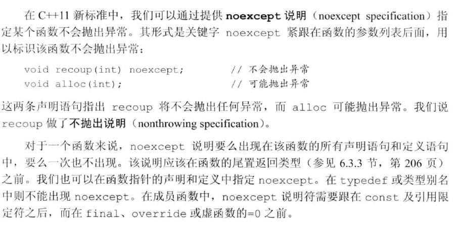

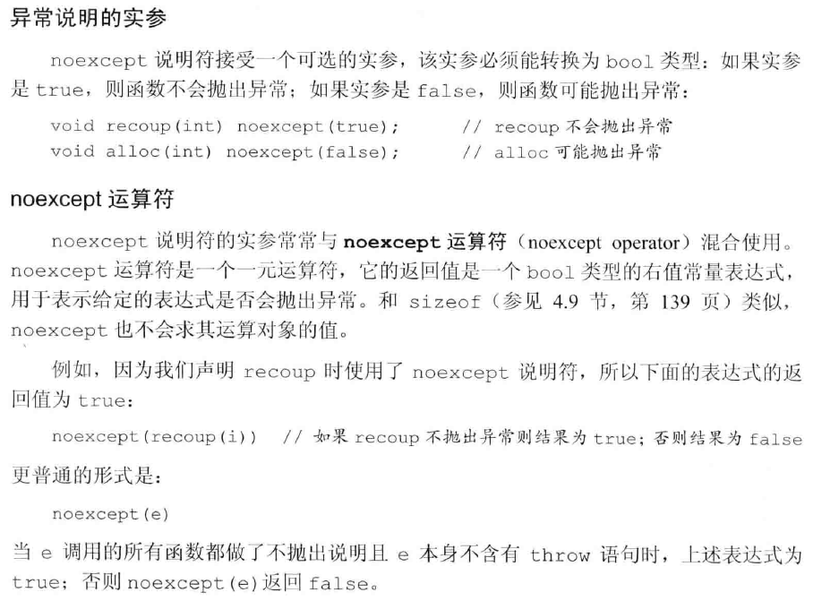

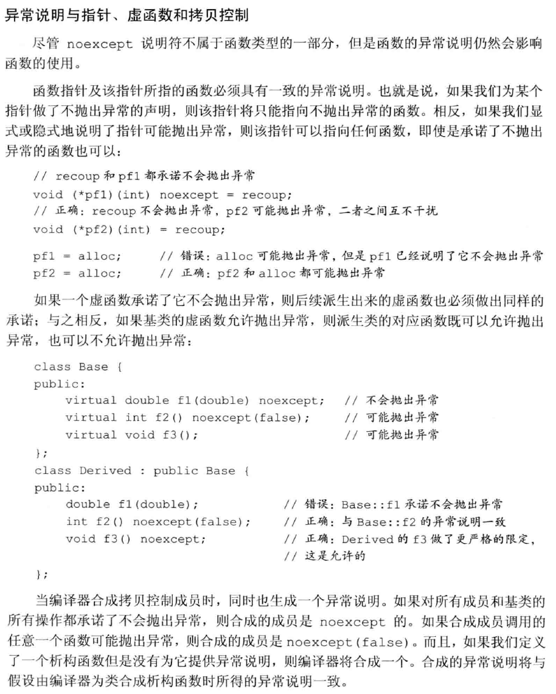
### 异常类层次
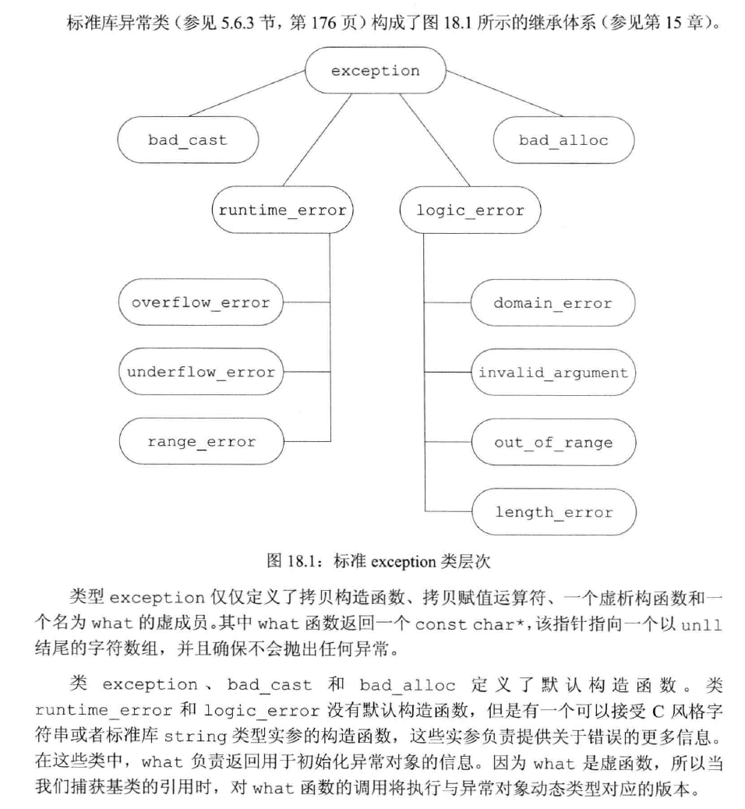

## 命名空间
多个库将名字放置在全局命名空间中将引发命名空间污染。命名空间为防止名字冲突提供了更加可控的机制。命名空间分割了全局命名空间，其中每个命名空间是一个作用域。
### 定义
一个命名空间的定义包含两部分：首先是关键字`namespace`, 随后是命名空间的名字。在命名空间名字后面是一系列由花括号括起来的声明和定义。只要能出现在全局作用域中的声明就能置于命名空间内，主要包括：类、变量（及其初始化操作）、函数（及其定义）、模板和其他命名空间。

## 枚举类型
枚举类型使我们可以将一组整型常量组织在一起。和类一样，每个枚举类型定义了一种新的类型。枚举属于字面值常量类型。C++包含两种枚举：限定作用域的和不限定作用域的。

定义限定作用域的枚举类型的一般形式是：首先是关键字`enum class`(或者等价地使用`enum struct`)，随后是枚举类型名字以及用花括号括起来的以逗号分隔的枚举成员列表，最后是一个分号。
```cpp
enum class open_modes {input, output, append};
 ```

定义不限定作用域的枚举类型时省略掉关键字class(或struct)，枚举类型的名字是可选的。如果enum是未命名的，则我们只能在定义该enum时定义它的对象。
```cpp
enum color {red, yellow, green};
enum {floatPrec = 6, doublePrec = 10, double_doublePrec = 10};
 ```

在限定作用域的枚举类型中，枚举成员的名字遵循常规的作用域准则，并且在枚举类型的作用域外是不可访问的。与之相反，在不限定作用域的枚举类型中，枚举成员的作用域与枚举类型本身的作用域相同：
```cpp
color eyes = green;
open_modes mode = open_modes::input;
 ```
默认情况下，枚举值从0开始，依次加1。不过我们也能为一个或几个枚举成员指定专门的值。
枚举值不一定唯一。如果我们没有显式地提供初始值，则当前枚举成员的值等千于之前枚举成员的值加1。

枚举成员是const，因此在初始化枚举成员时提供的初始值必须是常量表达式。也就是说，每个枚举成员本身就是一条常量表达式，我们可以在任何需要常量表达式的地方使用枚举成员。
例如，我们可以定义枚举类型的constexpr变量。我们也可以将一个enum作为switch语句的表达式，而将枚举值作为case标签。我们还能将枚举类型作为一个非类型模板形参使用，或者在类的定义中初始化枚举类型的静态数据成员。

### 和类一样， 枚举也定义新的类型
只要enum有名字，我们就能定义并初始化该类型的成员。要想初始化enum对象或
者为enum 对象赋值，必须使用该类型的一个枚举成员或者该类型的另一个对象。

一个不限定作用域的枚举类型的对象或枚举成员自动地转换成整型。因此，我们可以在任何需要整型值的地方使用它们。

### 指定enum的大小
我们可以在enum的名字后加上冒号以及我们想在该enum中使用的类
型。
```cpp
enum Tokens: unsigned char{INLINE = 128 , VIRTUAL= 129};
 ```
如果我们没有指定enum的潜在类型，则默认情况下**限定作用域**的enum成员类型是`int` 。
对于不限定作用域的枚举类型来说，其枚举成员不存在默认类型，我们只知道成员的潜在类型足够大，肯定能够容纳枚举值。如果我们指定了枚举成员的潜在类（包括对限定作用域的enum的隐式指定），则一旦某个枚举成员的值超出了该类型所能容纳的范围，将引发程序错误。

### 枚举类型的前置声明
我们可以提前声明enum。enum的前置声明（无论隐式地还是
显示地）必须指定其成员的大小。
```cpp
enum Tokens: unsigned char;
enum class open_modes;
 ```
因为不限定作用域的enum未指定成员的默认大小，因此每个声明必须指定成员的大小。对于限定作用域的enum来说，我们可以不指定其成员的大小，这个值被隐式地定义成int。

和其他声明语句一样，enum的声明和定义必须匹配，这意味若在enum的所有声明和定义中成员的大小必须一致。而且，我们不能在同一个上下文中先声明一个不限定作用域的enum名字，然后再声明一个同名的限定作用域的enum。

### 形参匹配与枚举类型
要想初始化一个enum对象，必须使用该enum类型的另一个对象或者它的一个枚举
成员。因此，即使某个整型值恰好与枚举成员的值相等，它也不能作为函数的enum实参使用。

尽管我们不能直接将整型值传给enum形参，但是可以将一个不限定作用域的枚举类
型的对象或枚举成员传给整型形参。此时，enum的值提升成`int`或更大的整型，实际提升的结果由枚举类型的潜在类型决定。

## 嵌套类
一个类可以定义在另一个类的内部，前者称为**嵌套类**。

嵌套类是一个独立的类，与外层类基本没什么关系，外层类的对象和嵌套类的对象是相互独立的。

嵌套类的名字在外层类作用域中是可见的，在外层类作用域之外不可见。和其他嵌套的名字一样，嵌套类的名字不会和别的作用域中的同一个名字冲突。

嵌套类也使用访问限定符来控制外界对其成员的访问权限。外层类对嵌套类的成员没有特殊的访问权限，同样，嵌套类对外层类的成员也没有特殊的访问权限。

嵌套类在其外层类中定义了一个类型成员。和其他成员类似，该类型的访问权限由外层类决定。位于外层类public部分的嵌套类实际上定义了一种可以随处访问的类型，位于外层类protecte部分的嵌套类定义的类型只能被外层类及其友元和派生类访问，位
于外层类private部分的嵌套类定义的类型只能被外层类的成员和友元访问。

### 声明并定义一个嵌套类
因为QueryResult是一个类型成员， 所以我们必须对它先声明后使用，尤其是必须先声明QueryResult，再将它作TextQuery成员的返回类型。**在嵌套类在其外层类之外完成真正的定义之前，它都是一个不完全类型。**

我们在TextQuery内声明了QueryResult，但是没有给出它的定义。和成员函数一样，嵌套类必须声明在类的内部，但是可以定义在类的内部或者外部。当我们在外层类之外定义一个嵌套类时，必须以外层类的名字限定嵌套类的名字。
```cpp
class TextQuery {
public:
	class QueryResult; 
}

class TextQuery::QueryResult {
    // some codes
}
 ```
### 嵌套类的静态成员定义
如果QueryResult声明了一个静态成员，则该成员的定义将位于TextQuery的作用域之外。例如，假设QueryResult有一个静态成员，则该成员的定义将形如：
```cpp
int TextQuery::QueryResult::static_mem = 1024;
 ```

## `union`：一种节省空间的类
联合(union)是一种特殊的类。一个union可以有多个数据成员，但是在任意时刻只有一个数据成员可以有值。当我们给union的某个成员赋值之后，该union的其他成员就变成未定义的状态了。分配给一个union对象的存储空间至少要能容纳它的最大的数据成员。和其他类一样，一个union定义了一种新类型。

类的某些特性对union同样适用，但并非所有特性都如此。**union不能含有引用类型的成员**，除此之外，它的成员可以是绝大多数类型。含有构造函数或析构函数的类类型也可以作为union的成员类型。union可以为其成员指定public、protected和private等保护标记。默认情况下，union的成员都是公有的，这一点与struct相同。

union可以定义包括构造函数和析构函数在内的成员函数。但是由于union既不能继承自其他类，也不能作为基类使用，所以在**union中不能含有虚函数**。
### 定义并使用union
union提供了一种有效的途径使得我们可以方便地表示一组类型不同的互斥值。在定义一个union时，首先是关键字union，随后是该union的（可选的）名字以及花括号内的一组成员声明。

union的名字是一个类型名。和其他内置类型一样，默认情况下union是未初始化的。我们可以像显式地初始化聚合类一样使用一对花括号内的初始值显式地初始化一个union。如果提供了初始值，则该初始值被用于初始化第一个成员。我们使用通用的成员访问运算符访间一个union对象的成员。

为union的一个数据成员赋值会令其他数据成员变成未定义的状态。因此，当我们使用union时，必须清楚地知道当前存储在union中的值到底是什么类型。如果我们使用错误的数据成员或者为错误的数据成员赋值，则程序可能崩溃或出现异常行为。
```cpp
union Token
{
    char cval;
    int ival;
    double dval;
};

Token t1{'a'};
cout << t1.cval;
 ```

### 匿名union
匿名union ( anonymous union ) 是一个未命名的union, 并且在右花括号和分号之间没有任何声明。一旦我们定义了一个匿名union，编译器就自动地为该union创建一个未命名的对象。在匿名union的定义所在的作用域内该union的成员都是可以直接访问的。

**匿名union不能包含受保护的成员或私有成员，也不能定义成员函数。**
```cpp
union
{
    char cval;
    int ival;
    double dval;
};
ival = 1;
cout << ival;
 ```

### 含有类类型成员的union
当union包含的是内置类型的成员时，我们可以使用普通的赋值语句改变union保存的值。
对千含有特殊类类型成员的union，如果我们想将union的值改为类类型成员对应的值，或者将类类型成员的值改为一个其他值，则必须分别构造或析构该类类型的成员。

当union包含的是内置类型的成员时，编译器将按照成员的次序依次合成默认构造函数或拷贝控制成员。但是如果union含有类类型的成员，并且该类型自定义了默认构造函数或拷贝控制成员，则编译器将为union合成对应的版本并将其声明为删除的。如果在某个类中含有一个union成员，而且该union含有删除的拷贝控制成员，则该类与之对应的拷贝控制操作也将是删除的。
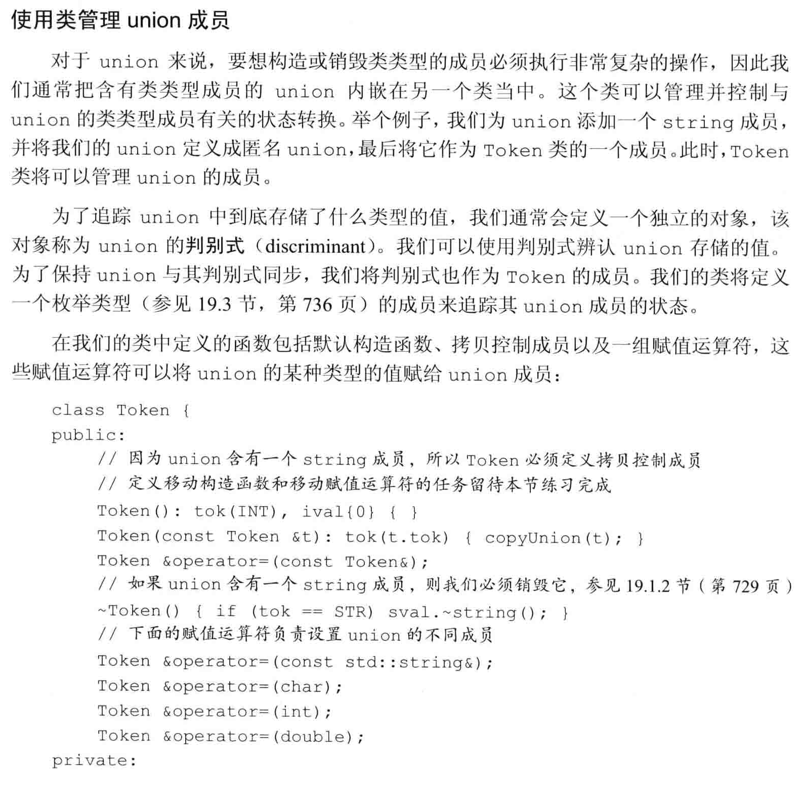
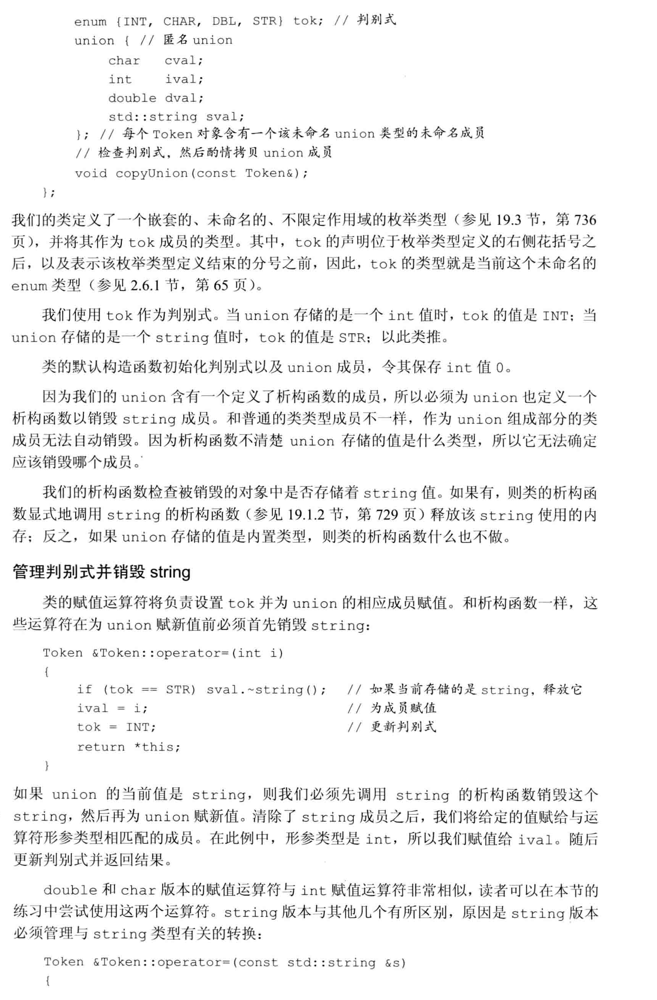
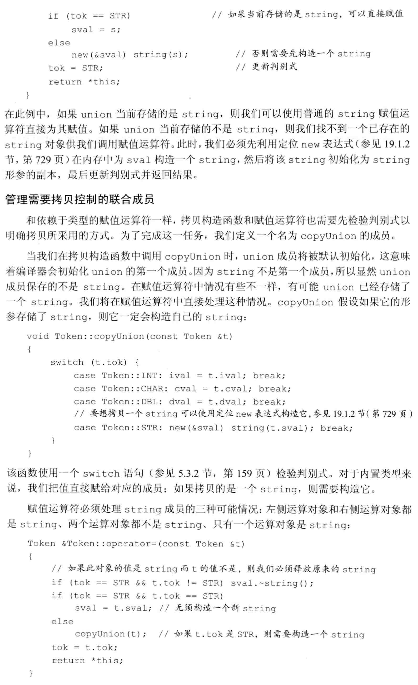

## 局部类
类可以定义在某个函数的内部，我们称这样的类为局部类。局部类定义的类型只在定义它的作用域内可见。和嵌套类不同，局部类的成员受到严格限制。局部类的所有成员都必须完整定义在类的内部。**在局部类中也不允许声明静态数据成员**，因为我们没法定义这样的成员。

局部类对其外层作用域中名字的访问权限受到很多限制，**局部类只能访问外层作用域定义的类型名、静态变量以及枚举成员。如果局部类定义在某个函数内部，则该函数的普通局部变量不能被该局部类使用。**

外层函数对局部类的私有成员没有任何访问特权。当然，局部类可以将外层函数声明为友元；或者**更常见的情况是局部类将其成员声明成公有的(struct)**。在程序中有权访问局部类的代码非常有限。局部类已经封装在函数作用域中，通过信息隐藏进一步封装就显得没什么必要了。

局部类内部的名字查找次序与其他类相似。在声明类的成员时，必须先确保用到的名字位于作用域中，然后再使用该名字。定义成员时用到的名字可以出现在类的任意位置。如果某个名字不是局部类的成员，则继续在外层函数作用域中查找；如果还没有找到，则在外层函数所在的作用域中查找。

可以在局部类的内部再嵌套一个类。此时，嵌套类的定义可以出现在局部类之外。嵌套类必须定义在与局部类相同的作用域中。局部类内的嵌套类也是一个局部类，必须遵循局部类的各种规定。嵌套类的所有成员必须定义在嵌套类内部。

## 固有的不可移植的特性
### 位域
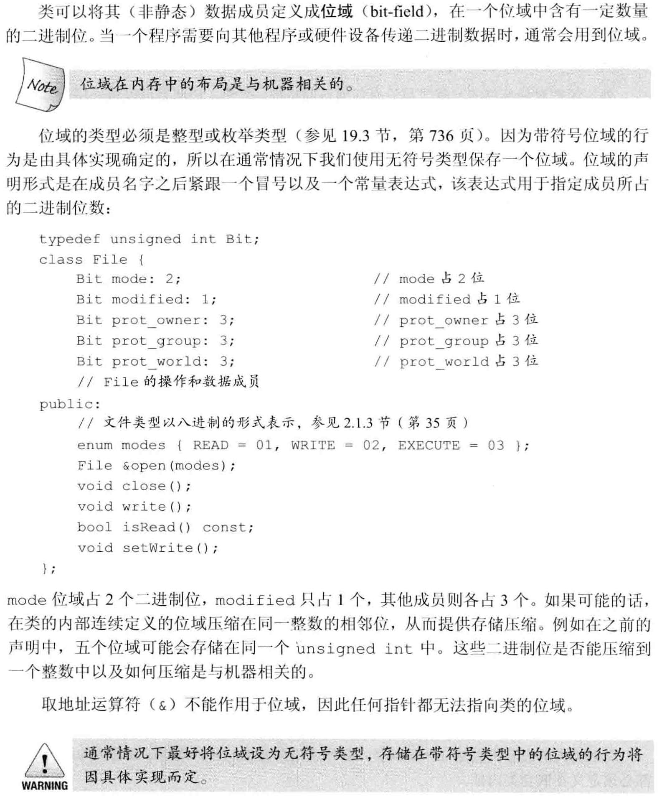

### `volatile`限定符
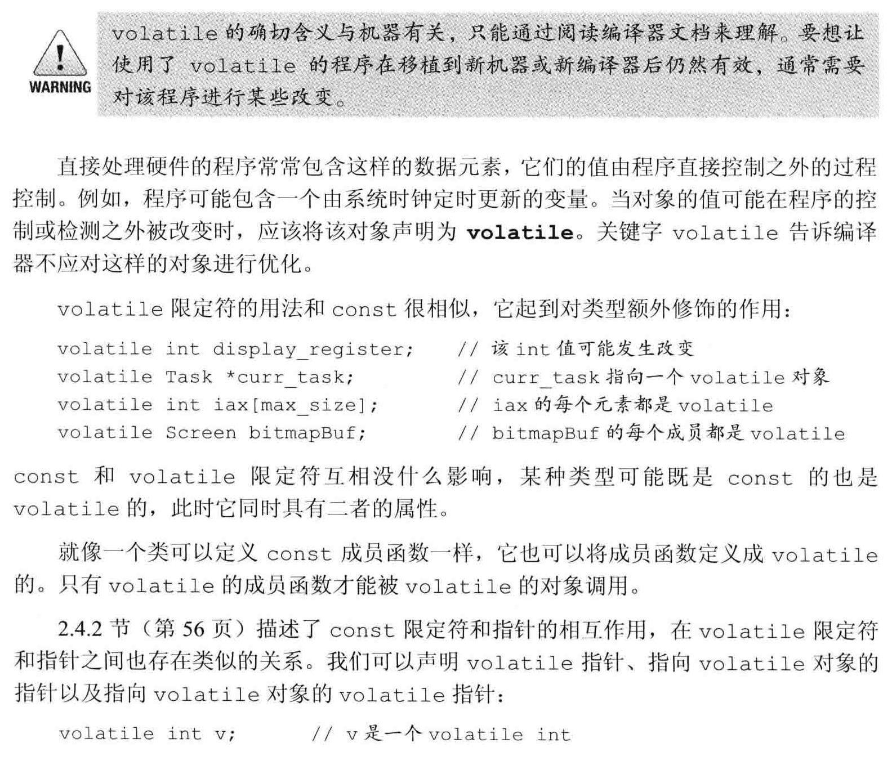
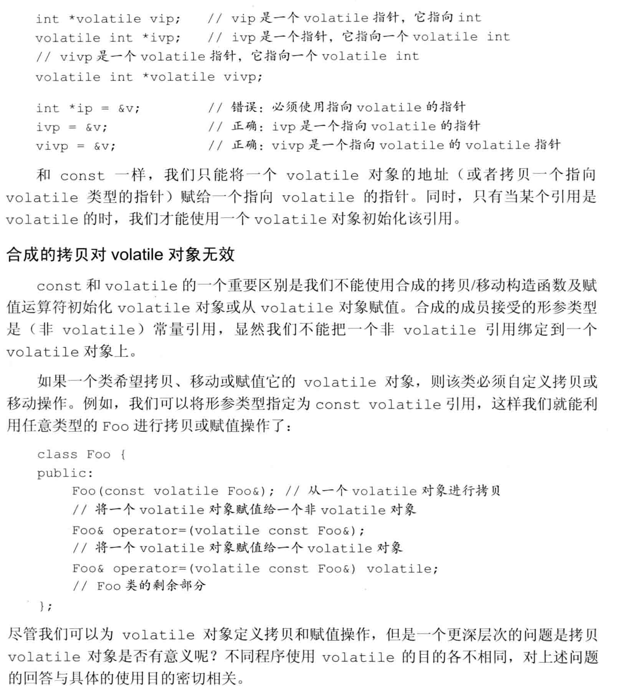

### 链接指示：`extern "C"`
C++程序有时需要调用其他语言编写的函数，最常见的是调用C语言编写的函数。像所有其他名字一样，其他语言中的函数名字也必须在C++中进行声明，并且该声明必须指定返同类型和形参列表。对于其他语言编写的函数来说，编译器检查其调用的方式与处理普通C++函数的方式相同，但是生成的代码有所区别。C++使用链接指示指出任意非C++函数所用的语言。

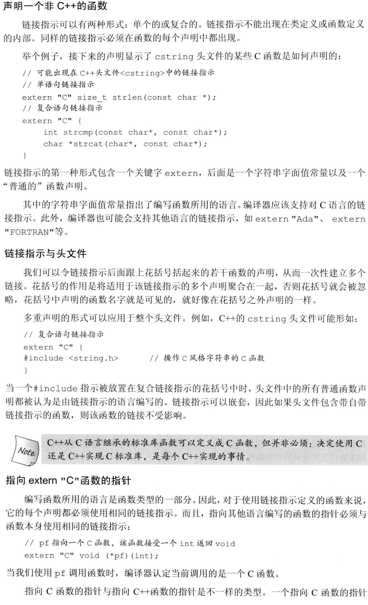
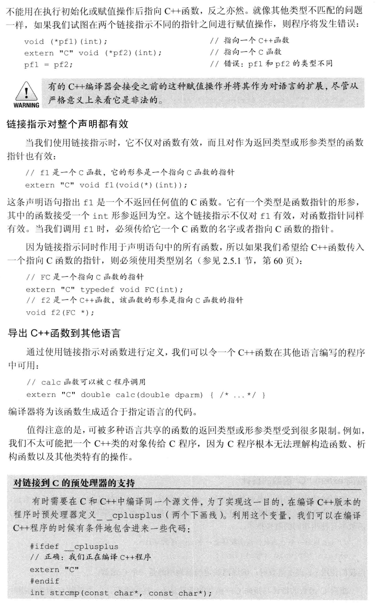
#### 重载函数与链接指示
链接指示与重载函数的相互作用依赖于目标语言。如果目标语言支持重载函数，则为该语言实现链接指示的编译器很可能也支持重载这些C++的函数。C语言不支持函数重载，因此一个C链接指示只能用于说明一组重载函数中的某一个了。

如果在一组重载函数中有一个是C函数，则其余的必定都是C++函数。