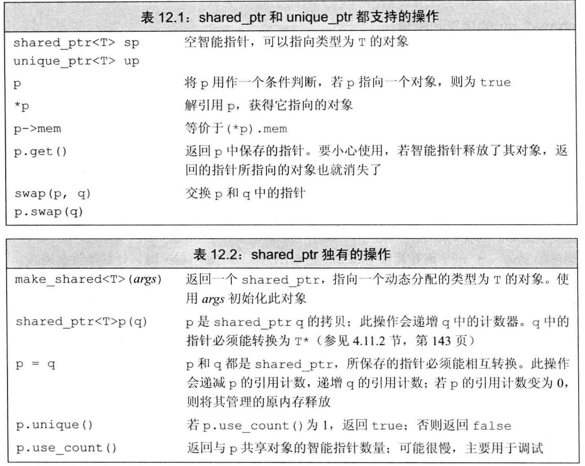
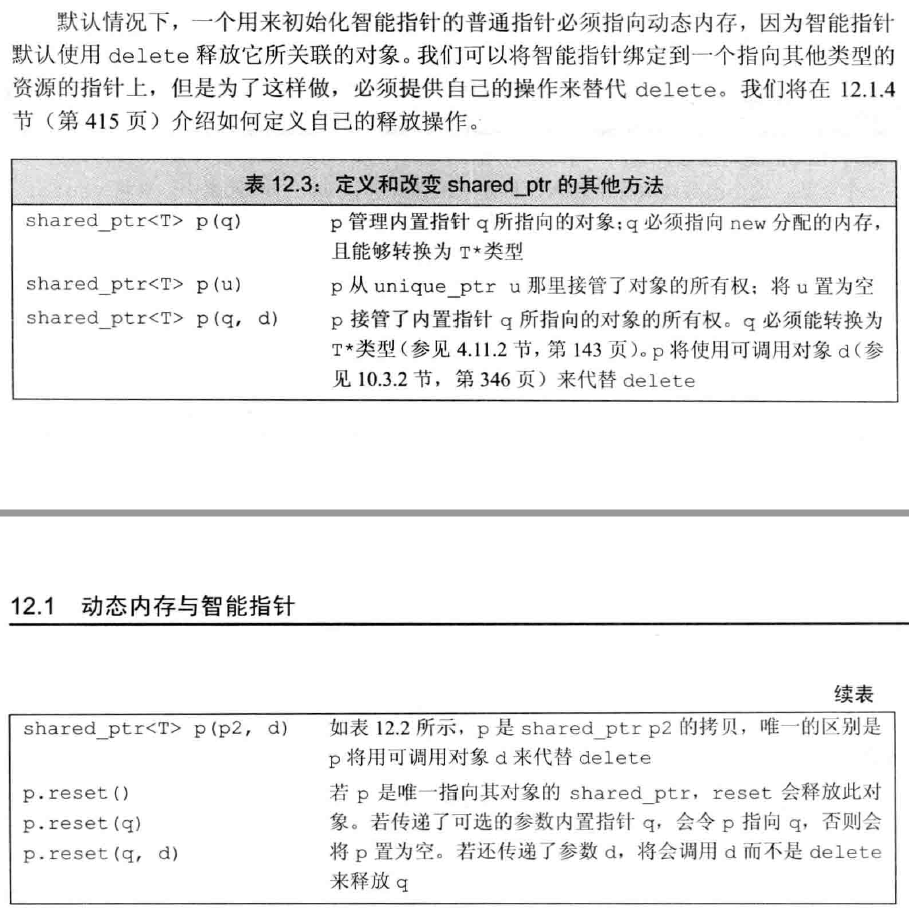
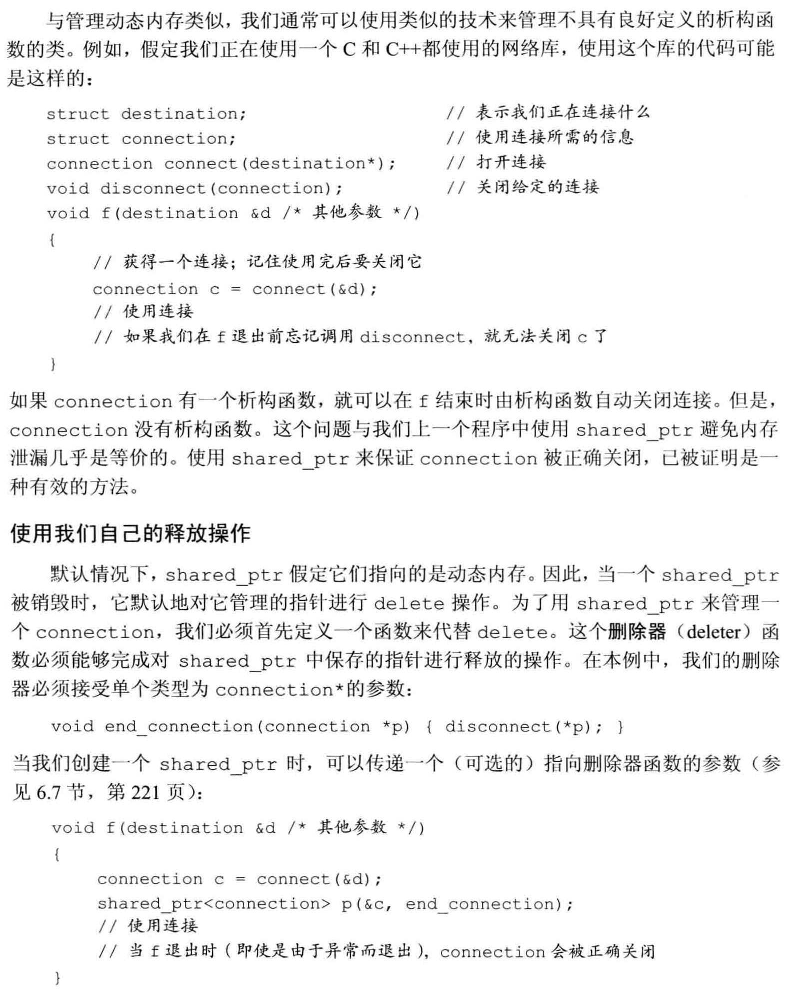
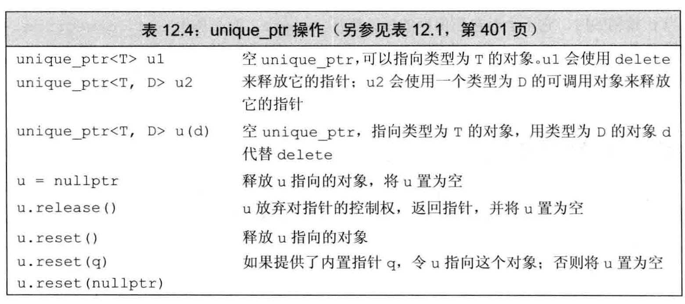
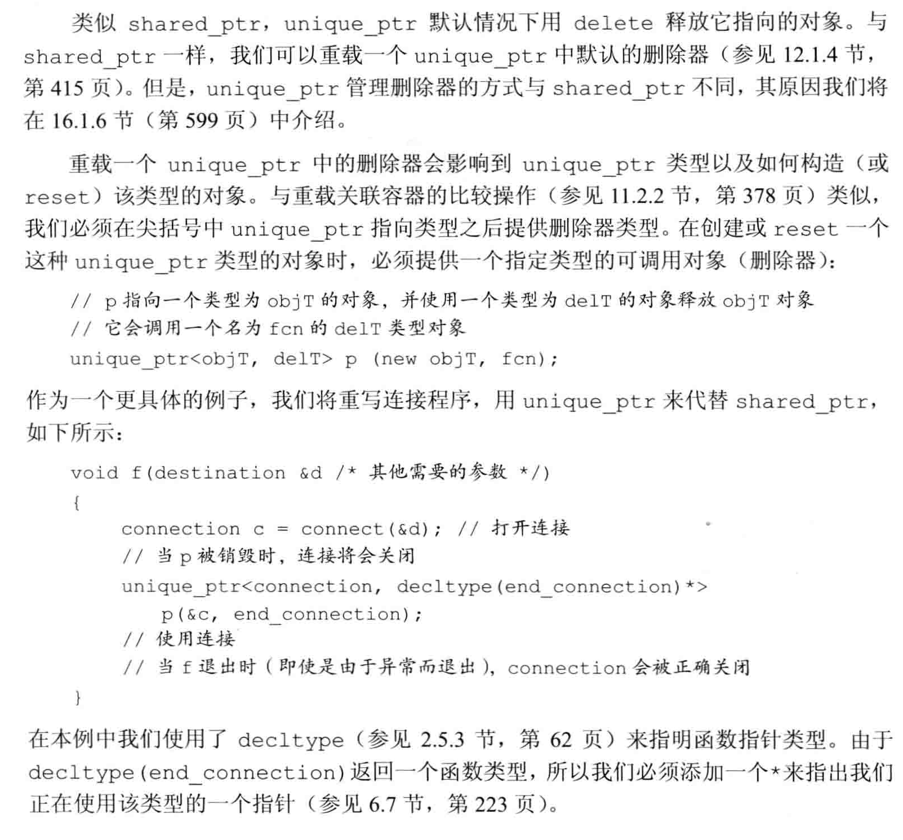
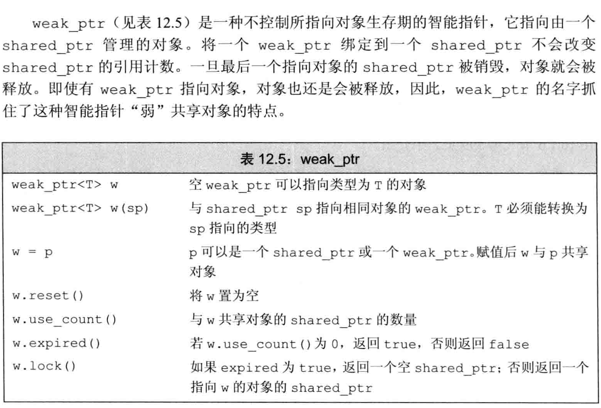
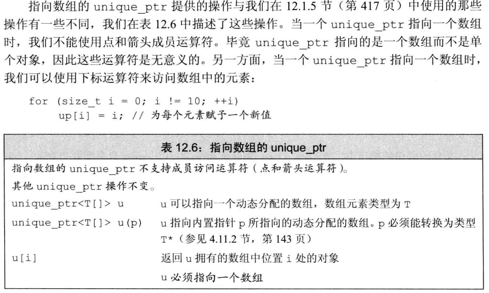

# 动态内存
## 动态内存与智能指针
除了静态内存和栈内存，每个程序还拥有一个内存池。这部分内存被称作自由空间或堆。程序用堆来存储动态分配的对象（在程序运行时分配的对象）。动态对象的生存期由程序来控制，也就是说，当动态对象不再使用时，我们的代码必须显式地销毁它们。

智能指针的行为类似常规指针，重要的区别是它负责自动释放所指向的对象。新标准库提供的这两种智能指针的区别在于管理底层指针的方式：`shared_ptr`允许多个指针指向同一个对象： `unique_ptr`则“独占”所指向的对象。标准库还定义了一个名为`weak_ptr`的伴随类，它是一种弱引用，指向`shared_ptr`所管理的对象。这三种类型都定义在memory头文件中。

### `shared_ptr`类
智能指针是一个模板类，当我们创建一个智能指针时，必须提供指针可以指向的类型。默认初始化的智能指针中保存着一个空指针。
```CPP
shared_ptr<string> p1;
 ```



#### `make_shared`函数
最安全的分配和使用动态内存的方法是调用一个名为`make_shared`的标准库函数。此函数在动态内存中分配一个对象并初始化它，返回指向此对象的shared_ptr。
```CPP
shared_ptr<string> p1 = make_shared<string>("asd");
auto p2 = make_shared<string>("asd"); //使用auto简化
 ```
#### `shared_ptr`的拷贝和赋值
我们可以认为每个shared_ ptr都有一个关联的计数器，通常称其为**引用计数**。无论何时我们拷贝一个shared_ptr（拷贝初始化、作为参数传递给一个函数，作为函数的返回值）, 计数器都会递增。当我们给shared_ptr赋予一个新值或是shared_ptr被销毁（例如一个局部的shared_ptr离开其作用域时），计数器就会递减。

#### `shared_ptr`的的自动销毁对象与自动释放内存
shared_ ptr的析构函数会递减它所指向的对象的引用计数。如果引用计数变为0，shared_ptr的析构函数就会销毁对象，并释放它占用的内存。

#### 使用了动态生存期的资源的类
程序使用动态内存出于以下三种原因之一：
1. 程序不知道自己需要使用多少对象
2. 程序不知道所需对象的类型
3. 程序需要在多个对象间共享数据


### 直接管理内存
C++语言定义了两个运算符来分配和释放动态内存。运算符`new`分配内存，`delete`释放`new`分配的内存。自己管理内存的类不能依赖对象拷贝、赋值和销毁操作的任何默认定义。
#### 使用`new`动态分配和初始化对象
在自由空间分配的内存是无名的，因此new无法为其分配的对象命名，而是返回一个指向该对象的指针。

默认情况下，动态分配的对象是默认初始化的，这意味着内置类型或组合类型的对象的值将是未定义的，而类类型对象将用默认构造函数进行初始化。
我们可以使用直接初始化来初始化一个动态分配的对象（圆括号或花括号），也可以对动态分配的对象进行值初始化。对于内置类型，值初始化的内置类型对象有着良好定义的值，而默认初始化的对象的值则是未定义的。类似的，对于类中那些依赖于编译器合成的默认构造函数的内置类型成员，如果它们未在类内被初始化，那么它们的值也是未定义的。

如果我们提供了一个括号包围的初始化器，就可以使用`auto`从此初始化器来推断我们想要分配的对象的类型。但是，由于编译器要用初始化器的类型来推断要分配的类型，只有当括号中仅有单一初始化器时才可以使用`auto`。
```cpp
auto p = new auto(1);
 ```
##### 动态分配的const对象
```cpp
const int* p = new const int(1);
 ```

##### 当内存耗尽时
默认情况下，如果new不能分配所要求的内存空间，它会抛出一个类型为`bad—alloc`的异常。我们可以使用**定位new**形式的new来组织它抛出异常。定位new表达式允许我们向new传递额外的参数。在此例中，我们传递给它一个由标准库定义的名`nothrow`的对象。如果将nothrow传递给new, 我们的意图是告诉它不能抛出异常。如果这种形式的new不能分配所需内存，它会返回一个空指针。bad_ alloc和nothrow都定义在头文件`new`中。
```cpp
int* p = new (nothrow) int(1);
 ```

#### `delete`使用释放动态内存
为了防止内存耗尽，在动态内存使用完毕后，必须将其归还给系统。我们通过`delete`表达式来将动态内存归还给系统。delete表达式接受一个指针，指向我们想要释放的对象。
```cpp
delete p;
 ```

我们传递给delete的指针必须指向动态分配的内存，或者是一个空指针。释放一块并非new分配的内存，或者将相同的指针值释放多次，其行为是未定义的。
虽然一个const对象的值不能被改变，但它本身是可以被销毁的。如同任何其他动态对象一样，想要释放一个const动态对象，只要delete指向它的指针即可。

由内置指针（而不是智能指针）管理的动态内存在被显式释放前一直都会存在。与类类型不同，内置类型的对象被销毁时什么也不会发生。特别是， 当一个指针离开其作用域时，它所指向的对象什么也不会发生。如果这个指针指向的是动态内存，那么内
存将不会被自动释放。

当我们delete一个指针后，指针值就变为无效了。虽然指针已经无效，但在很多机器上指针仍然保存着（已经释放了的）动态内存的地址。在delete 之后，指针就变成了空悬指针, 即指向一块曾经保存数据对象但现在已经无效的内存的指针。未初始化指针的所有缺点空悬指针也都有。
有一种方法可以避免空悬指针的问题：**在指针即将要离开其作用域之前释放掉它所关联的内存**。这样，在指针关联的内存被释放掉之后，就没有机会继续使用指针了。如果我们需要保留指针，可以在delete之后将nullptr赋予指针，这样就清楚地指出指针不指向任何对象。
动态内存的一个基本问题是可能有多个指针指向相同的内存。在delete内存之后重置指针的方法只对这个指针有效，对其他任何仍指向（已释放的）内存的指针是没有作用的。

### `shared_ptr`和`new`结合使用
我们可以使用new返回的指针来初始化智能指针。接受指针参数的智能指针构造函数是explicit的。因此我们不能将一个内置指针隐式转换为一个智能指针，**必须使用直接初始化形式来初始化一个智能指针**。出于同样的原因，一个返回shared_ptr的函数不能在其返回语句中隐式转换一个普通指针。
```cpp
shared_ptr<int> p1(new int(1)); // 正确
shared_ptr<int> p2 = new int(1); // 错误，必须使用直接初始化
 ```


#### 不要混合使用普通指针和智能指针
当将一个shared_ptr 绑定到一个普通指针时，我们就将内存的管理责任交给了这个shared_ptr。一旦这样做了，我们就不应该再使用内置指针来访问shared_ptr所指向的内存了。

使用一个内置指针来访问一个智能指针所负责的对象是很危险的，因为我们无法知道对象何时会被销毁。

#### 不要使用get初始化另一个智能指针或为智能指针赋值
get用来将指针的访问权限传递给代码，你只有在确定代码不会delete指针的情况下，才能使用get 。特别是，永远不要用get初始化另一个智能指针或者为另一个智能指针赋值。

### 智能指针和异常

### 智能指针陷阱
智能指针可以提供对动态分配的内存安全而又方便的管理，但这建立在正确使用的
前提下。为了正确使用智能指针， 我们必须坚持一些基本规范：
• 不使用相同的内置指针值初始化（或reset）多个智能指针。
• 不 delete get() 返回的指针。
• 不使用 get() 初始化或reset另一个智能指针。
• 如果你使用 get()返回的指针，记住当最后一个对应的智能指针销毁后，你的指针就变为无效了。
• 如果你使用智能指针管理的资源不是new 分配的内存，记住传递给它一个删除器。

### `unique_ptr`
一个`unique_ptr`"拥有”它所指向的对象。与shared_ptr不同，某个时刻只能有一个unique_ptr指向一个给定对象。当unique_ptr被销毁时，它所指向的对象也被销毁。

与shared_ptr 不同，没有类似make_shared 的标准库函数返回一个unique_ptr。**当我们定义一个unique_ptr时，需要将其绑定到一个new返回的指针上。类似shared_ptr, 初始化unique_ptr必须采用直接初始化形式。由于一个unique_ptr拥有它指向的对象， 因此unique_ptr不支持普通的拷贝或赋值操作。**
```cpp
unique_ptr<double> p1; // 可以指向一个double的unique_ptr
unique_ptr<int> p2 (new int(42));
 ```


虽然我们不能拷贝或赋值unique_ptr, 但可以通过调用r`elease`或`reset`将指针的所有权从一个（非const）unique_ptr转移给另一个unique。
调用release会切断unique_ptr和它原来管理的对象间的联系。release返回的指针通常被用来初始化另一个智能指针或给另一个智能指针赋值。管理内存的责任可以简单地从一个智能指针转移给另一个。但是，如果我们不用另一个智能指针来保存release返回的指针，我们的程序就要负责资源的释放。

#### 传递unique_ptr参数和返回unique_ptr
不能拷贝unique_ptr 的规则有一个例外：我们可以拷贝或赋值一个将要被销毁的unique_ptr。最常见的例子是从函数返回一个unique_ptr，还可以返回一个局部对象的拷贝。这种情况下，编译器将执行移动构造函数或移动赋值函数。
#### 向unique_ptr传递删除器


### `weak_ptr`类


由于对象可能不存在，我们不能使用weak_ptr直接访问对象，而必须调用lock。此函数检查weak_ptr指向的对象是否仍存在。如果存在，lock返回一个指向共享对象的shared_ptr。与任何其他shared_ptr类似，只要此shared_ptr存在，它所指向的底层对象也就会一直存在。

## 动态数组
使用容器的类可以使用默认版本的拷贝、赋值和析构操作。分配动态数组的类则必须定义自己版本的操作，在拷贝、复制以及销毁对象时管理所关联的内存。
### new和数组
为了让new分配一个对象数组，我们要在类型名之后跟一对方括号，在其中指明要分配的对象的数目。在本节的例子中，new分配要求数组的对象并（假定分配成功后）返回指向第一个对象的指针。也可以用一个表示数组类型的类型别名来分配一个数组，这样，new表达式中就不需要方括号了。**方括号大小必须是整形，但不必是常量**。

当用new分配一个数组时，我们并未得到一个数组类型的对象，而是得到一个数组元素类型的指针。
```cpp
int *p1 = new int[n];

typedef int arrT[10];
int *p2 = new arrT;
 ```
### 初始化动态分配对象的数组
默认情况下，new分配的对象，不管是单个分配的还是数组中的，都是默认初始化的。可以对数组中的元素进行值初始化，方法是在大小之后跟一对空括号。我们还可以提供一个元素初始化器的花括号列表。

与内置数组对象的列表初始化一样，初始化器会用来初始化动态数组中开始部分的元素。如果初始化器数目小于元素数目，剩余元素将进行值初始化。如果初始化器数目大于元素数目， 则new表达式失败，不会分配任何内存。在本例中，new会抛出一个类型为`bad_array_new_length`的异常。类似bad_alloc, 此类型定义在头文件new中。

虽然我们用空括号对数组中元素进行值初始化，但不能在括号中给出初始化器，这意味着不能用auto分配数组。
```cpp
int *p1 = new int[10];

int *p2 = new int[10]();

int *p3 = new int[10]{1,2,3,4,5,6,7,8,9,0};
 ```
### 动态分配一个空数组是合法的
当我们用new分配一个大小为0的数组时， new返回一个合法的非空指针。此指针保证与new返回的其他任何指针都不相同。对于零长度的数组来说，此指针就像尾后指针一样，我们可以像使用尾后迭代器一样使用这个指针。可以用此指针进行比较操作，就像上面循环代码中那样。可以向此指针加上(或减去)0，也可以从此指针减去自身从而得到0 。但此指针不能解引用——毕竟它不指向任何元素。

### 释放动态数组
为了释放动态数组，我们使用一种特殊形式的delete一在指针前加上一个空方括号对。

第二条语句销毁p1指向的数组中的元素，并释放对应的内存。数组中的元素按逆序销毁，即最后一个元素首先被销毁，然后是倒数第二个，依此类推。

当我们释放一个指向数组的指针时， 空方括号对是必需的：它指示编译器此指针指向一个对象数组的第一个元素。如果我们在delete一个指向数组的指针时忽略了方括号（或者在delete一个指向单一对象的指针时使用了方括号），其行为是未定义的。

当我们使用一个类型别名来定义一个数组类型时， 在new表达式中不使用`[]`。即使是这样，在释放一个数组指针时也必须使用方括号。不管外表如何，p2指向一个对象数组的首元素，而不是一个类型为arrT的单一对象。因此，在释放p2时我们必须使用`[]`。

```cpp
int *p1 = new int[n];
delete[] p1;

typedef int arrT[10];
int *p2 = new arrT;
delete[] p2;
 ```

### 智能指针和动态数组
#### 使用unique_ptr管理
为了用一个unique_ptr管理动态数组，我们必须在对象类型后面跟一对空方括号。
```cpp
unique_ptr<int> up(new int[10]);
up.release() // 自动用delete[] 销毁其指针
 ```

#### 使用shared_ptr管理
与unique_ptr不同，shared_ptr不直接支持管理动态数组。如果希望使用shared_ptr管理一个动态数组，必须提供自己定义的删除器。

shared_ptr不直接支持动态数组管理，因此未定义下标访问符。而且智能指针类型不支持指针算术运算。因此为了访问数组元素，必须用get获取一个内置指针，然后用它来访问数组元素。
```cpp
shared_ptr<int> sp(new int[10](), [](int *p)
                    { delete[] p; });
cout << *(sp.get() + 1);
 ```