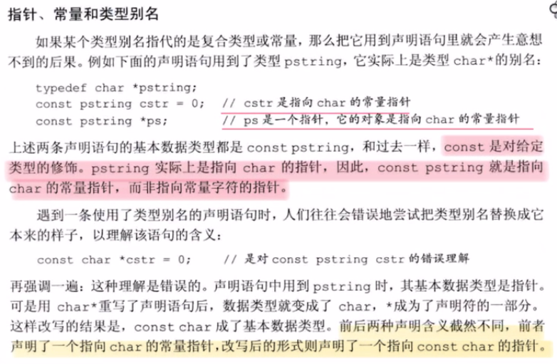
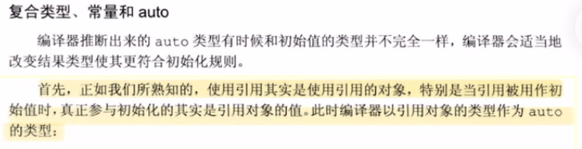
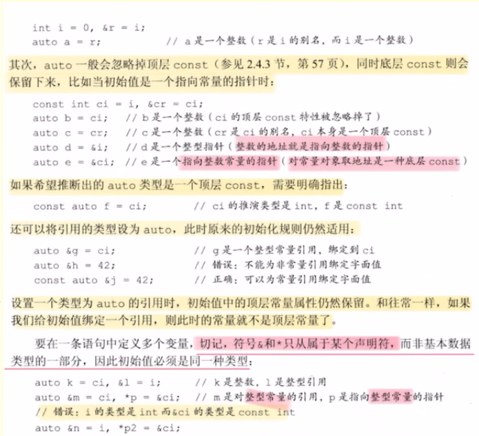
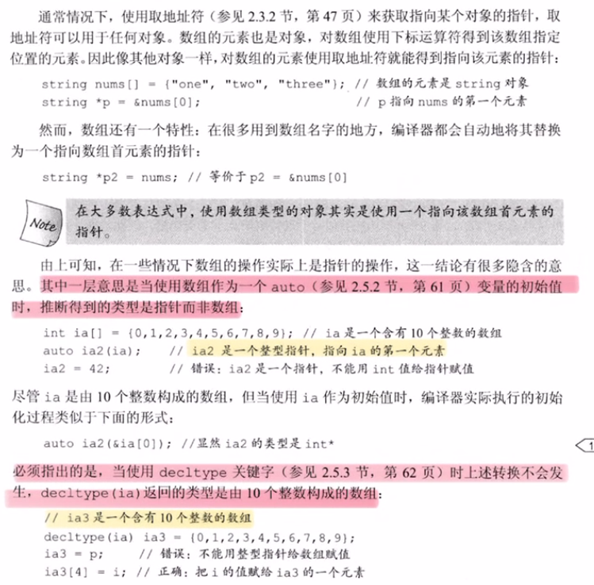
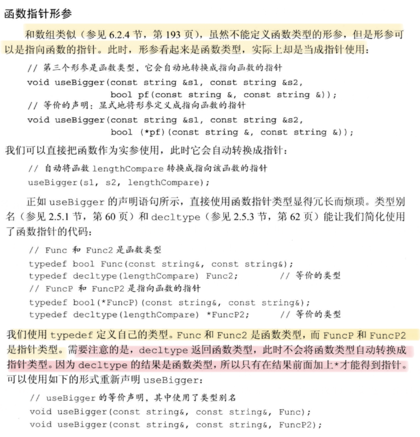
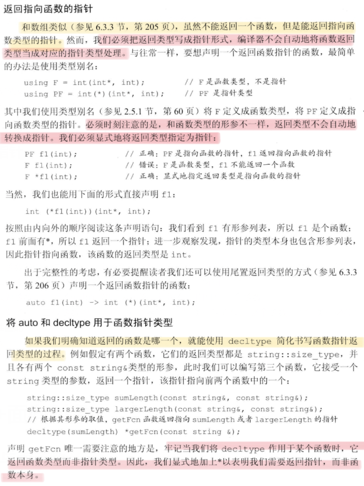

# C++基础
## const
### 基础知识
1. const对象必须初始化。初始化时，赋予的值是不是const都可以，因为常量特征仅在执行时改变其值才会发挥作用。const对象仅在文件内有效。（C++ primer 5th P54）
2. 顶层const：对象本身是个常量，例如常量指针。  底层const：指针所指向的对象是一个常量。此外，声明引用的const(const int &r)都是底层const。（C++ primer 5th P57-58）
### 与引用
1. 不能让一个非常量引用指向一个常量对象。但允许一个常量引用(const int &r)绑定非常量的对象、字面值或一般表达式。对常量的引用可能引用一个并非const的对象。
### 与指针
1. 指向常量的指针(pointer to const)(const int *ptrToConst)不能用于改变其所指对象的值。同样的，不能让一个非常量指针指向常量。
2. 常量指针(const pointer)(int *const cptr)必须初始化，初始化后，地址本身不能改变。
### constexpr
1. 常量表达式：编译时就可确定结果的表达式。
2. 字面值类型：算数类型、引用、指针等。它们是声明constexpr用到的类型。
3. 将变量声明为constexpr类型以便编译器验证变量值是否为一个常量表达式。
4. constexpr指针初始值必须是nullptr或0，或存于某个固定地址的对象。
```cpp
constexpr int mf = 20;
constexpr int *p = nullptr;  //p是一个指向整数的常量指针，是顶层指针
const int *q = nullptr; //qq是一个指向整数常量的指针，是底层指针
```
### 类型别名

### auto类型说明符
auto会忽略掉顶层const，而decltype不会忽略。


### decltype


### 优先级
1. const用于修饰它左侧的内容（类型 int、指针 *），当const处于最左端时，它修饰右边的内容
### 与类和函数
1. const 修饰类成员函数，其目的是防止成员函数修改被调用对象的值，如果我们不想修改一个调用对象的值，所有的成员函数都应当声明为 const 成员函数。
**注意**：const 关键字不能与 static 关键字同时使用，因为 static 关键字修饰静态成员函数，静态成员函数不含有 this 指针，即不能实例化，const 成员函数必须具体到某一实例。
1. const修饰函数的三种用法：修饰返回值（当函数的返回值为引用时，避免被调用者修改），修饰函数参数（防止传递的参数在函数内部被修改），修饰类的成员函数（也称为**常量成员函数**， const修饰成员函数，根本上是修饰了this 指针）
   
## 指针
1. - 指针数组：int *ptrs[10] 包含十个指向int的指针的数组
   - 数组指针：int (*Parray)[10] 指向包含10个int元素的数组的指针
   - 判断复杂数组声明的方法：从数组名字开始，从内向外读。上例中，从Parray开始，*表示它是一个指针，然后[10]说明它指向大小为10的数组的指针，最后是int，说明了数组中元素是int。

## 引用
### 左值引用与右值引用
#### 左值引用与const
引用是变量的别名，由于右值没有地址，无法被修改，所以左值引用无法指向右值。但const左值引用可以指向右值。
```cpp
int &ref_a = 5 //编译失败
const int &ref_a = 5; //成功
```
这是因为const左值引用不会修改指向值，因此可以指向右值，这也是为什么要使用```const value_type&```作为函数参数的原因之一，例如```std::vector```的```push_back```：
```cpp
void push_back(const value_type& val);
```
如果没有```const```，```vec.push_back(5)```这样的代码就无法编译通过了。


## 函数
### 返回数组指针
(C++ primer 5th P205)
```cpp
// 使用类型别名
typedef int arrT[10];
using arrT int[10];
arrT* func(int i); //func返回指向含有十个元素的数组的指针

// 不使用类型别名
int (*func(int i))[10]; //func返回指向含有十个元素的数组的指针

// 使用尾置返回类型
auto func(int i) -> int(*)[10];

// 使用decltype
int odd[] = {1,3,5,7,9};
decltype(odd) *func(int i);
```
### 函数重载
1. 当向函数传递实参时，形参中的顶层const被忽略了。因此，函数重载时，顶层const与没有顶层const的形参是一样的，不能重载。
### constexpr函数
1. 函数的返回类型盒所有形参类型都是字面值类型
2. 函数体中必须有且仅有一条return语句
3. constexpr函数不一定返回常量表达式
### 函数指针
 ```cpp
bool func(int i,int j); // 函数声明
bool (*pf)(int i,int j ); // 对应的未初始化的函数指针，即使用指针替换了函数名，括号是必须的
 ```
1. 当把函数名作为值赋予给一个函数指针时，该函数直接自动转换为指针，无需取地址符
2. 可以直接使用指向函数的指针调用该函数，无需提前解引用指针
3. 可以为函数指针赋予nullptr或0，表示该指针没有指向任何一个函数
4. 当定义了指向重载函数的指针时，编译器通过指针类型决定使用哪个函数，指针类型必须与重载函数中的某一个**精准匹配**
5. 函数指针可以用作函数形参，但不能定义函数类型的形参（当形参类型为函数时，它实际上会自动转换为指向函数的指针，因此仍是函数指针类型）。因为本小节的条目1，所以可以直接把函数作为实参使用，它会自动的转为指针。




