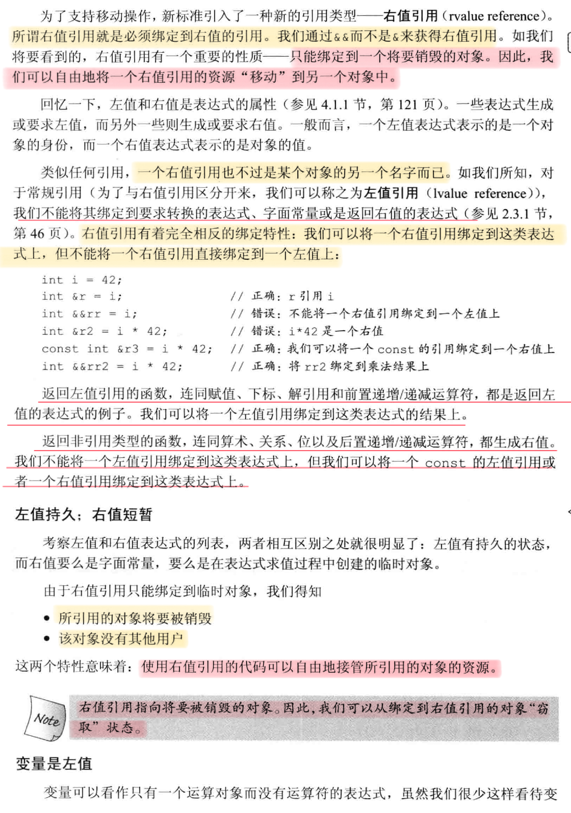
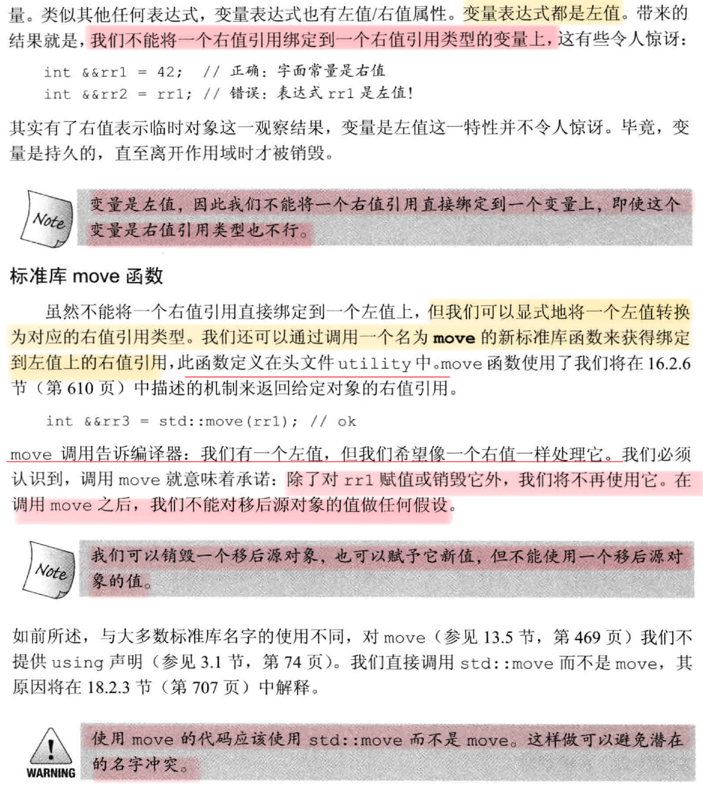
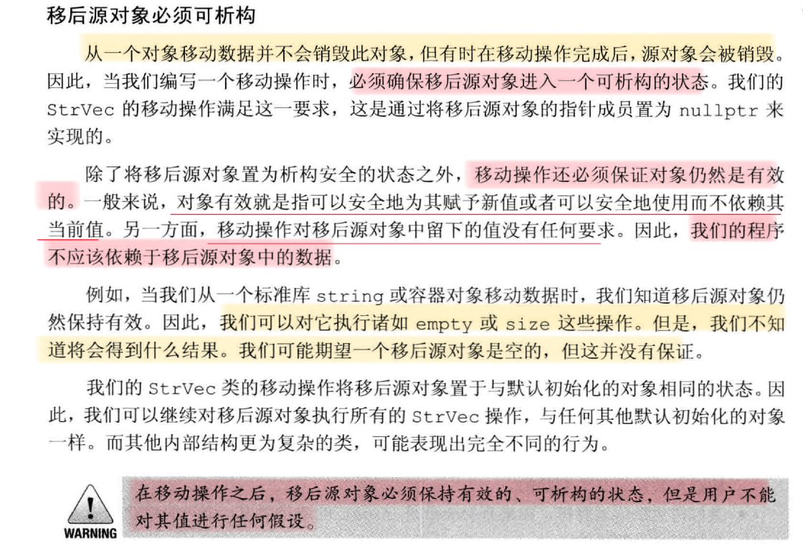
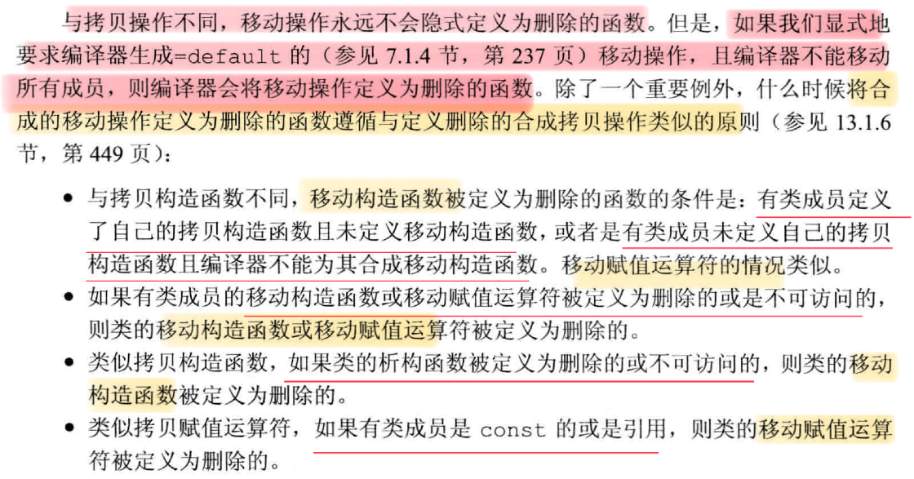
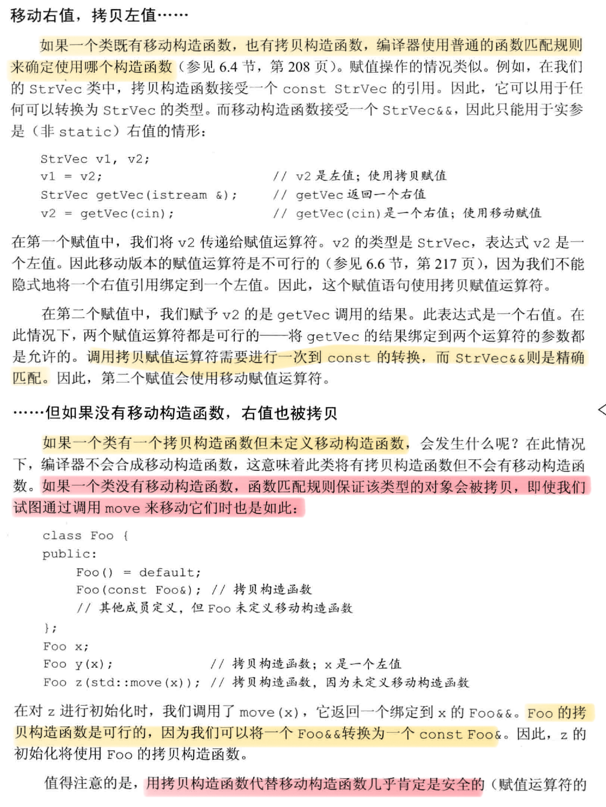

# 对象移动
## 右值引用



## 右值引用的一篇文章讲解
https://zhuanlan.zhihu.com/p/335994370
右值引用可以指向右值，不能指向左值，右值引用的标志为`&&`

### 利用 ```std::move``` 使右值引用指向左值
```cpp
int a = 5; // a是个左值
int &ref_a_left = a; // 左值引用指向左值
int &&ref_a_right = std::move(a); // 通过std::move将左值转化为右值，可以被右值引用指向
 
cout << a; // 打印结果：5
```
```std::move```是一个非常有迷惑性的函数，不理解左右值概念的人们往往以为它能把一个变量里的内容移动到另一个变量，但事实上```std::move```移动不了什么，唯一的功能是把左值强制转化为右值，让右值引用可以指向左值。其实现等同于一个类型转换：`static_cast<T&&>(lvalue)`。 所以，单纯的```std::move(xxx)```不会有性能提升。

同样的，右值引用能指向右值，本质上也是把右值提升为一个左值，并定义一个右值引用通过`std::move`指向该左值：
 ```cpp
int &&ref_a = 5;
ref_a = 6; 
 
等同于以下代码：
 
int temp = 5;
int &&ref_a = std::move(temp);
ref_a = 6;
 ```

### 左值引用、右值引用本身是左值还是右值？
被声明出来的左、右值引用都是左值。 因为被声明出的左右值引用是有地址的，也位于等号左边。

右值引用既可以是左值也可以是右值，如果有名称则为左值，否则是右值。

或者说：作为函数返回值的 `&&` 是右值，直接声明出来的 `&&` 是左值。 这同样也符合对左值，右值的判定方式：其实引用和普通变量是一样的，`int &&ref = std::move(a)`和 `int a = 5`没有什么区别，等号左边就是左值，右边就是右值。

最后，从上述分析中我们得到如下结论：

- 从性能上讲，左右值引用没有区别，传参使用左右值引用都可以避免拷贝。
- 右值引用可以直接指向右值，也可以通过std::move指向左值；而左值引用只能指向左值(const左值引用也能指向右值)。
- 作为函数形参时，右值引用更灵活。虽然const左值引用也可以做到左右值都接受，但它无法修改，有一定局限性。

#### 右值引用和std::move的应用场景
1. 实现移动语义，避免深拷贝

#### 完美转发 `std::forward`
和`std::move`一样，它的兄弟`std::forward`也充满了迷惑性，虽然名字含义是转发，但他并不会做转发，同样也是做类型转换.

与move相比，forward更强大，move只能转出来右值，forward都可以。

> `std::forward<T>(u)`有两个参数：`T`与 `u`。
a. 当T为左值引用类型时，u将被转换为T类型的左值； 
b. 否则u将被转换为T类型右值。

## 移动构造函数和移动赋值运算符
1. 因为移动操作窃取数据，它通常不分配资源，因此通常不会抛出异常。使用`noexcept`通知标准库，承诺函数不会抛出异常。noexcept出现在参数列表和初始化列表开始的冒号之间。必须在类头文件的声明和定义（如果定义在类外）中都指定`noexcept`。
2. 不抛出异常的移动构造函数和移动赋值运算符必须标记为`noexcept`。这样做是为了使标准库容器使用移动构造函数而不是拷贝构造函数
### 移动构造函数
 ```cpp
 HasPtr(HasPtr&& hp) noexcept;
 ```
### 移动构造函数
 ```cpp
HasPtr & HasPtr::operator=(HasPtr &&rhs) noexcept
{
	if (this != &rhs) {
		if (--*use == 0) {   // 释放已有资源
			delete ps;
			delete use;
		}
		ps = rhs.ps;         // 从rhs接管资源
		i = rhs.i;
		use = rhs.use;
		ps = 0; use = 0; // 将rhs置于可析构状态
	}
	return *this;
}
 ```
### 移动后的源对象必须可析构

### 合成的移动操作
1. 如果一个类没有移动操作，通过正常的函数匹配，会使用对应的拷贝操作代替移动操作。
2. 只有当一个类没有定义任何自己版本的拷贝控制成员，且类的每个非静态成员均可移动时，编译器才会生成合成的移动构造函数和移动赋值运算符。(当对移动构造函数或移动赋值运算符使用=default时，且不会因为下图中的条例被删除时，则无论有没有定义拷贝操作，都会生成合成的移动操作函数)
3. 定义了一个移动构造函数或移动赋值运算符的类，也必须定义拷贝操作，否则合成的拷贝构造函数和拷贝赋值运算符会被定义为删除的。



### 移动左值，拷贝右值


### 移动迭代器
调用`make_move_iterator`函数将一个普通迭代器转换为一个移动迭代器。移动迭代器的解引用返回一个右值引用。
 ```cpp
	auto p = uninitialized_copy(
		make_move_iterator(v.begin()), 
		make_move_iterator(v.begin()),
		first); 
        // make_move_iterator(v.begin())返回一个右值引用，因此construct使用移动构造函数来构造元素。
;
 ```

### 谨慎使用std:move
在移动构造函数和移动赋值运算符这些类实现代码外的地方，只有当确信需要进行移动操作且移动操作是安全的时候，才能使用std::move。

### 右值引用与成员函数
允许移动的成员函数的参数模式：一个版本接受一个指向const的左值引用(const T&)，另一个版本接受指向非const的右值引用(T&&)。
#### 左值/右值引用成员函数
通常，在对象上调用成员函数，不管该对象是左值还是右值。有时需要阻止对右值对象进行赋值，这时，我们使用引用限定符(`&`或`&&`)来指出this指针的左值/右值属性。

引用限定符只能用于非静态成员函数，且必须同时出现在函数的声明和定义中.

对于`&`限定的函数，只能用于左值。对于`&&`限定的函数，只能用于右值。

一个函数可以同时用const和引用限定，引用限定符必须跟在const后面。
 ```cpp
Screen function() const &{};
 ```
#### 重载和引用函数
可以综合const和引用限定符来区分一个成员函数的重载版本。

如果定义两个或以上的具有相同名字和相同参数列表的成员函数，就必须对所有函数加上引用限定符，或者都不加。