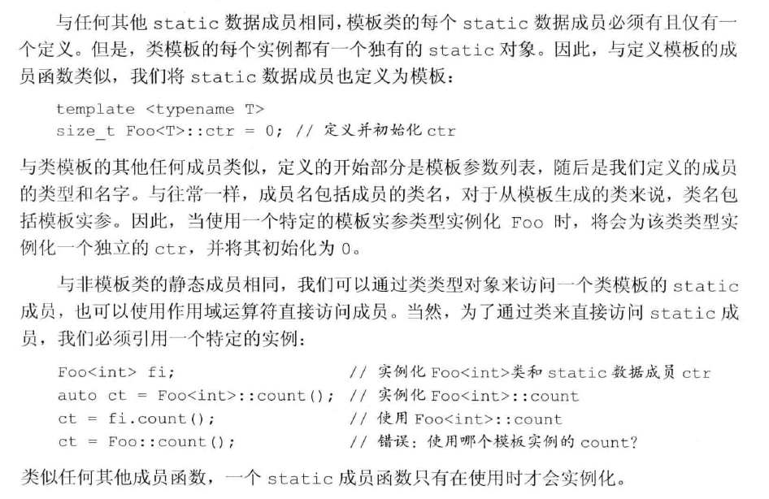
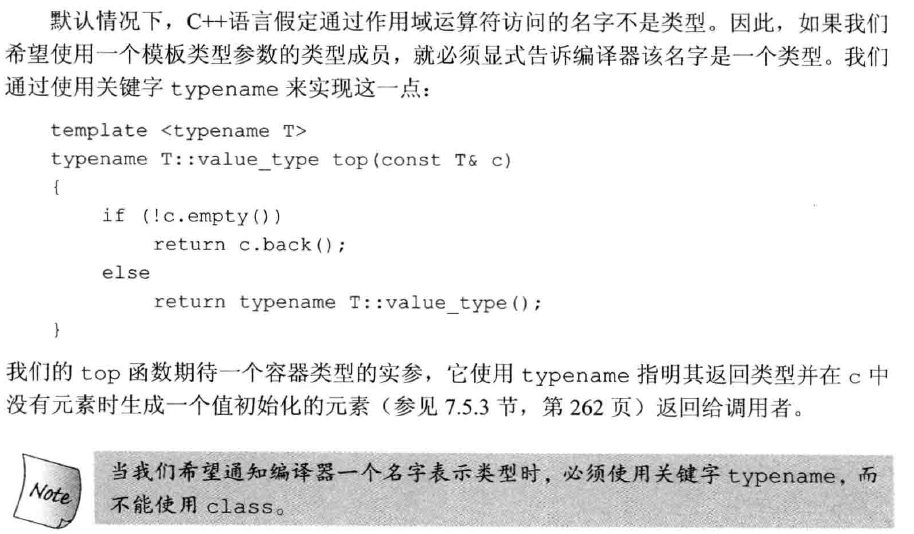
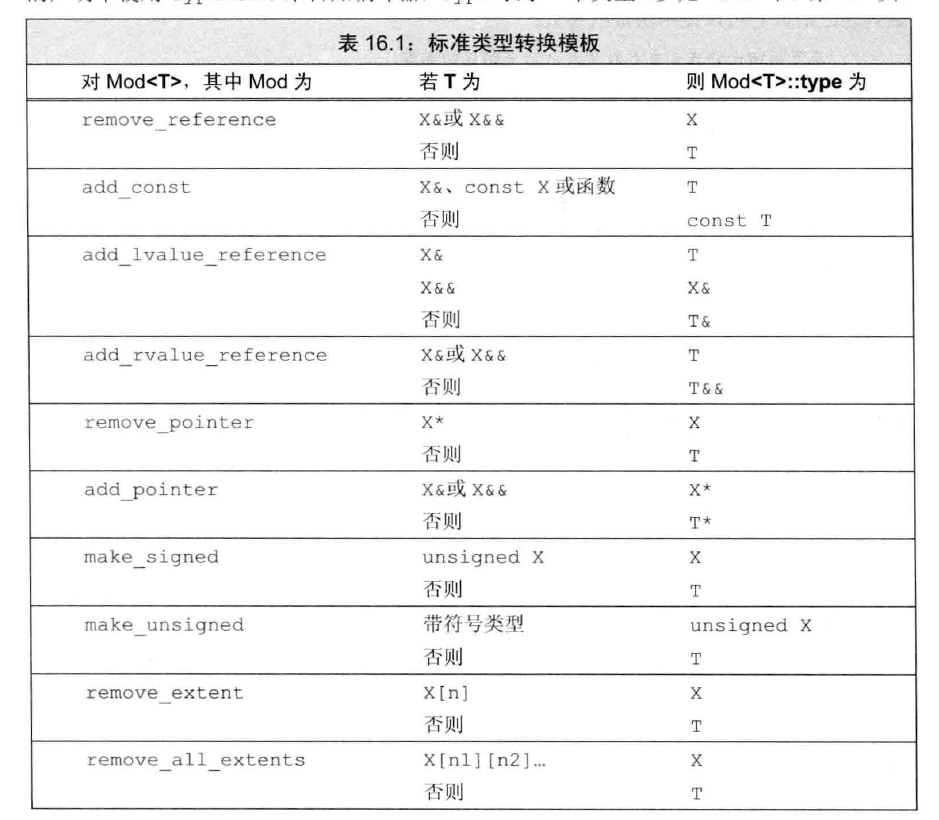
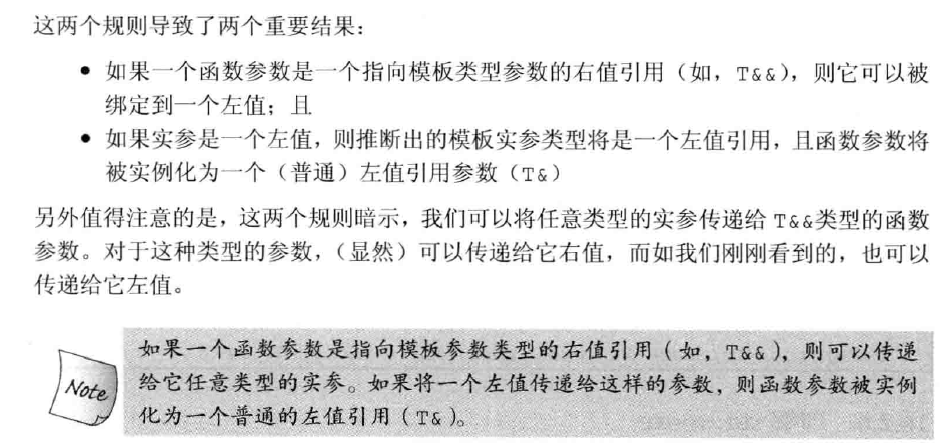
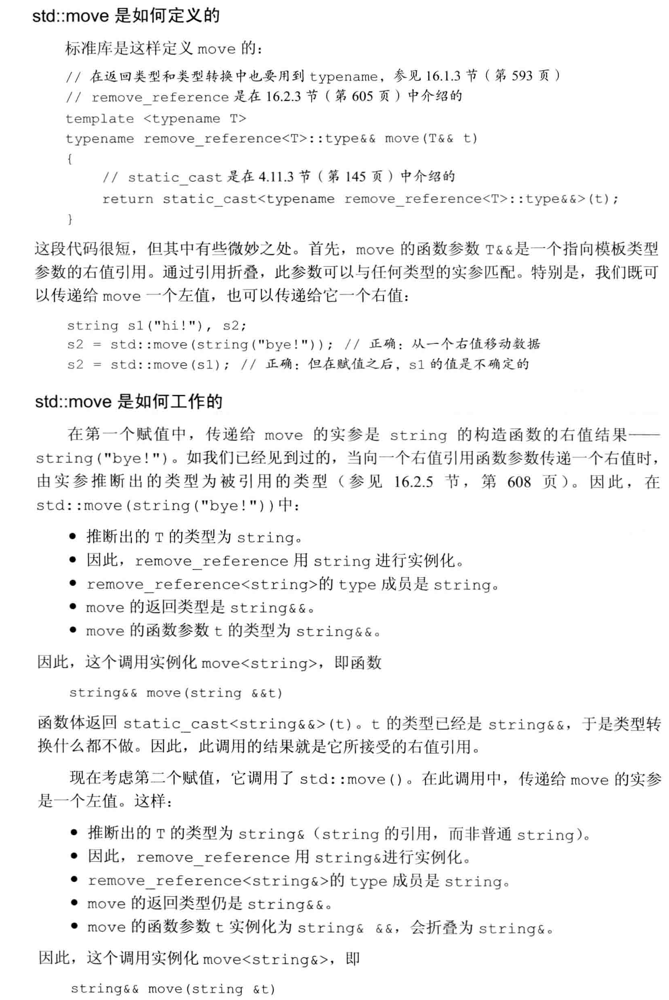
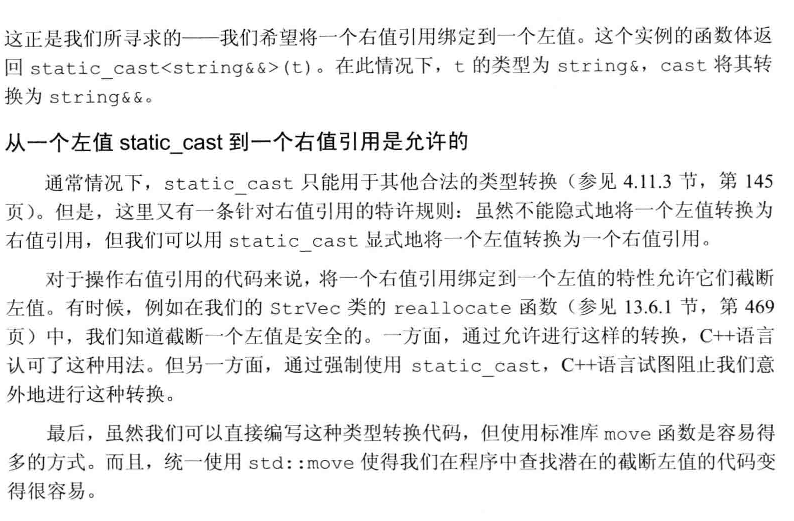
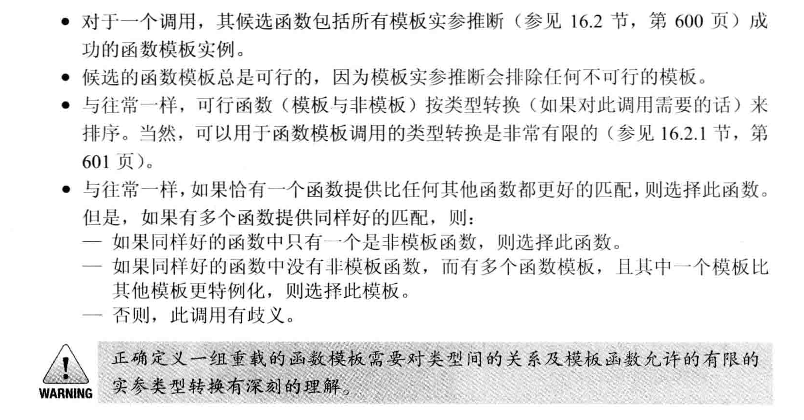
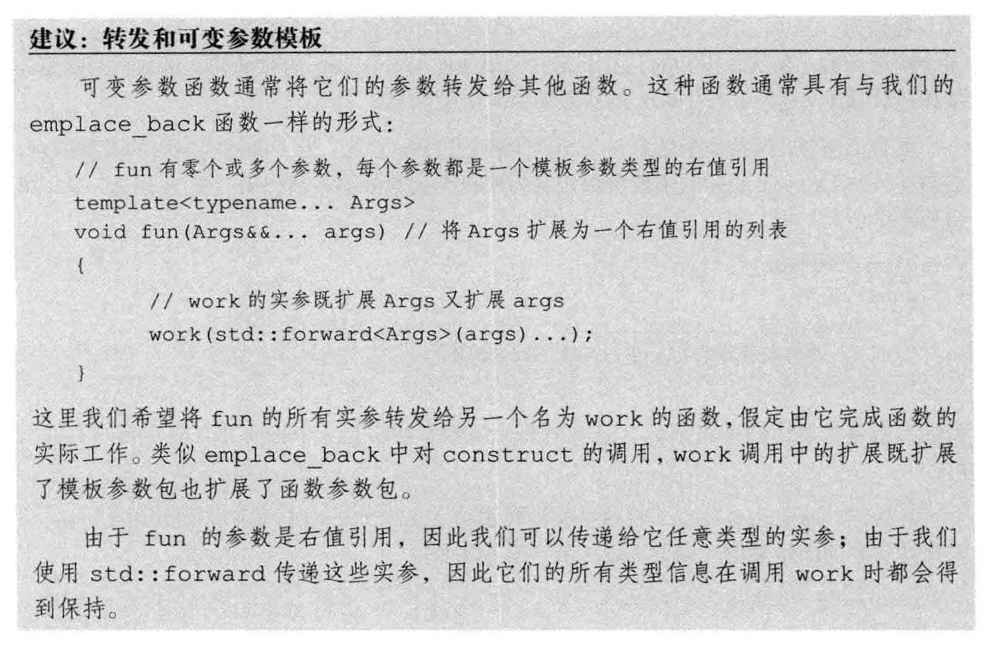

# 模板与泛型编程
模板是泛型编程的基础，一个模板是一个创建类或函数的蓝图或者说公式。我们提供足够的信息，将蓝图转为特定的类或函数，这种转换发生在编译时。
## 定义模板
### 函数模板
一个函数模板就是一个公式，可以用来生成特定类型的函数版本。
模板定义以关键字`template`开始，后跟一个**模板参数列表**（template parameter list），这是一个逗号分隔的一个或多个**模板参数**（template parameter）的列表，用小于号（<）和大于号（>）包围起来。在模板定义中，**模板参数列表不能为空。**
```cpp
template <typename T>
int compare(const T &v1, const T &v2)
{
    if (v1 < v2)
        return -1;
    if (v2 < v1)
        return 1;
    return 0;
}
```

模板参数列表的作用很像函数参数列表。函数参数列表定义了若干特定类型的局部变量，但并未指出如何初始化它们。在运行时，调用者提供实参来初始化形参。
类似的，模板参数表示在类或函数定义中用到的类型或值。当使用模板时，我们（隐式地或显式地）指定**模板实参**（template argument），将其绑定到模板参数上。

#### 实例化函数模板
编译器用推断出的模板参数来为我们**实例化**（instantiate）一个特定版本的函数。当编译器实例化一个模板时，它使用实际的模板实参代替对应的模板参数来创建出模板的一个新“实例”。

#### 模板类型参数
我们的compare函数有一个模板**类型参数**（type parameter）。一般来说，我们可以将类型参数看作类型说明符，就像内置类型或类类型说明符一样使用。特别是，类型参数可以用来指定返回类型或函数的参数类型，以及在函数体内用于变量声明或类型转换：
```cpp
// 正确：返回类型和参数类型相同
template <typename T>
T foo(T *p)
{
    T tmp = *p; // tmp的类型将是指针p指向的类型
    //...
    return tmp;
}
```
类型参数前必须使用关键字class或typename。

#### 非类型模板参数
除了定义类型参数，还可以在模板中定义**非类型参数**（nontype parameter）。一个非类型参数表示一个值而非一个类型。我们通过一个特定的类型名而非关键字class或typename来指定非类型参数。
```cpp
template<unsigned N, unsigned M> 
int compare(const char (&p1)[N], const char (&p2)[M])
{
	cout << "compare(const char arrays)" << "\t";

	return strcmp(p1, p2);
}
```
一个非类型参数可以是一个整型，或者是一个指向对象或函数类型的指针或（左值）引用。**绑定到非类型整型参数的实参必须是一个常量表达式。绑定到指针或引用非类型参数的实参必须具有静态的生存期**我们不能用一个普通（非static）局部变量或动态对象作为指针或引用非类型模板参数的实参。指针参数也可以用nullptr或一个值为0的常量表达式来实例化。

在模板定义内，模板非类型参数是一个常量值。在需要常量表达式的地方，可以使用非类型参数，例如，指定数组大小。

#### inline和constexpr的函数模板
函数模板可以声明为inline或constexpr的，如同非模板函数一样。inline或constexpr说明符**放在模板参数列表之后，返回类型之前**。

#### 模板编译
当编译器遇到一个模板定义时，它并不生成代码。只有当我们实例化出模板的一个特定版本时，编译器才会生成代码。当我们使用（而不是定义）模板时，编译器才生成代码。

为了生成一个实例化版本，编译器需要掌握函数模板或类模板成员函数的定义。因此，与非模板代码不同，模板的头文件通常既包括声明也包括定义。

用来实例化模板的所有函数、类型以及与类型相关联的运算符的声明都必须是可见的。

编译器报告错误的三个阶段：
1. 编译模板本身时；
2. 编译器遇到模板使用时；
3. 模板实例化时

### 类模板
类模板（class template）是用来生成类的蓝图的。与函数模板的不同之处是，编译器不能为类模板推断模板参数类型。为了使用类模板，我们必须在模板名后的尖括号中提供额外信息用来代替模板参数的模板实参列表。

类模板以关键字`template`开始，后跟模板参数列表。

#### 实例化类模板
当使用类模板时，必须提供**显式模板实参**列表，它们被绑定到模板参数，编译器使用这些模板实参来实例化出特定的类。

#### 类模板的成员函数
与其他任何类相同，我们既可以在类模板内部，也可以在类模板外部为其定义成员函数，且定义在类模板内的成员函数被隐式声明为内联函数。

类模板的成员函数本身是一个普通函数。但是，类模板的每个实例都有其自己版本的成员函数。因此，类模板的成员函数具有和模板相同的模板参数。因而，定义在类模板之外的成员函数就必须以关键字`template`开始，后接类模板参数列表。

与往常一样，当我们在类外定义一个成员时，必须说明成员属于哪个类。而且，从一个模板生成的类的名字中必须包含其模板实参。当我们定义一个成员函数时，模板实参与模板形参相同。
即，对于strBlob的一个给定的成员函数`return_type StrBlob::member_name（parm_list）`
对应的Blob的成员应该是这样的：
```cpp
template <typename T>
return_type Blob<T>::member_name（parm_list）
```

默认情况下，对于一个实例化的类模板，其成员只有在使用时才被实例化。

#### 使用模板类名
1. 在类模板自己的作用域中，我们可以直接使用模板名而不提供实参。

#### 类模板和友元
当一个类包含一个友元声明时，类与友元各自是否是模板是相互无关的。如果一个类模板包含一个非模板友元，则友元被授权可以访问所有模板实例。如果友元自身是模板，类可以授权给所有友元模板实例，也可以只授权给特定实例。

1. 类模板与另一个（类或函数）模板间友好关系的最常见的形式是建立对应实例及其友元的友好关系。
2. 一个类可以将另一个模板的每个实例都声明为自己的友元，或限定特定的实例为友元。为了让所有实例都成为友元，友元声明必须使用与类模板本身不同的模板参数。
3. 可以将模板参数声明为友元。

Tips: 如果将模板的特定实例化声明为普通类或类模板的友元，则需要前置声明。如果将模板的所有实例声明为普通类或类模板的友元，则不需要前置声明。如果将普通类声明为类模板的友元，也不需要前置声明。

#### 模板类型别名
```cpp
typedef Blob<string> StrBlob; //引用一个实例化的类

template<typename T> using twin = pair<T, T>; //twin为成员类型相同的pair的类型名
twin<double> area;
twin<int> win_loss;
 
template <typename T> using partNo = pair<T, unsigned>; //固定一个模板参数
 ```

#### 类模板的static成员
与其他类相同，类模板可以声明static成员。


### 模板参数
1. 模板参数会隐藏外层作用域中声明的相同名字，但在模板内不能重用模板参数名。
2. 与函数参数相同，声明中的模板参数不必与定义中相同。

#### 使用类的类型成员


```cpp
typedef typename std::vector<T>::size_type size_type;
// typedef创建了存在类型的别名，而typename告诉编译器std::vector<T>::size_type是一个类型而不是一个成员。
 ```

#### 默认模板实参
我们可以提供为函数模板和类模板默认模板实参。
对于一个模板参数，只有当它右侧的所有参数都有默认实参时，它才可以有默认实参。
```cpp
template <typename T, typename F = less<T>> 
int compare(const T &v1, const T &v2, F f = F()) 
{
	if (f(v1, v2)) return -1;
	if (f(v2, v1)) return 1;  
	return 0;
}
 ```

如果一个类模板为其所有模板参数都提供了默认实参，且我们使用这些实参，就必须在模板名后跟一个空的尖括号对。

### 成员模板
一个类可以包含本身是模板的成员函数，这种成员叫做**成员模板**，成员模板不能是虚函数。
#### 普通非模板类的成员函数
```cpp
class DebugDelete {
public:
	DebugDelete(const std::string &s = "unique_ptr",
                std::ostream &strm = std::cerr): os(strm), type(s) { }
	template <typename T> void operator()(T *p) const 
	  { os << "deleting " << type << std::endl; delete p; }
private:
	std::ostream &os;  // where to print debugging info
	std::string type;  // what type of smart pointer we're deleting
};
 ```

 #### 类模板的成员模板
```cpp
template <typename T>
class Blob
{
    template <typename It>
    Blob(It b, It e);
};
template <typename T>
template <typename It>
Blob<T>::Blob(It b, It e) {}
 ```

### 控制实例化
我们可以通过**显式实例化**来避免相同的实例出现在多个对象文件中，其形式如下：
```cpp
extern template declaration; // 实例化的声明
template declaration; // 实例化的定义
//  declaration是类或函数声明
// 定义和声明通常不在一处
 ```
 1. 对于每个实例化声明，在程序某个位置必须有其显示的实例化定义。
 2. 在一个类模板的实例化定义中，所用类型必须能用于模板的所有成员函数。

## 模板实参推断
从函数实参来确定模板实参的过程被称为**模板实参推断**，编译器使用函数调用中的实参类型来寻找模板实参，用这些模板实参生成的函数版本与给定的函数调用最为匹配。
### 类型转换
1. 只有以下几种类型转换会自动的应用于这些实参：const转换、数组或函数指针转换。
2. 算术转换、派生类向基类的转换、用户定义的转换不能用于函数模板。
3. 如果函数参数类型不是模板参数，则对进行正常的类型转换。
### 函数模板显式实参
我们提供显式模板实参为：显示模板实参在尖括号中给出，位于函数名之后，实参列表之前。

显式模板实参按由左至右的顺序与对应的模板参数匹配；第一个模板实参与第一个模板参数匹配，第二个实参与第二个参数匹配，依此类推。只有尾部（最右）参数的显式模板实参才可以忽略，而且前提是它们可以从函数参数推断出来。

对于用普通类型定义的函数参数，允许进行正常的类型转换，出于同样的原因，对于模板类型参数已经显式指定了的函数实参，也进行正常的类型转换。

### 尾置返回类型与类型转换
```cpp
template <typename It>
auto fcn1(It beg, It end) -> decltype(*beg)
{
	//处理序列
	return *beg;
}

template <typename It>
auto fcn2(It beg, It end) -> typename remove_reference<decltype(*beg)>::type
{
	//处理序列
	return *beg;
}
 ```


### 函数指针和实参推断
当用一个函数模板初始化一个函数指针或为一个函数指针赋值时，编译器使用指针的类型来推断模板实参。

当参数是一个函数模板实例的地址时，程序上下文必须满足：对每个模板参数，能唯一确定其类型或值。

### 模板实参推断和引用
```cpp
template <typename T> void f(T &p);
 ```
当函数参数p是模板参数T的一个引用时，编译器会应用正常的引用绑定规则：const是底层的，不是顶层的。
#### 从左值引用函数参数推断类型
当一个函数参数是模板类型参数的一个普通（左值）引用时, 绑定规则告诉我们，只能传递给它一个左值（如，一个变量或一个返回引用类型的表达式）。实参可以是const类型，也可以不是。如果实参是const的，则T将被推断为const类型。

如果一个函数参数的类型是`const T&`, 正常的绑定规则告诉我们可以传递给它任何类型的实参 —— 一个对象(const或非const) 、一个临时对象或是一个字面常量值。当函数参数本身是const 时， T的类型推断的结果不会是一个const 类型。

```cpp
int i=0;
const int ci=0;
template <typename T> void f(T &p);
f(i); // T为int
f(ci); // T为const int
f(5); // 错误，实参必须是左值

template <typename T> void f1(const T &p);
f(i); // T为int
f(ci); // T为int
f(5); // const&参数可以绑定到一个右值，T为int
 ```
#### 从右值值引用函数参数推断类型
```cpp
template <typename T> void f2(T &&p);
f(5); // 实参是int类型的右值，T为int
 ```
#### 引用折叠和右值引用参数
通常我们不能将一个右值引用绑定到一个左值上。但是， C++语言在正常绑定规则之外定义了两个例外规则，允许这种绑定。这两个例外规则是move这种标准库设施正确工作的基础。在实际中，右值引用通常用于：模板转发其实参或模板被重载。

第一个例外规则影响右值引用参数的推断如何进行。当我们将一个左值（如i）传递给函数的右值引用参数，且此右值引用指向模板类型参数（如T&&）时，编译器推断模板类型参数为实参的左值引用类型。

第二个例外绑定规则：**如果我们间接创建一个引用的引用，则这些引用形成了“折叠”**。在所有情况下（除了一个例外），引用会折叠成一个普通的左值引用类型。在新标准中，折叠规则扩展到右值引用。只在一种特殊情况下引用会折叠成右值引用： 右值引用的右值引用。即，对千一个给定类型X:
• X& &、X& &&和X&& &都折叠成类型X&
• 类型X&& &&折叠成X&&

**引用折叠只能应用于间接创建的引用的引用，如类型别名或模板参数。**



### 理解`std::move`


### 转发
某些函数需要将其一个或多个实参连同类型不变地转发给其他函数。在此情况下，我们需要保持被转发实参的所有性质，包括实参类型是否是const的以及实参是左值还是右值。
```cpp
template <typename F, typename T1, typename T2>
void flip(F f, T1 &&t1, T2 &&t2)
{
	f(std::forward<T2>(t2), std::forward<T1>(t1));
	// 与std::move相同，对std::forward不使用using声明是一个好主意。
}
 ```
通过将一个函数参数定义为一个指向模板类型参数的右值引用，我们可以保持其对应实参的所有类型信息。而使用引用参数（无论是左值还是右值）使得我们可以保持const属性，因为在引用类型中的const是底层的。如果我们将函数参数定义为`T1&&`和`T2&&`,通过引用折叠就可以保待翻转实参的左值/右值属性。

**如果一个函数参数是指向模板类型参数的右值引用（如`T&&`）, 它对应的实参的const属性和左值/右值属性将得到保持。**

类似move，forward 定义在头文件utility中。与move不同,forward必须通过显式模板实参来调用。forward返回该显式实参类型的右值引用。即，`forward<T>`的返回类型是`T&&`。

当用于一个指向模板参数类型的右值引用函数参数(`T&&`)时,forward会保持实参类型的所有细节。

## 重载与模板
函数模板可以被另一个模板或一个普通非模板函数重载。与往常一样，名字相同的函数必须具有不同数量或类型的参数。


## 可变参数模板
一个可变参数模板就是一个接受可变数目参数的模板函数或模板类。可变数目的参数被称为参数包。存在两种参数包：模板参数包, 表示零个或多个模板参数；函数参数包, 表示零个或多个函数参数。

我们用一个省略号来指出一个模板参数或函数参数表一个包。在一个模板参数列表中，`class`或`typename`指出接下来的参数表示零个或多个类型的列表；一个类型名后面跟一个省略号表示零个或多个给定类型的非类型参数的列表。在函数参数列表中，如果一个参数的类型是一个模板参数包，则此参数也是一个函数参数包。

与往常一样，编译器从函数的实参推断模板参数类型。对于一个可变参数模板，编译器还会推断包中参数的数目。

`sizeof...` 运算符：可以知道包中有多少元素，返回一个常量表达式。
```cpp
template <typename T, typename... Args>
void foo(const T &t, const Args&... rest){
	cout<<sizeof...(rest);
}
 ```

### 编写可变参数函数模板
```cpp
template <typename T>
void foo(const T &t)
{
	cout<<t;
}

template <typename T, typename... Args>
void foo(const T &t, const Args &...rest)
{
	cout<<t;
	foo(rest...);
}

foo(99,"S",false); //类型不同的可变数目实参
 ```

### 包拓展
对于一个参数包，除了获取其大小外，我们能对它做的唯一的事情就是扩展它。当扩展一个包时，我们还要提供用于每个扩展元素的模式。扩展一个包就是将它分解为构成的元素，对每个元素应用模式，获得扩展后的列表。我们通过在模式右边放一个省略号(`...`)来触发扩展操作。

扩展中的模式会独立地应用于包中的每个元素。

### 转发参数包


## 模板特例化
### 定义函数模板特例化
当我们特例化一个函数模板时，必须为原模板中的每个模板参数都提供实参。为了指出我们正在实例化一个模板，应使用关键字template后跟一个空尖括号对（`＜＞`）。空尖括号指出我们将为原模板的所有模板参数提供实参。

### 函数重载与模板实例化
特例化的本质是实例化一个模板，而非重载它。因此，特例化不影响函数匹配。

为了特例化一个模板，原模板的声明必须在作用域中。而且，在任何使用模板实例的代码之前，特例化版本的声明也必须在作用域中。

模板及其特例化版本应该声明在同一个头文件中。所有同名模板的声明应该放在前面，然后是这些模板的特例化版本。

### 类模板实例化
对标准库hash模板进行特例化：详见*C++ primer 5th P627*
### 类模板部分实例化
与函数模板不同， 类模板的特例化不必为所有模板参数提供实参。我们可以只指定一部分而非所有模板参数，或是参数的一部分而非全部特性。一个类模板的部分特例化本身是一个模板，使用它时用户还必须为那些在特例化版本中未指定的模板参数提供实参。

**我们只能部分特例化类模板，而不能部分特例化函数模板。**

由于一个部分特例化版本本质是一个模板，与往常一样，我们首先定义模板参数。类似任何其他特例化版本，部分特例化版本的名字与原模板的名字相同。对每个未完全确定类型的模板参数，在特例化版本的模板参数列表中都有一项与之对应。在类名之后，我们为要特例化的模板参数指定实参，这些实参列于模板名之后的尖括号中。这些实参与原始模板中的参数按位置对应。

### 特例化成员而不是类
我们可以只特例化特定成员函数而不是特例化整个模板。