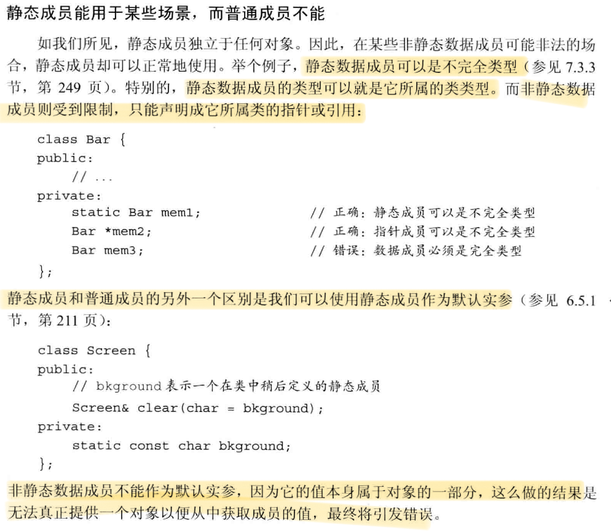

# C++面向对象
## 类的基础用法
### 类的声明
 ```cpp
class Screen; // 类的前向声明，定义前是不完全类型
 ```
不完全类型只能：定义指向这种类型的指针或引用，声明（但不能定义）以不完全类型作为参数或返回类型的函数
### this指针
1. 成员函数通过叫做this的隐式参数来访问调用它的对象。当调用一个成员函数时，使用请求该函数的对象地址初始化this。this形参是隐式定义的，在成员函数中自定义名为this的参数或变量是非法的。
2. 在成员函数内部访问对象的成员时，无需成员访问符，因为this所指的正是这个对象。任何对类成员的直接访问都会被看做this的隐式引用。
3. 默认情况下，this类型是**指向类类型非常量版本的常量指针**(`class_name *const this`, 顶层const)。因此不能赋予this指针一个常量对象，这导致不能在常量对象上调用非常量成员函数。
4. const成员函数（常量成员函数）：紧跟在参数列表后的const表示this是一个指向常量的指针(例如：`string SalesData::isBookNum(int n) const;`)，此时，this指针的类型是**指向类类型常量版本的常量指针**(`const class_name *const this`, 既是顶层const，也是底层const)。因为，this指向常量，因此常量成员函数不能修改它的对象的内容。**常量对象、常量对象的引用或指针都只能调用常量成员函数**（不能把底层const指针赋给非常量指针），而非常量对象即可调用常量成员函数，也可调用普通成员函数。
### 构造函数
1. 构造函数可以有多个，但参数数量或类型必须有所区别。
2. 默认构造函数：类通过它来控制默认初始化过程，它无需任何实参。编译器创建的默认构造函数(未定义构造函数的时候才会创建)被称作合成的默认构造函数。对于一个普通的类，必须定义它的默认构造函数。如果我们需要默认的初始化行为，则在参数列表后面写上`=default`来要求编译器生成构造函数。
3. 如果成员是const、引用或属于某种未提供默认构造函数的类类型，则**必须通过构造函数初始化列表**进行初始化。
4. 成员初始化顺序与它们在类定义中出现的顺序一致。构造函数初始化列表中的顺序不会影响实际初始化的顺序。
5. 如果一个构造函数未所有参数都提供默认实参，则它实际上也定义了默认构造函数。此时再定义其他默认构造函数，编译器报错：多个默认构造函数。
6. 委托构造函数：使用所在类的其他构造函数执行它自己应做的初始化过程。委托构造函数的初始化列表只有一个唯一的入口：类名本身。
#### 默认构造函数的作用

### 类的静态成员

#### 声明
在成员的声明前加上关键字`static`，使其与类关联在一起。

类的静态成员存于对象之外，对象中不包含与静态数据成员有关的数据。静态成员函数也不与对象绑定在一起，也**不包含this指针**，因此其不能声明为const的，也不能在函数体中使用this指针（对调用成员函数的隐式使用也有效）。因此也不能使用类内非静态成员。
#### 使用
使用作用域运算符直接访问静态成员。
 ```cpp
double r;
r = Account::rate();
 ```
也可以使用类的对象、引用或指针访问静态成员。
#### 定义
既可以在类内，也可以在类外定义静态成员函数。在类外定义时，不能重复使用static关键词，它只能出现在类内的声明中。

静态数据成员不属于任何对象，因此它不是由类的构造函数初始化的。一般来说，不能在类内初始化它。必须在类的外部定义和初始化每个静态数据成员。和其他对象一样，一个静态数据成员只能定义一次。

与全局变量类似，静态数据成员定义在任何函数之外。因此它们的生命周期为整个程序。
 ```cpp
double Account::interestRate = initRate(); // 定义并初始化一个静态成员
 ```

上文说过：一般来说，不能在类内初始化它。但是，可以为静态成员提供**const整数类型**的类内初始化，但静态成员必须是字面值常量类型的constexpr。初始值必须是常量表达式。
C++ primer 5th P271：**即使一个常量静态数据成员在类内被初始化了，也应在类外定义一下该成员，但不能再指定一个初始值**（一个静态数据成员只能定义一次）。
 ```cpp
static constexpr int period = 30; // period是常量表达式
static const int period = 30; // 与上一行同义

constexpr int Account::period; // 在类外定义，防止错误
 ```

### 类的作用域
类的定义过程：1. 首先，编译成员的声明； 2. 直到类全部可见后才编译函数体。
因此，成员函数可以使用类中定义的任何名字。但上面的规则只适用成员函数体中的使用的名字。声明中使用的名字（返回类型、参数类型）都必须保证在使用前可见。

在类中，成员如果使用外层作用域的某个名字，且该名字代表一种类型(例如: `typdef double Money`),则类不能在之后重新定义该名字。

成员函数中使用的名字解析过程：
1. 在成员函数内查找该名字的声明。只有在**函数使用之前**的声明才被考虑。
2. 若未找到，则：在类内的所有成员中查找。
3. 若未找到，则：在**成员函数定义之前**的作用域查找。（当成员函数定义在类外时，不仅要考虑类定义之前的全局作用域中的声明，还要考虑在成员函数定义之前的全局作用域中的声明）
### 友元
1. 令其他类或函数称为一个类的友元，则它们可以访问该类的非公有成员。使用方法为：在函数声明前加上`friend`关键字。
2. 友元声明只能出现在类定义的内部。友元不受访问控制级别的约束。友元在类内声明后，还应在类外专门再对函数进行一次声明。因为，类中的友元声明仅仅影响访问权限，并非真正的声明。
3. 重载函数的名字相同，但它们是不同的函数，因此需要分别对其进行友元声明。
4. 友元函数能定义在类的内部，它是隐式内联的。但即便如此，也需要在类外声明该函数（在声明前，该函数无法被调用，但在类的内部的作用域中是可见的，详见C++ primer 5th P252）
### 其他特性
1. 类可以自定义某个类型在类中的别名（`typedef, using`），同时类型名字和其他成员一样存在访问限制，可以是public或private。
2. 可变数据成员：在变量的声明中加入`mutable`关键字。它永远不会是const，即使它是const对象的成员。因此，一个const成员函数可以改变一个可变成员的值。
3. 类内初始化时，只能用`=`或`{}`，不能使用`()`。
4. 当const成员函数返回自身的this指针时，函数的返回值应为**常量引用**（`const class_name &func() const{};`,注意第一个const与&）
5. 通过区分成员函数是否为const的，可以对其进行重载（因为this是隐藏的形参，const成员函数的指针是顶层和底层const，可以进行区分）。
### 隐式的类类型转换
如果构造函数只接受一个实参，则它实际上定义了转换为此类类型的隐式转换机制，有时把这类构造函数称作转换构造函数。


因为string类可以接受const char*类型的值来进行拷贝初始化，而vector不接受一个int类型的值来进行拷贝初始化。
### 聚合类与字面值常量类
C++ primer 5th P266-268

## 拷贝控制
### 拷贝构造函数
拷贝构造函数：一个构造函数的第一个参数是自身类型的引用，且其他参数都有默认值。因为会在几种情况下被隐式使用，它不应该是`explicit`的。
 ```cpp
class Foo {
public:
	Foo() = default;  
	Foo(const Foo&); 
};
 ```
1. 即使定义了其他构造函数，编译器也会合成一个拷贝构造函数。除了某些类，编译器从给定对象中依次将每个非静态成员拷贝到正在创建的对象中。  
2. 对于内置指针类型，合成的拷贝构造函数只会浅拷贝，即两个指针指向同一内存空间，这会导致析构时可能出现重复删除同一块内存区域的错误，详见三五准则。
### 拷贝赋值运算符
 ```cpp
class Foo {
public:
	Foo() = default;  
	Foo& operator=(const Foo&); 
};
 ```
1. 如果没有定义拷贝赋值函数，编译器会生成合成拷贝赋值函数。除了某些类，编译器会将右侧运算对象的每个非静态成员赋予左侧运算对象的对应成员，这一工作是通过成员类型的拷贝赋值运算符来完成的。合成拷贝赋值运算符返回一个指向其左侧运算对象的引用。

### 析构函数
析构函数的名字由波浪号接类名构成，没有返回值，不接受参数。
 ```cpp
class Foo {
public:
	Foo() = default;  
	~Foo(); 
};
 ```


1. 析构函数释放对象使用的资源，并销毁对象的非静态数据成员。
2. 在一个析构函数中，先执行函数体，然后销毁成员，成员按初始化顺序的**逆序**销毁。
3. 隐式销毁内置指针类型的成员不会delete它指向的对象。
4. 当指向一个对象的引用或指针离开作用域时，析构函数不会执行。
### 三/五法则
**1. 需要析构函数的类也需要拷贝和赋值操作。
1. 需要拷贝操作的类也需要赋值操作，反之同理。但需要拷贝构造函数或拷贝赋值运算符都不意味着需要析构函数。
2. 一般来说，如果一个类定义了任何一个拷贝操作，它就应该定义所有五个操作。**
### =default
将拷贝控制成员定义为`=default`来显示要求编译器生成合成的版本，只能对具有合成版本的成员函数使用。
### =delete
1. 在函数的参数列表后加上`=delete`指出我们将它定义为删除的。删除的函数不能以任何方式使用。
2. 与`=default`不同，`=delete`必须出现在函数第一次声明的时候。
3. 与`=default`不同，`=delete`可以对任意函数使用。
4. 析构函数不能被删除，否则将无法销毁此类型的对象。对于删除析构函数的类型，不能定义该类型的变量或成员，可以动态分配该类型的对象，但不能释放它们。
5. 合成的拷贝控制函数可能是被删除的。本质上，当不可能拷贝、赋值或销毁类的成员时，类的合成拷贝控制函数就被定义为删除的，详见C++ primer 5th P450-451，P476

### 资源管理
通常，管理类外资源的类必须定义拷贝控制函数（三五法则）。定义拷贝操作有两种选择：使类的行为像一个值或一个指针。
#### 类行为像一个值
1. 类有自己的状态，当拷贝一个类时，副本与原对象是完全独立的。改变副本不会影响原对象，反之同理。
2. 赋值运算符通常组合析构函数和拷贝构造函数的操作。操作应按正确顺序执行（**先拷贝右侧对象到一个局部临时对象中，再释放左侧对象的现有成员，最后将局部临时对象拷贝到左侧对象的成员中**），以确保一个对象赋予自身或发生异常时，左侧对象始终在有意义的状态。
#### 类行为像一个指针
1. 类共享状态，当拷贝一个类时，副本和原对象使用相同的底层数据（底层数据的地址相同）。改变副本会改变原对象，反之同理。
2. 使用shared_ptr管理类中的资源，或使用引用计数来直接管理资源。
### swap操作
1. 每个swap调用都应是不加限定的，即不使用`std::swap(a,b)`，而是直接使用`swap(a,b)`
2. 使用拷贝并交换的赋值运算符自动处理了赋值情况且天然就是异常安全的。此时的拷贝赋值运算符的参数不是一个引用，以进行拷贝。

## 类成员指针
```cpp
// 演示用类
class Screen {
public:
    typedef std::string::size_type pos;
    char get_cursor() const { return contents[cursor]; }       
	char get() const;
	char get(pos ht, pos wd) const;
private:
    pos cursor = 0;
    pos height = 0, width = 0;
    std::string contents;
};
 ```
### 成员指针的的定义
**成员指针**是可以指向类的非静态成员的指针。静态成员的指针与普通指针一样。

成员指针的类型囊括了类的类型与成员的类型。初始化时，令其指向类的成员，但不指定所属的对象；直到使用它时，才提供成员所属的对象。
```cpp

const string Screen::*pdata; // 声明，pdata指向常量或非常量Screen对象得到的string成员
pdata = &Screen::contents; // 初始化或赋值时，指定pdata指向contents成员

auto pdata = &Screen::content; //等于上面两句的效果
 ```
### 数据成员指针的使用
使用`.*`或`->*`来解引用指针并获得该对象的成员。它们首先解引用成员指针得到所需的成员，再使用成员访问运算符来获取成员。
```cpp
Screen s1,*ps1 = &s1;
auto s = s1.*pdata;
s = ps1->*pdata；
 ```
### 返回数据成员指针的函数
之前使用pdata应在Screen类的成员或友元内部，我们最好定一个函数，令其返回值是指向该成员的指针。
```cpp
class Screen {
public:
    static const string Screen::*data(){
		return &Screen::contents;
	};
};

const string Screen::*pdata = Screen::data();
auto s = s1.*pdata;
 ```
### 成员函数指针
```cpp
auto pmf = &Screen::get_cursor;
 ```
当成员有重载的问题时，必须显式地声明函数类型以明确指出我们想要的哪个函数，如下
```cpp
// 括号必不可少
char (Screen::pmf2)(Screen::pos,Screen::pos) const; // pmf指向含有两个形参的get
pmf2 = &Screen::get();


// 与普通函数指针不同，在成员函数和指向该成员的指针之间不存在自动转换规则
pmf=&Screen::get;
 ```

### 使用成员函数指针
使用`.*`或`->*`作用于指向成员函数的指针，以调用类的成员函数。
```cpp
Screen s1,*ps1 = &s1;
// 括号必不可少，因为函数调用优先级很高
char c1 = (ps1->*pmf)()；
char c1 = (ps1->*pmf2)(0,0)；
 ```
### 使用成员指针的别名
```cpp
using Action = char (Screen::*)(Screen::pos,Screen::pos) const;
Action get = &Screen::get;
 ```
可以将指向成员函数的指针作为其他函数的返回类型或形参类型，形参类型可以有默认形参。

### 将成员函数用作可调用对象
```cpp
// 1. 使用 function
function<bool (const string&)> fcn = &string::empty; 
// 需指明该对象表示的函数类型。
// 如果对象时成员函数，第一个形参必须表示成员在哪个对象上执行的。
// 还必须指明对象是否以指针或引用形式传入。
find_if(v.begin(),v.end(),fcn);

// 2. 使用 mem_fn
find_if(v.begin(),v.end(),mem_fn(&string::empty));
// 它可以从成员指针的类型推断出可调用对象的类型，无需显示指定。
// 它生成的对象可以通过对象调用，也可通过指针调用

// 3. 使用bind
find_if(v.begin(),v.end(),bind(&string::empty, _1));
// 与function类似，如果对象时成员函数，第一个形参必须表示成员在哪个对象上执行的。
// 与mem_fn类似，它生成的对象的第一个实参既可以是string的指针，也可以是string的引用。
 ```