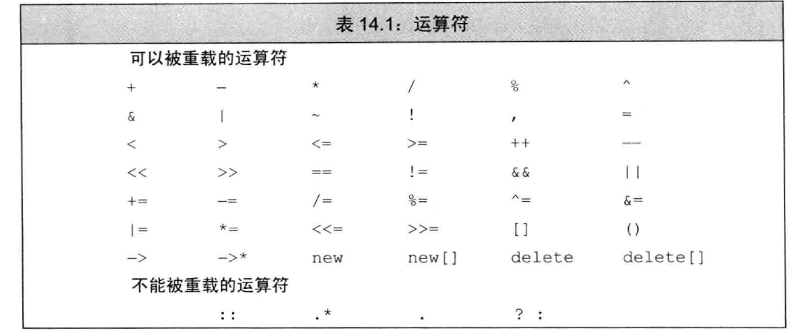
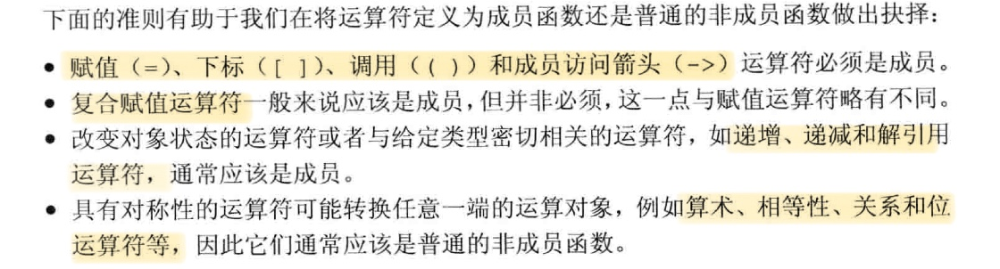
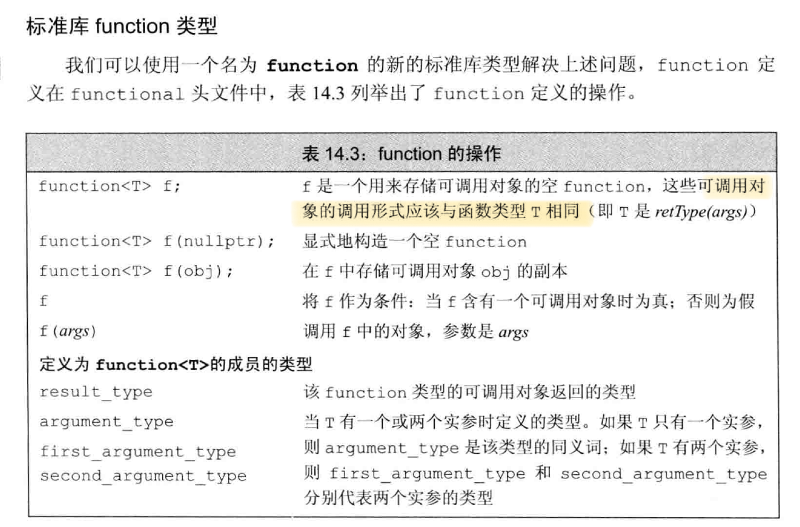

# 重载
## 基本概念

重载运算符函数的参数数量与该运算符作用的运算对象数量一样多。

当一个重载的运算符时成员函数时，this绑定到左侧运算对象，成员运算符函数的显式参数数量比运算对象的数量少一个。

对于一个运算符函数来说，它或者是类的成员，或者至少含一个类类型的参数。

通常情况下，不应该重载逗号、取地址、逻辑与和逻辑或运算符。



## 成员访问运算符
1. 箭头运算符必须是类的成员。重载的箭头运算符必须返回类的指针或自定义了箭头运算符的某个类的对象
2. 箭头运算符部执行任何自己的操作，而是调用解引用运算符并返回解引用结果元素的地址。(`this->operator*()`)

## 函数调用运算符
1. 函数调用运算符必须是成员函数。一个类可以定义多个不同版本的调用运算符，相互之间应该在参数数量或类型上有所区别。
2. 如果类定义了调用运算符，则该类的对象称作函数对象。函数对象通常作为泛型算法的实参。
### lambda是函数对象(C++ primer 5th P508)
1. 当编写lambda后，编译器将该表达式翻译为一个未命名类的未命名对象。
2. 默认情况下，由lambda产生的类中的函数调用符是一个const成员函数。如果lambda被声明为可变的，则调用运算符不是const的。
3. 当使用引用捕获变量时，编译器直接使用引用，而不在类中储存它为数据成员。
4. 当使用值捕获变量时，编译器为每个变量建立数据成员并创建构造函数。构造函数使用捕获的变量的值来初始化数据成员
5. lambda表达式产生的类不含默认构造函数、赋值运算符、默认析构函数。是否含有默认的拷贝/移动构造函数则通常视捕获的数据成员类型而定。

### 可调用对象与function
不同类型可能具有相同的调用形式，调用形式指明了调用返回的类型以及传递给调用的实参类型。例如：`int(int,int)`

可调用的对象：函数、函数指针、lambda表达式、bind创建的对象、重载了函数调用运算符的类。



## 重载、类型转换与运算符
转换构造函数和类型转换运算符共同定义了类类型转换。
### 类型转换运算符
它是类的特殊成员函数，将一个类类型的值转换成其他类型。

不允许转换成数组或者函数类型，但可以转换成指针或者引用类型。

必须将它定义为类的成员函数，不能声明返回类型，形参列表必须为空。通常是const成员函数。
 ```cpp
operator type() const; //type是要转换成的类型
 ```
#### 显式的类型转换运算符
 ```cpp
explicit operator type() const; //编译器不会自动执行这个类型转换
 ```

只有显示的转换才会调用上面的函数，但如果表达式被用作**条件表达式**，显式的类型转换会被隐式的执行。

向bool的类型转换通常在条件部分，因此operator bool一般被定义为explicit的。

### 避免二义性的类型转换
1. 通常情况下，不要为类定义相同的类型转换，也不要在类中定义两个或以上的转换源或转换目标是算术类型的转换。
2. 当使用两个或以上用户定义的类型转换时，如果转换函数之前或之后存在标准类型转换，则标准类型转换将决定最佳匹配是哪个（根据标准类型转换的级别）。
3. 在调用重载函数时，如果需要额外的标准类型转换，则该转换的级别只有当所有可行函数都请求同一个用户定义的类型转换时才有用。如果所需的用户定义的类型转换不止一个，则调用具有二义性。

### 函数匹配和重载运算符
1. 当使用重载运算符作用于类类型的运算对象时，候选函数（根据函数参数选择最终使用的函数）包含该运算符的**普通非成员版本**和**内置版本**。此外，如果左侧运算对象时类类型，候选函数还要类中的运算符**重载版本**。
2. 如果对同一个类型提供了转换目标时是算数类型的类型转换，也提供了重载的运算符，则会遇到重载运算符与内置运算符的二义性问题。

