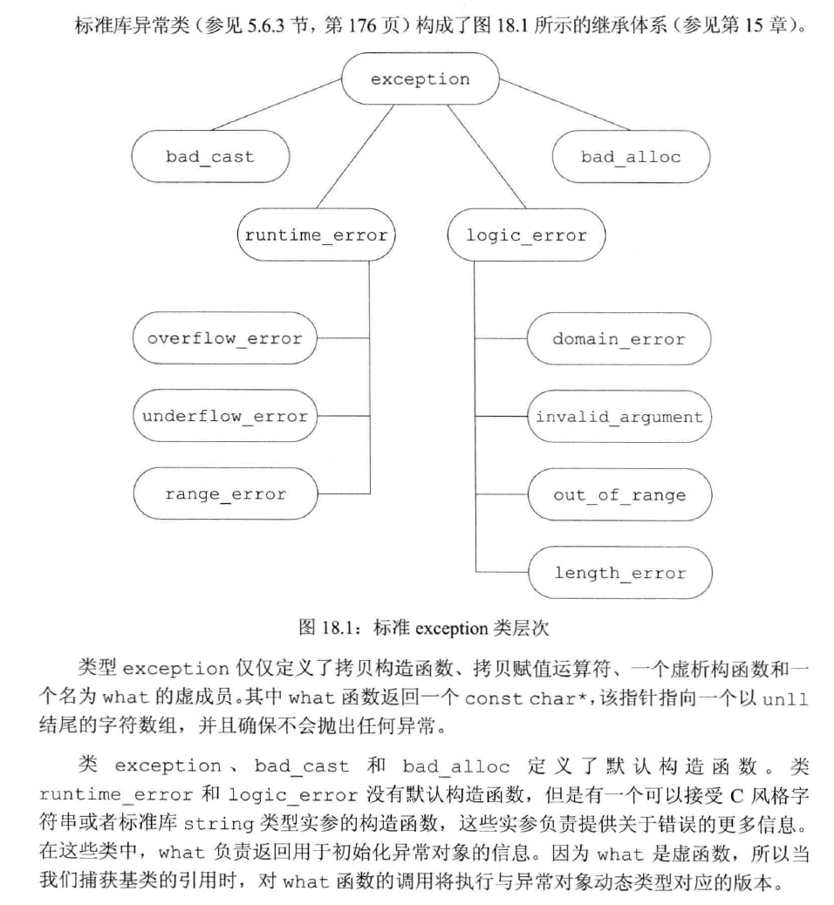

# 高级主题
## 异常处理
### 抛出异常
1. 一个异常如果没有没捕获，则它将终止当前的程序。
2. 栈展开的过程中，对象被自动相会
3. 如果析构函数需要执行某个可能异常的操作，则该操作应该放在一个try语句块中，并在析构函数中得到处理。
4. 异常对象是一种特殊的对象，编译器使用异常抛出表达式来对异常对象进行拷贝初始化，thorw语句中的表达式必须拥有完全类型。

### 捕获异常
1. 通常情况下，如果catch接受的异常与某个继承体系有关，则最好将该catch的参数定义成引用类信息。
2. 异常与catch异常声明的匹配规则只允许以下类型的转换：非常量到常量，派生类到基类的类型转换，数组和函数向对应的指针的转换。
3. 重新抛出：在catch块中使用空throw语句重新抛出。这会将当前的异常对象沿着调用链向上传递。
4. 捕获所有异常：`catch(...){}`
### noexcept

### 异常类层次

## 命名空间
多个库将名字放置在全局命名空间中将引发命名空间污染。命名空间为防止名字冲突提供了更加可控的机制。命名空间分割了全局命名空间，其中每个命名空间是一个作用域。
### 定义
一个命名空间的定义包含两部分：首先是关键字`namespace`, 随后是命名空间的名字。在命名空间名字后面是一系列由花括号括起来的声明和定义。只要能出现在全局作用域中的声明就能置于命名空间内，主要包括：类、变量（及其初始化操作）、函数（及其定义）、模板和其他命名空间。

## 控制内存分配
