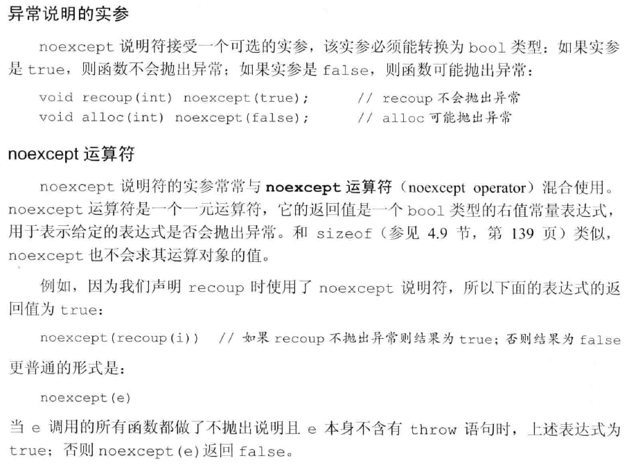

# 高级主题
## 异常处理
### 抛出异常
1. 一个异常如果没有没捕获，则它将终止当前的程序。
2. 栈展开的过程中，对象被自动相会
3. 如果析构函数需要执行某个可能异常的操作，则该操作应该放在一个try语句块中，并在析构函数中得到处理。
4. 异常对象是一种特殊的对象，编译器使用异常抛出表达式来对异常对象进行拷贝初始化，thorw语句中的表达式必须拥有完全类型。

### 捕获异常
1. 通常情况下，如果catch接受的异常与某个继承体系有关，则最好将该catch的参数定义成引用类信息。
2. 异常与catch异常声明的匹配规则只允许以下类型的转换：非常量到常量，派生类到基类的类型转换，数组和函数向对应的指针的转换。
3. 重新抛出：在catch块中使用空throw语句重新抛出。这会将当前的异常对象沿着调用链向上传递。
4. 捕获所有异常：`catch(...){}`
### noexcept





### 异常类层次


## 命名空间
多个库将名字放置在全局命名空间中将引发命名空间污染。命名空间为防止名字冲突提供了更加可控的机制。命名空间分割了全局命名空间，其中每个命名空间是一个作用域。
### 定义
一个命名空间的定义包含两部分：首先是关键字`namespace`, 随后是命名空间的名字。在命名空间名字后面是一系列由花括号括起来的声明和定义。只要能出现在全局作用域中的声明就能置于命名空间内，主要包括：类、变量（及其初始化操作）、函数（及其定义）、模板和其他命名空间。

## 枚举类型
枚举类型使我们可以将一组整型常量组织在一起。和类一样，每个枚举类型定义了一种新的类型。枚举属于字面值常量类型。C++包含两种枚举：限定作用域的和不限定作用域的。

定义限定作用域的枚举类型的一般形式是：首先是关键字`enum class`(或者等价地使用`enum struct`)，随后是枚举类型名字以及用花括号括起来的以逗号分隔的枚举成员列表，最后是一个分号。
```cpp
enum class open_modes {input, output, append};
 ```

定义不限定作用域的枚举类型时省略掉关键字class(或struct)，枚举类型的名字是可选的。如果enum是未命名的，则我们只能在定义该enum时定义它的对象。
```cpp
enum color {red, yellow, green};
enum {floatPrec = 6, doublePrec = 10, double_doublePrec = 10};
 ```

在限定作用域的枚举类型中，枚举成员的名字遵循常规的作用域准则，并且在枚举类型的作用域外是不可访问的。与之相反，在不限定作用域的枚举类型中，枚举成员的作用域与枚举类型本身的作用域相同：
```cpp
color eyes = green;
open_modes mode = open_modes::input;
 ```
默认情况下，枚举值从0开始，依次加1。不过我们也能为一个或几个枚举成员指定专门的值。
枚举值不一定唯一。如果我们没有显式地提供初始值，则当前枚举成员的值等千于之前枚举成员的值加1。

枚举成员是const，因此在初始化枚举成员时提供的初始值必须是常量表达式。也就是说，每个枚举成员本身就是一条常量表达式，我们可以在任何需要常量表达式的地方使用枚举成员。
例如，我们可以定义枚举类型的constexpr变量。我们也可以将一个enum作为switch语句的表达式，而将枚举值作为case标签。我们还能将枚举类型作为一个非类型模板形参使用，或者在类的定义中初始化枚举类型的静态数据成员。

### 和类一样， 枚举也定义新的类型
只要enum有名字，我们就能定义并初始化该类型的成员。要想初始化enum对象或
者为enum 对象赋值，必须使用该类型的一个枚举成员或者该类型的另一个对象。

一个不限定作用域的枚举类型的对象或枚举成员自动地转换成整型。因此，我们可以在任何需要整型值的地方使用它们。

### 指定enum的大小
我们可以在enum的名字后加上冒号以及我们想在该enum中使用的类
型。
```cpp
enum Tokens: unsigned char{INLINE = 128 , VIRTUAL= 129};
 ```
如果我们没有指定enum的潜在类型，则默认情况下**限定作用域**的enum成员类型是`int` 。
对于不限定作用域的枚举类型来说，其枚举成员不存在默认类型，我们只知道成员的潜在类型足够大，肯定能够容纳枚举值。如果我们指定了枚举成员的潜在类（包括对限定作用域的enum的隐式指定），则一旦某个枚举成员的值超出了该类型所能容纳的范围，将引发程序错误。

### 枚举类型的前置声明
我们可以提前声明enum。enum的前置声明（无论隐式地还是
显示地）必须指定其成员的大小。
```cpp
enum Tokens: unsigned char;
enum class open_modes;
 ```
因为不限定作用域的enum未指定成员的默认大小，因此每个声明必须指定成员的大小。对于限定作用域的enum来说，我们可以不指定其成员的大小，这个值被隐式地定义成int。

和其他声明语句一样，enum的声明和定义必须匹配，这意味若在enum的所有声明和定义中成员的大小必须一致。而且，我们不能在同一个上下文中先声明一个不限定作用域的enum名字，然后再声明一个同名的限定作用域的enum。

### 形参匹配与枚举类型
要想初始化一个enum对象，必须使用该enum类型的另一个对象或者它的一个枚举
成员。因此，即使某个整型值恰好与枚举成员的值相等，它也不能作为函数的enum实参使用。

尽管我们不能直接将整型值传给enum形参，但是可以将一个不限定作用域的枚举类
型的对象或枚举成员传给整型形参。此时，enum的值提升成`int`或更大的整型，实际提升的结果由枚举类型的潜在类型决定。