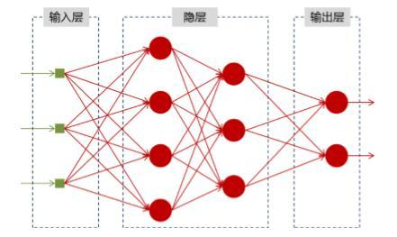
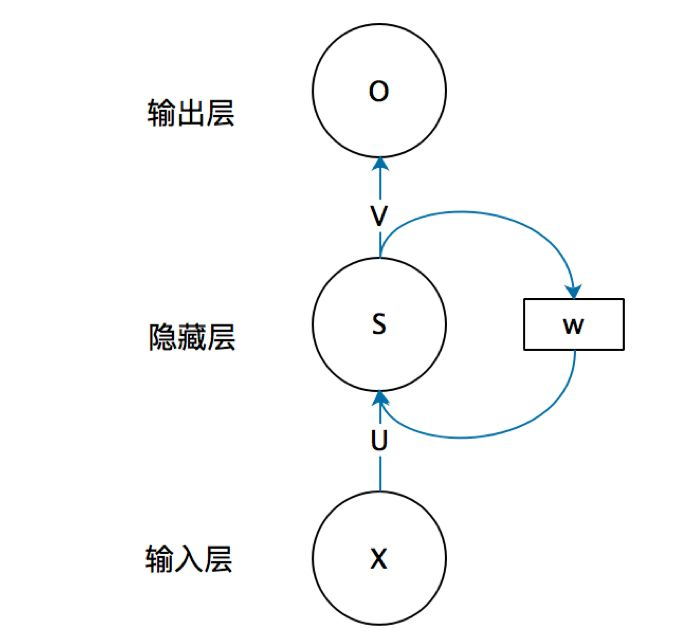
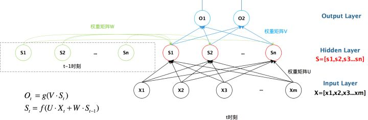
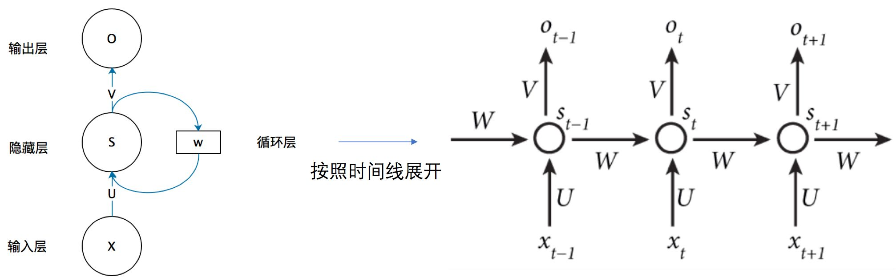
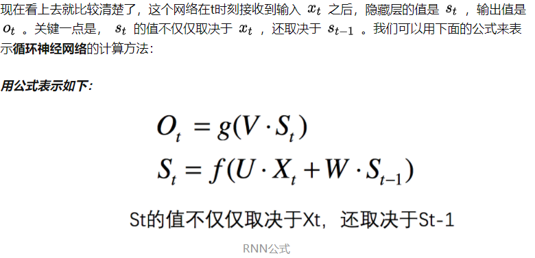
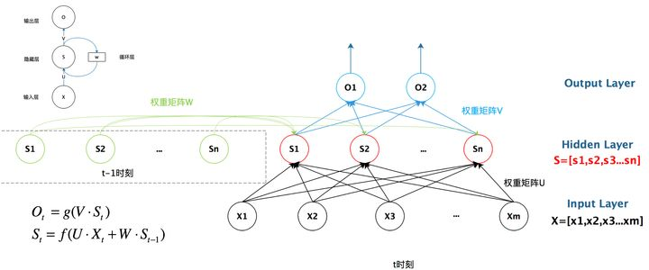
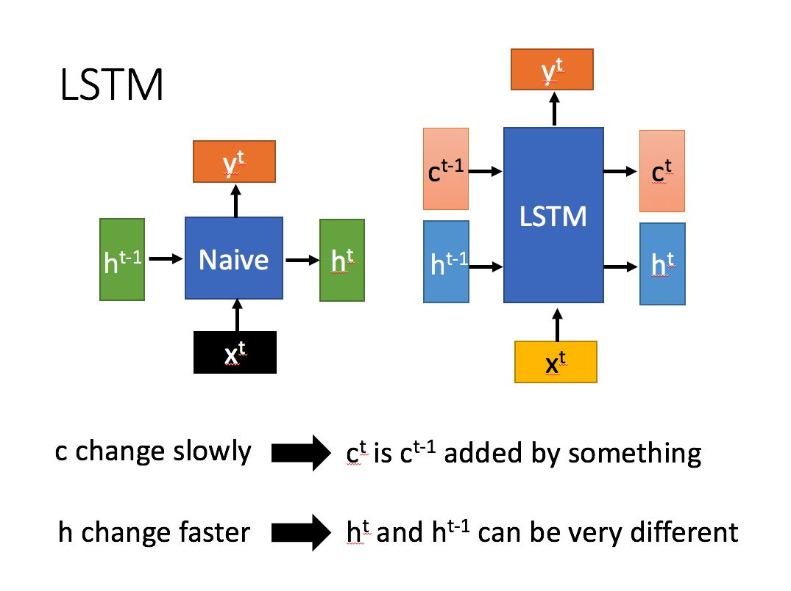
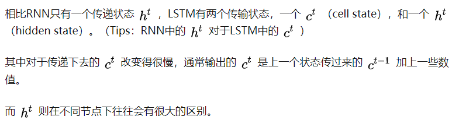

# 从RNN到BERT
## RNN
[什么是RNN](https://zhuanlan.zhihu.com/p/30844905)
### 为什么需要RNN（循环神经网络）

传统神经网络（上图）都只能单独的取处理一个个的输入，前一个输入和后一个输入是完全没有关系的。但是，某些任务需要能够更好的处理序列的信息，即前面的输入和后面的输入是有关系的。
### RNN结构
首先看一个简单的循环神经网络如，它由输入层、一个隐藏层和一个输出层组成：

我们现在这样来理解，如果把上面有W的那个带箭头的圈去掉，它就变成了最普通的全连接神经网络。

x是一个向量，它表示输入层的值（这里面没有画出来表示神经元节点的圆圈）；
s是一个向量，它表示隐藏层的值（这里隐藏层面画了一个节点，你也可以想象这一层其实是多个节点，节点数与向量s的维度相同）；
U是输入层到隐藏层的权重矩阵，o也是一个向量，它表示输出层的值；
V是隐藏层到输出层的权重矩阵。

循环神经网络的隐藏层的值s不仅仅取决于当前这次的输入x，还取决于上一次隐藏层的值s。

### RNN具体结构

我们从上图就能够很清楚的看到，上一时刻的隐藏层是如何影响当前时刻的隐藏层的。

如果我们把上面的图展开，循环神经网络也可以画成下面这个样子：

### 总括图

## LSTM
### 什么是LSTM
长短期记忆（Long short-term memory, LSTM）是一种特殊的RNN，主要是为了解决长序列训练过程中的梯度消失和梯度爆炸问题。简单来说，就是相比普通的RNN，LSTM能够在更长的序列中有更好的表现。

LSTM结构和普通RNN的主要输入输出区别如下所示。

