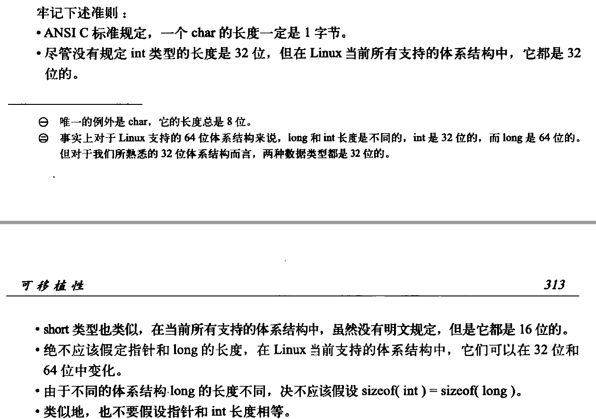

# Linux内核简介
## Unix系统特点
- 简洁
- 所有东西都被当作文件对待
- 用C语言编写
- 进程创建非常迅速
- 提供了一套非常简单但又很稳定的进程间通信原语

## 操作系统与内核简介
用户界面是操作系统的外在表象，内核是操作系统的内在核心。系统态和被保护起来的内存空间，统称为内核空间。

一个内核由负责相应中断的**终端服务程序**、负责管理多个进程从而分享处理器时间的**调度程序**，负责管理进程地址空间的**内存管理程序**和网络、进程间通信等**系统服务程序**共同组成。

在系统中运行的应用程序通过**系统调用**来与内核通信，当一个应用程序执行一条系统调用，我们说*内核正在代其执行*，在这种情况下，应用程序通过系统调用*在内核空间运行*，内核运行于*进程上下文中*。

上下文（进程上下文、中断上下文等等）代表着内核活动的范围，我们可以将每个处理器在任何指定时间点上的活动概括为下列三者之一：
- 运行于用户空间，执行用户进程
- 运行于内核空间，处于进程上下文，代表某个特定的进程正在执行
- 运行于内核空间，处于中断上下文，与任何进程无关，处理某个特定的中断

## Linux内核和传统Unix内核的比较
### 单内核与微内核
**单内核**
- 单内核就是把它从整体上作为一个单独的大过程来实现，同时也运行在一个单独的地址空间上
- 通常以单个静态二进制文件的形式存放于磁盘中，所有的内核服务都在一个大内核地址空间上运行
- 因为大家都运行在内核态，身处同一个地址空间，所以内核间基本无需通信
- 与用户空间应用程序没有什么区别，内核可以直接调用函数

**微内核**
- 微内核的功能被划分为多个独立的过程，每个过程叫做一个服务器
- 理想情况下，只有强烈请求特权服务的服务器运行在特权模式下，其他服务器都运行在用户空间
- 所有的服务器都保持独立并运行在各自的地址空间上，因此不能直接调用函数，而是通过*消息传递*处理微内核通信
- 系统采用了进程间通信（IPC）机制，因此各个服务器通过IPC来互通消息，互换服务。
- 服务器的各自独立避免了一个服务器的失效祸及另一个
- 模块化的系统允许一个服务器为了另一个服务器而换出 
- 但由于IPC机制的开销要多于函数调用，同时会涉及到内核空间与用户空间的上下文切换，因此消息传递需要一定的周期，而单内核则不需要。结果，所有实际的基于微内核的系统都让大部分或全部服务器位于内核，这样就可以避免频繁的上下文切换，从而直接调用函数

Windows NT内核与MAC OS X均不让任何微内核服务器运行在用户空间。
Linux是一个单内核，是模块化、多线程的以及内核本身可调度的操作系统。
                                     
### Linux的特点（与Unix的差异）
- 支持动态加载内核模块
- 支持对称多处理（SMP）机制
- 内核可以抢占：具有允许在内核运行的任务优先执行的能力
- 对线程实现的特殊性：内核不区分线程和其他的一般进程，对内核来说，所有的进程都一样———只不过是其中的一些共享资源而已
- 提供具有设备类的面向对象的设备模型、热插拔事件，以及用户空间的设备文件系统（sysfs）

# 从内核出发
## 获取内核源码
### 使用Git
```shell
git clone git://git.kernel.org/pub/scm/linux/kernel/git/torvalds/linux-2.6.git
```
## 编译内核
### 配置内核
### 减少编译的垃圾信息
### 衍生多个编译作业
### 安装新内核

## 内核开发的特点
- 既不能访问C库也不能访问标准的C头文件头文件
- 必须使用GNU C
- 缺乏像用户空间那样的内存保护机制
    - 内核中发生的内存错误会导致oops
    - 内核中的内存都不分页
- 难以执行浮点运算
- 容积小而固定的栈
    - 内核栈的准确大小随体系结构而变
    - 内核栈的大小是两页，32位机的内核栈是8KB，64位机是16KB
- 由于内核支持异步中断、抢占和SMP，因此必须时刻注意同步和并发（解决竞争的办法通常是自旋锁和信号量）
- 要考虑可移植性的重要性

# 进程管理
## 进程
有关进程的概念在此不再重复。
### fork()
进程在创建它的时刻开始存活，通常使用fork()系统调用来创建。该系统调用通过复制一个现有进程创建一个全新的进程。调用fork()的进程称为父进程，新产生的进程称为子进程。

在调用结束后，在返回点相同位置上，父进程恢复执行，子进程开始执行（并发执行），即它从内核返回两次：一次回到父进程，另一次返回回到新产生的子进程。

### 进程的创建与终结
首先，使用fork()（在Linux中，由clone()系统调用实现的）创建新的进程；

随后，调用exec()来创建新的地址空间，把新的程序载入其中；

最后，通过exit()系统调用退出执行，其会终结进程并将其占用的资源释放掉。

## 进程描述符及任务结构

# 可移植性
## 字长和数据类型
能够由机器一次完成处理的数据称为“字”，机器的位数也就是机器的字长。处理器通用寄存器（GPR）的大小和机器的字长是相同的。通常情况下，对于一个体系结构，它各部件的宽度至少和它的字长一样大（例如内存总线）。

此外，C语言定义的long类型总是等于机器的字长，而int类型有时会比字长小。例如，一台64位机器（Alpha架构）的寄存器、指针、long类型都是64位的，而int类型是32位的。



[数据模型（LP32 ILP32 LP64 LLP64 ILP64 ）](https://www.cnblogs.com/lsgxeva/p/7614856.html)

## 数据对齐
