# 助记
## chapter1
操作系统的特征：**并发性、资源共享性**、虚拟性、异步性（加粗的是最重要的特征）

操作系统四大功能：处理器管理、存储器管理、设备管理、文件管理

批处理的主要优点：资源利用率高、系统吞吐量大，缺点是：无交互作用能力、作业平均周转时间长

分时系统的基本特征：多路性、独立性、交互性、及时性

## chapter2
程序的顺序执行特征：顺序性、封闭性、可再现性

并发执行特征：间断性、失去封闭性、不可再现性

进程的特征：动态性、并发性、独立性、异步性

进程控制块内容：进程标识符、处理器状态、进程控制信息、进程
调度信息
# 操作系统引论
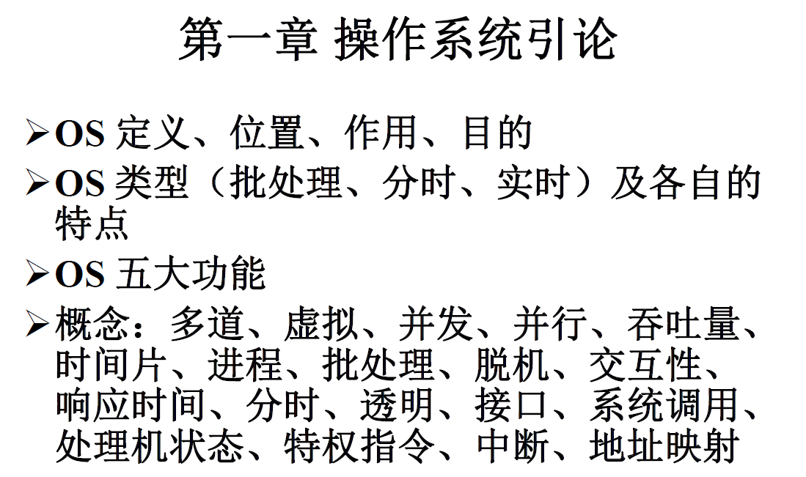
## 操作系统的定义、目标和作用
### 定义
#### 资源管理的观点
操作系统是控制和管理计算机软、硬件资源，合理地组织计算机的工作流程，以及方便用户的*程序集合*
#### 用户的观点
操作系统是配置在计算机硬件上的第一层软件，是对硬件系统的第一次扩充
### 目标
1. 有效性
   - 提高系统资源利用率
   - 提高系统吞吐率
2. 方便性
3. 可扩充性
4. 开放性
### 作用
1. 作为用户与计算机硬件系统之间的接口
   - 接口类型
      - 命令方式
      - 图形、窗口方式
      - 系统调用方式
2. 作为计算机系统资源的管理者
3. 实现了对计算机资源的抽象
## 发展过程
### 历史进程
手工（人工）操作
单道批处理
多道批处理，分时、实时、通用OS
单用户、网络、分布式、嵌入式、多处理机OS
### 无操作系统的计算机系统
1. 人工操作方式
2. 脱机输入/输出方式
   - 优点
      1. 减少CPU空闲时间
      2. 提高I/O速度
### 单道批处理
通常是把一批作业以脱机方式输入到磁带上，并在系统中配上监督程序，在它的控制下使这批作业一个接一个的连续处理

特点：
- 自动线
- 顺序性
- 单道性
### 多道批处理系统

### 分时系统

### 实时系统

## 操作系统的特征
### 并发性
#### 并发与并行
并行指多个事件在同一时刻发生
并发指多个事件在同一时间间隔内发生
#### 进程

### 共享性
#### 互斥共享方式
#### 同时访问方式

## 操作系统的五大功能
### 处理机管理
### 存储管理
### 设备管理
### 文件管理
### 用户接口

## 操作系统结构设计

# 进程管理
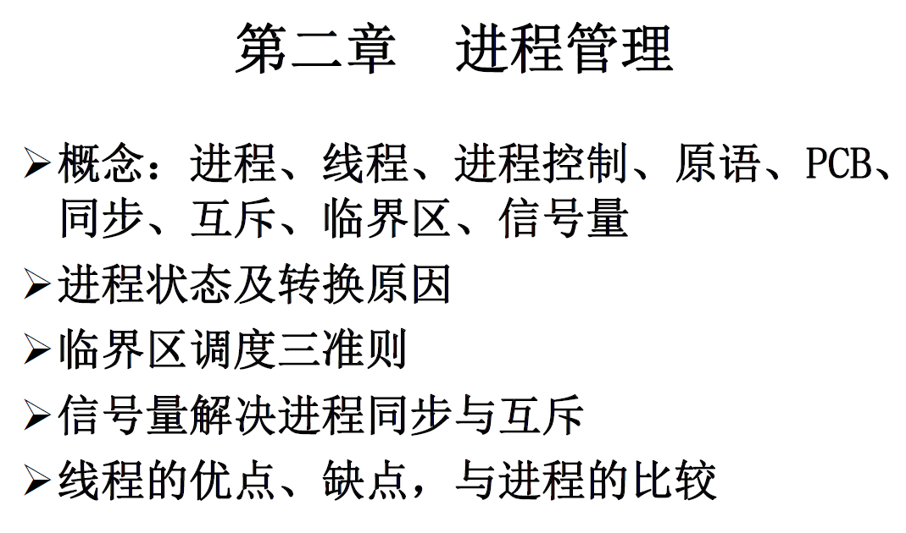
# 处理机调度与死锁
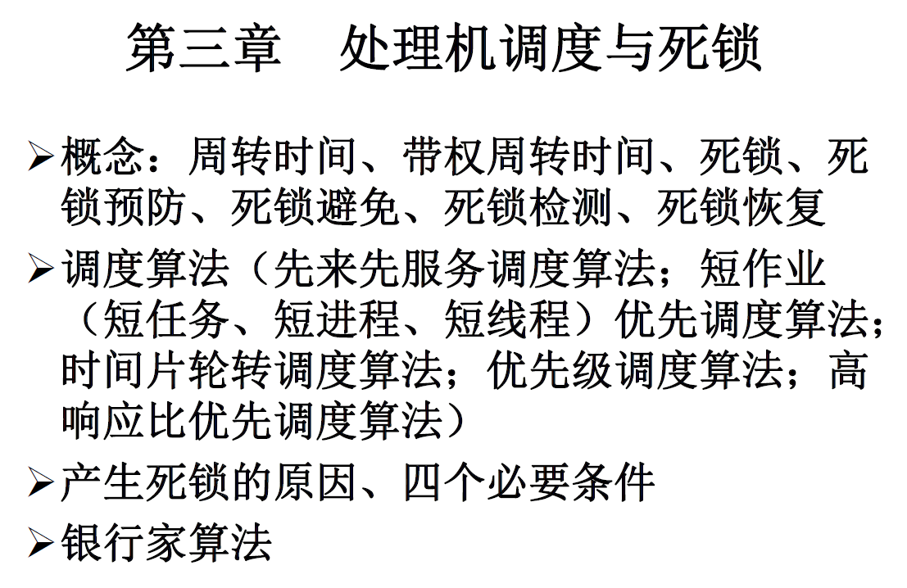
## 处理器调度的层次
### 高级调度（作业调度，长程调度）
#### 作业与作业步
作业（Job）是一个比程序更为广泛的概念，包含了通常的程序与数据，以及一份作业说明书，系统通过该说明书来对程序进行控制。

**作业=JCB+作业说明书+程序+数据**

作业步（Job Step）是每一个必须作业经过的若干的相对独立又相互关联的顺序加工步骤的一个。通常分为以下三个作业步：
1. 编译作业步
2. 链接装配作业步
3. 运行作业步

#### 作业控制块（JCB）
为管理和调度作业而设置

#### 作业调度
*周转时间=完成时间-提交时间=等待时间+运行时间*

每次执行作业调度时，需要做出两个决定：
1. 决定接纳多少个作业：取决于多道程序度
2. 决定接纳哪些作业（调度算法：应将哪些作业从外存调入内存）
   1. 先来先服务
   2. 短作业优先
   3. 响应比高者优先
   4. 基于作业优先级

### 中级调度（交换调度，中程调度）
中级调度：选择在外存上的那些具备运行条件的就绪进程，将它们重新调入内存，并修改其状态为就绪状态，挂在就绪队列上等待进程调度。

**中级调度实际上就是存储器管理中的对换功能。**

**引入目的：** 提高内存利用率和系统吞吐量。
### 低级调度（进程调度，短程调度）
#### 三个基本机制
1. 排队器
2. 分派器
3. 上下文切换机制

切换开销：上下文切换花去的处理机时间

#### 进程调度方式
1. 非抢占方式
在采用这种调度方式时，一旦把处理机分配给某进程后，不管它要运行多长时间，都一直让它运行下去。直至该进程完成，自愿释放处理机，或发生某事件而被阻塞时，才再把处理机分配给其他进程。
在采用非抢占调度方式时，可能引起进程调度的因素可
归结为如下几个：
   - 正在执行的进程执行完毕，或因发生某事件而不能再继续执行；
   - 执行中的进程因提出I/O请求而暂停执行；
   - 在进程通信或同步过程中执行了某种原语操作，如P操作(wait操作)、Block原语等。
  
    这种调度方式的优点是实现简单，系统开销小，适用于大多数的批
    处理系统环境。但它难以满足紧急任务的要求被立即执行，因而可能造
    成难以预料的后果。显然，在实时要求比较严格的实时系统中，不宜采
    用这种调度方式。

2. 抢占方式
这种调度方式允许调度程序根据某种原则去暂停某个正在执行的进程，将已分配给该进程的处理机重新分配给另一进程。
抢占方式的优点是，可以防止一个长进程长时间占用处理机，能为大多数进程提供更公平的服务，特别是能满足对响应时间有着较严格要求的实时任务的需求。抢占调度方式是基于一定原则的，主要有如下几条：
   - 优先权原则
   - 短作业优先原则
   - 时间片原则
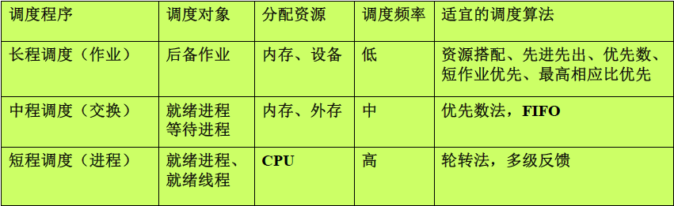

## 调度队列模型
### 仅有进程调度的队列模型
每个进程在执行时都可能出现以下三种情况：
1. 任务在给定的时间片内已经完成，该进程便在释放处理机后进入完成状态；
2. 任务在本次分得的时间片内尚未完成，OS便将该任务再放入就绪队列的末尾；
3. 在执行期间，进程因为某事件而被阻塞后，被OS放入阻塞队列。

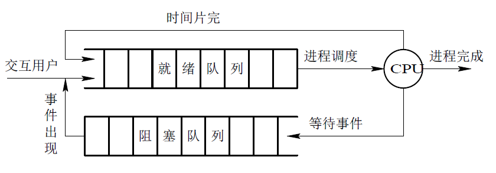

### 具有高级和低级调度的调度队列模型

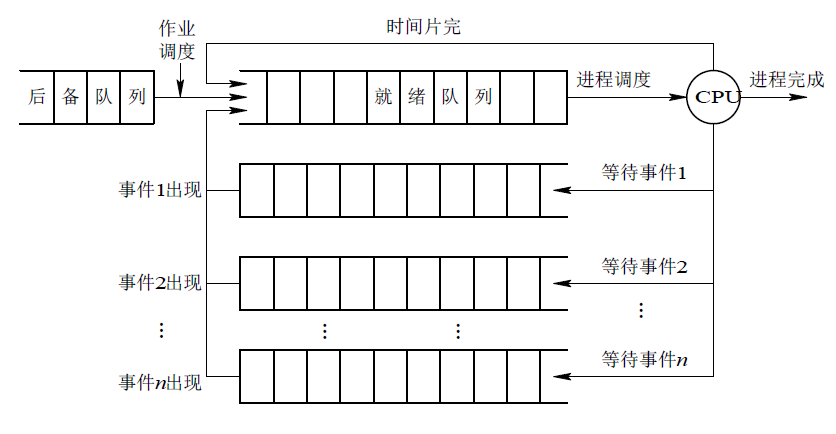
### 同时具有三级调度的调度队列模型
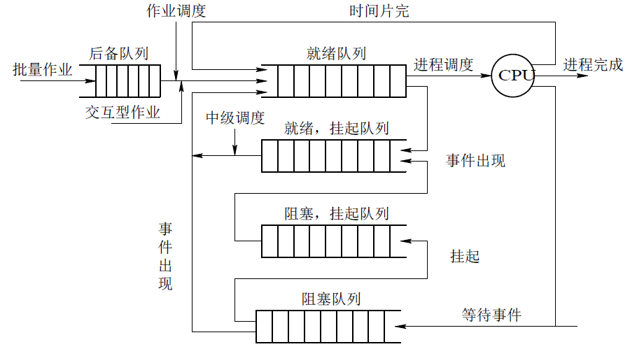

## 调度算法
### 先来先服务调度算法（FCFS）
既可用于作业调度也可用于进程调度。

### 短作业（进程）优先调度算法（ SJ(P)F ）
既可用于作业调度也可用于进程调度。

# 设备管理

设备管理的功能：
- 设备的分配与回收
- 设备的启动
- 设备的事件处理
- 设备缓冲区管理
- 实现虚拟设备
- 磁盘调度
设备管理目的
- 提高效率
- 方便使用
- 方便控制
- 防止设备误操作

## I/O系统
### I/O设备
#### 类型
1.按设备的使用特性
- 存储设备
- 输入/输出设备
2.按传输速率分类
- 低速设备
- 中速设备
- 高速设备
3.按信息交换的单位分类
- 字符设备
- 块设备
4.按设备的共享属性分类
- 独占设备
- 共享设备
- 虚拟设备：用共享设备模拟独占设备，用高速设备模拟低速设备
## I/O控制（数据传输）方式
- 程序I/O方式
- 中断驱动I/O控制方式
- 直接存储器存取（DMA）
- I/O通道控制方式
## 缓冲管理
### 缓冲的引入
### 单缓冲与双缓冲
### 循环缓冲
### 缓冲池
## 磁盘存储器的管理
### 磁盘性能简述
#### 数据的组织与格式
磁盘设备包括一个或多个物理盘片，每个磁盘片上分一个或两个存储面，每个磁盘面被组织成若干个同心圆，称为磁道。

# 文件管理
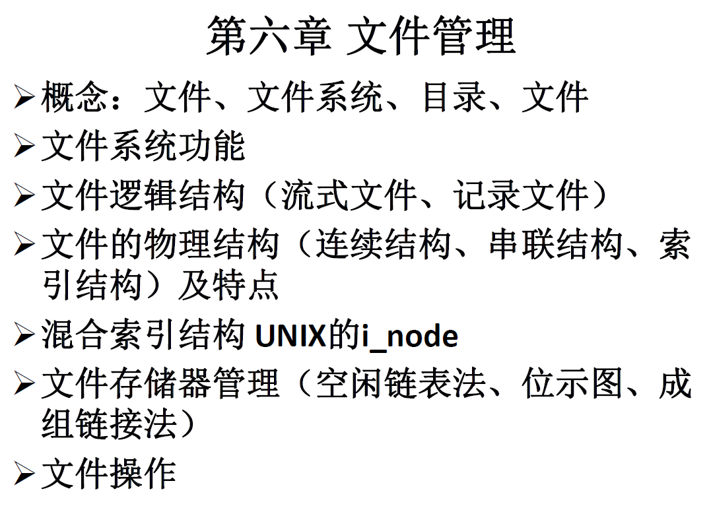
## 文件与文件系统
### 文件的概念
#### 文件定义
**定义：文件是指可保存的、具有标识名的一组逻辑上具有完整意义的信息集合。**
文件是计算机系统中信息存放的一种组织形式。
两种不同的具有代表性的解释：
- 文件是赋名的信息项的集合（UNIX、MS-DOS系统采用的，无结构文件、流式文件）
- 文件是赋名的、有关联的信息单位的集合（由记录组成的）

#### 文件属性

### 文件类型
#### 以性质与用途分类
- 系统文件
- 库文件
- 用户文件
#### 从存取控制属性分类
- 只读文件
- 读写文件
- 执行文件
#### 按组织形式分类
- 普通文件：一般的用户文件和系统文件
- 目录文件：由文件目录项组成的文件
- 特别文件：将设备称为特别文件

#### UNIX文件分类
- 普通文件：内容可以是程序、数据、图像等
- 目录文件：由若干**文件属性描述表**构成，保存在磁盘块中
- 特殊文件：设备（块设备文件、字符设备文件）

### 文件系统
OS中负责处理文件相关事宜的程序和数据结构。包括文件的查找、存放、保护、共享、命名、文件常用操作的实现以及文件存储器的管理等等。功能包括：
- 实现文件的按名存取，即实现名字到外存地址的映射
- 实现文件的信息组织、存放
- 实现文件的安全与保护
- 实现文件的共享
- 给用户提供文件的操作例程
- 管理文件存储器

## 文件结构与存储设备
### 逻辑结构
#### 逻辑结构类型
1. 有结构文件（流式文件）
   - 定长记录
   - 变长记录
2. 无结构文件（记录文件）

#### 存取方法
- 顺序存取
- 随机存取
- 按键存取
### 物理结构
#### 连续结构
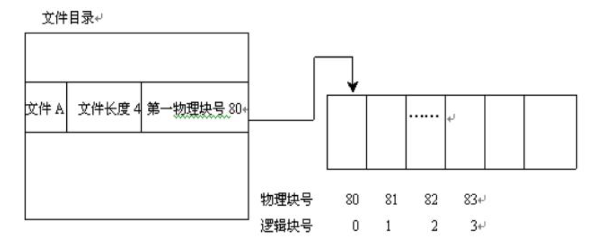
#### 串联结构
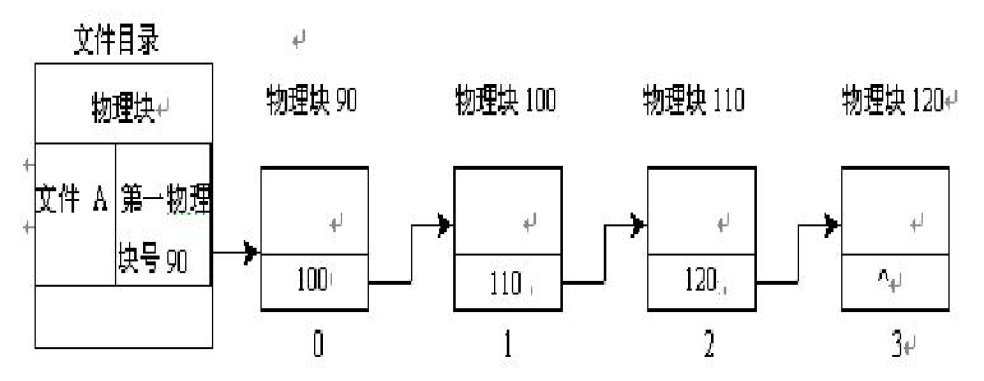
#### 索引结构
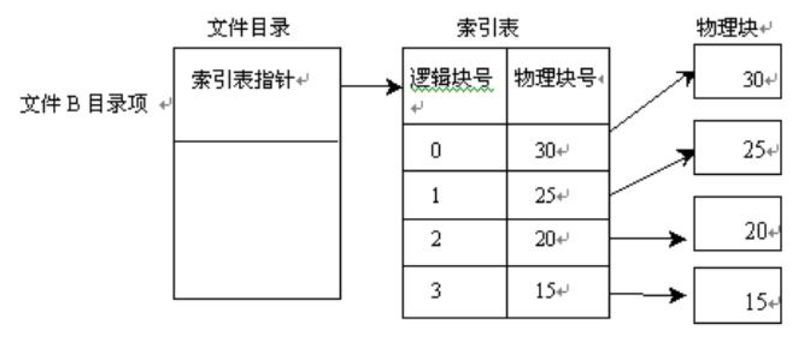
多级索引
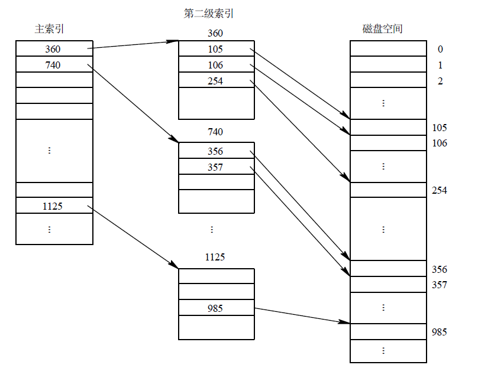
#### 混合索引结构（多重索引，UNIX）
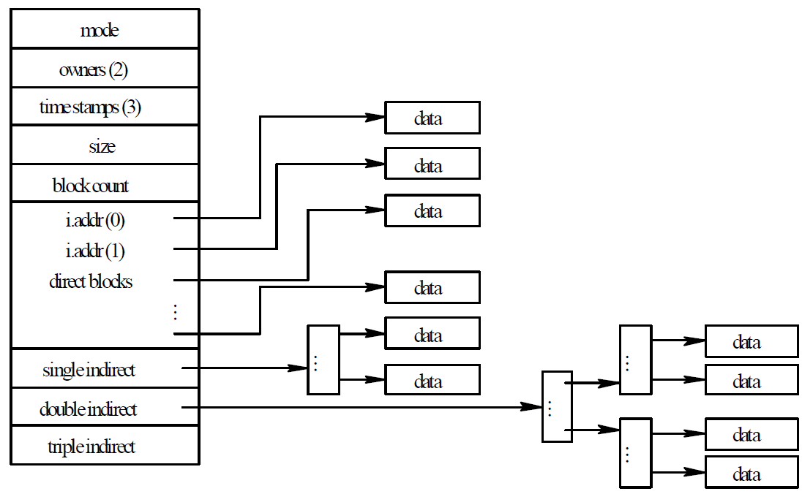
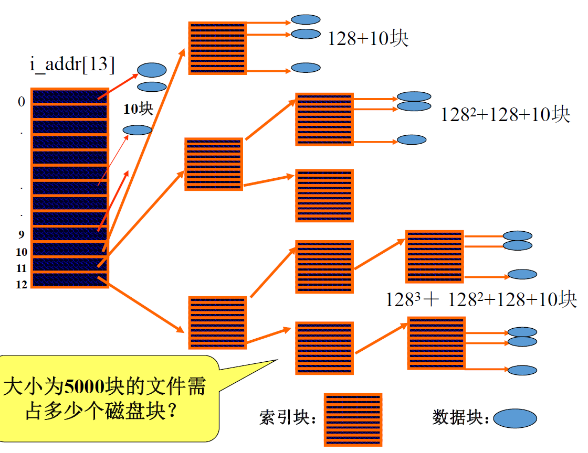
1. 直接地址
2. 一次间接地址
3. 多次间接地址
### 文件存储设备

## 文件目录管理
对文件目录管理的要求如下：
(1) 实现“按名存取”。
(2) 提高对目录的检索速度。
(3) 文件共享。
(4) 允许文件重名。
### 文件控制块与文件目录
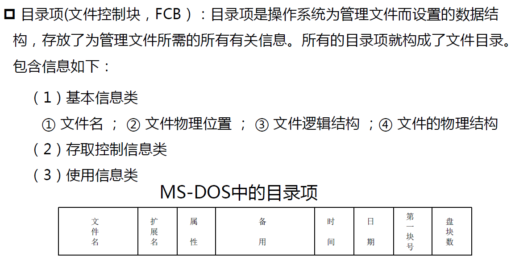
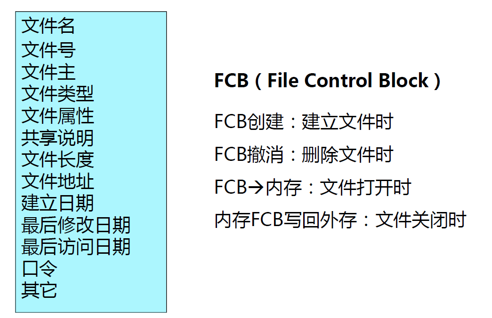
#### UNIX/LINUX的文件目录
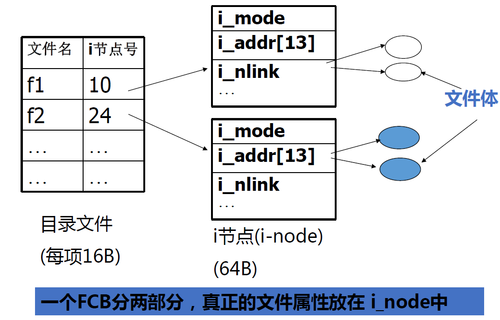
### 目录结构
#### 单级目录结构
#### 二级目录
#### 多级目录结构

## 文件存储空间管理

