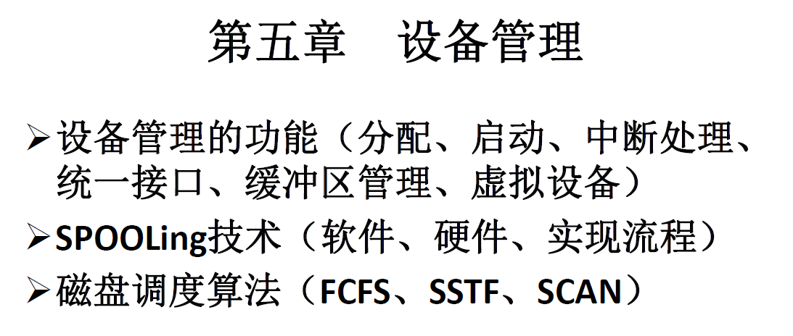

# 操作系统引论

# 进程管理

# 处理机调度与死锁

## 处理器调度的层次
### 高级调度（作业调度，长程调度）
#### 作业与作业步
作业（Job）是一个比程序更为广泛的概念，包含了通常的程序与数据，以及一份作业说明书，系统通过该说明书来对程序进行控制。

**作业=JCB+作业说明书+程序+数据**

作业步（Job Step）是每一个必须作业经过的若干的相对独立又相互关联的顺序加工步骤的一个。通常分为以下三个作业步：
1. 编译作业步
2. 链接装配作业步
3. 运行作业步

#### 作业控制块（JCB）
为管理和调度作业而设置

#### 作业调度
*周转时间=完成时间-提交时间=等待时间+运行时间*

每次执行作业调度时，需要做出两个决定：
1. 决定接纳多少个作业：取决于多道程序度
2. 决定接纳哪些作业（调度算法：应将哪些作业从外存调入内存）
   1. 先来先服务
   2. 短作业优先
   3. 响应比高者优先
   4. 基于作业优先级

### 中级调度（交换调度，中程调度）
中级调度：选择在外存上的那些具备运行条件的就绪进程，将它们重新调入内存，并修改其状态为就绪状态，挂在就绪队列上等待进程调度。

**中级调度实际上就是存储器管理中的对换功能。**

**引入目的：** 提高内存利用率和系统吞吐量。
### 低级调度（进程调度，短程调度）
#### 三个基本机制
1. 排队器
2. 分派器
3. 上下文切换机制

切换开销：上下文切换花去的处理机时间

#### 进程调度方式
1. 非抢占方式
在采用这种调度方式时，一旦把处理机分配给某进程后，不管它要运行多长时间，都一直让它运行下去。直至该进程完成，自愿释放处理机，或发生某事件而被阻塞时，才再把处理机分配给其他进程。
在采用非抢占调度方式时，可能引起进程调度的因素可
归结为如下几个：
   - 正在执行的进程执行完毕，或因发生某事件而不能再继续执行；
   - 执行中的进程因提出I/O请求而暂停执行；
   - 在进程通信或同步过程中执行了某种原语操作，如P操作(wait操作)、Block原语等。
  
    这种调度方式的优点是实现简单，系统开销小，适用于大多数的批
    处理系统环境。但它难以满足紧急任务的要求被立即执行，因而可能造
    成难以预料的后果。显然，在实时要求比较严格的实时系统中，不宜采
    用这种调度方式。

2. 抢占方式
这种调度方式允许调度程序根据某种原则去暂停某个正在执行的进程，将已分配给该进程的处理机重新分配给另一进程。
抢占方式的优点是，可以防止一个长进程长时间占用处理机，能为大多数进程提供更公平的服务，特别是能满足对响应时间有着较严格要求的实时任务的需求。抢占调度方式是基于一定原则的，主要有如下几条：
   - 优先权原则
   - 短作业优先原则
   - 时间片原则

## 调度队列模型
### 仅有进程调度的队列模型
每个进程在执行时都可能出现以下三种情况：
1. 任务在给定的时间片内已经完成，该进程便在释放处理机后进入完成状态；
2. 任务在本次分得的时间片内尚未完成，OS便将该任务再放入就绪队列的末尾；
3. 在执行期间，进程因为某事件而被阻塞后，被OS放入阻塞队列。

### 具有高级和低级调度的调度队列模型

### 同时具有三级调度的调度队列模型

## 调度算法
### 先来先服务调度算法（FCFS）
既可用于作业调度也可用于进程调度。

### 短作业（进程）优先调度算法（ SJ(P)F ）
既可用于作业调度也可用于进程调度。

# 设备管理

## 磁盘存储器的管理
### 磁盘性能简述
#### 数据的组织与格式
磁盘设备包括一个或多个物理盘片，每个磁盘片上分一个或两个存储面，每个磁盘面被组织成若干个同心圆，称为磁道。