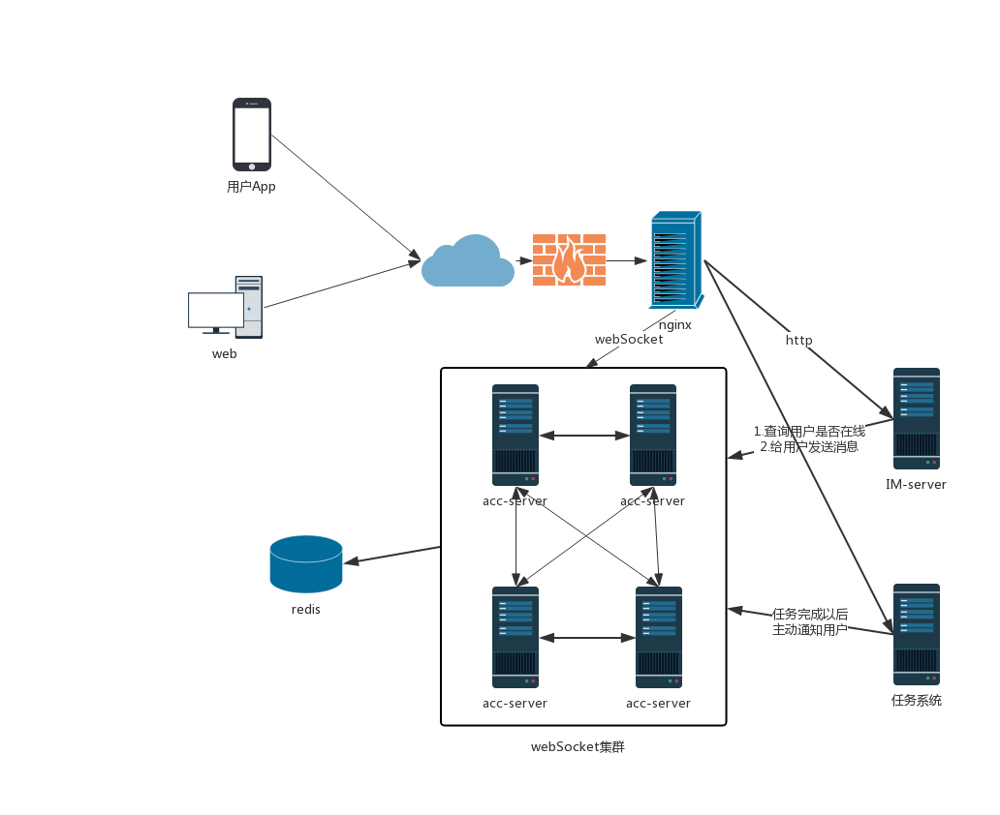
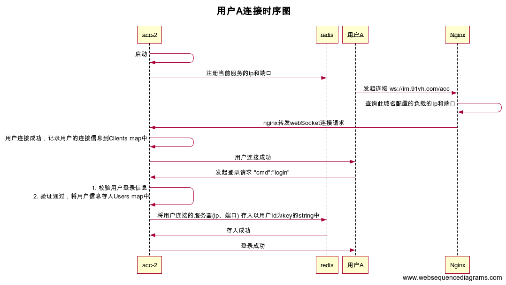
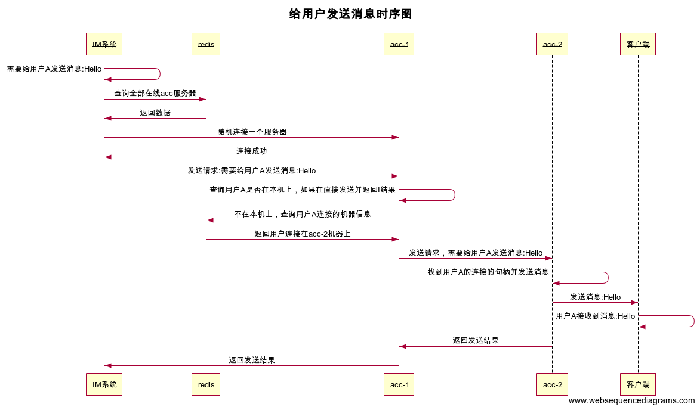

## 项目架构


### 后端架构


### 前端架构

##  项目目标
1. 使用redis缓存，消息队列 
2. 使用nginx实现负载均衡
3. 使用分布式架构实现高可用系统
4. 使用docker实现CI/CD

## 项目功能
### 基础聊天
- 大房间（世界）聊天
- 小房间（群聊）聊天
- 一对一聊天

### 查看历史聊天记录

### 交友（待定）
- 在大房间、小房间、一对一聊天中均可添加好友
- 点击头像即可添加，添加后需对方确认，才可添加成功

### 聊天页特色功能
- 抢红包

## 项目排期
1. 验证grpc可行性：以发送单播消息http请求为例
2. 分离消息发送模块
## 功能实现
### 在线聊天室
利用redis的Publish/Subscribe的功能作为中间件，实现分布式架构

1. 客户端向服务端请求建立连接
2. 客户端登陆，服务端存储
3. 客户端向服务端发送消息
4. 服务端检验消息类型，确定发送目标
5. 服务端向指定客户端发送消息
### 抢红包系统
Redis缓存+RabbitMQ

## 开发规范
### Git提交
#### 类型
- [Bug Fix]
- [Feature]
- [Optimize]

## API接口
- 在接口开发和接口文档使用的过程中，规范开发流程，减少沟通成本，所以约定一下接口开发流程和文档说明
- 接口地址

 线上:http://chat.beyonduniverse.club

 测试:http://chat.beyonduniverse.club


### 聊天页面
- 地址:/home/index
- 请求方式:GET
- 接口说明:聊天页面
- 请求参数:

|  参数   |  必填   |  类型  |  说明   |  示例   |
| :----: | :----: | :----: | :----: | :----: |
| appId   |   是    | uint32 | appId/房间Id |   101      |

- 返回参数:
无


### 获取房间用户列表
- 地址:/user/list
- 请求方式:GET/POST
- 接口说明:获取房间用户列表
- 请求参数:

|  参数   |  必填   |  类型  |  说明   |  示例   |
| :----: | :----: | :----: | :----: | :----: |
| appId   |   是    | uint32 | appId/房间Id |   101      |

- 返回参数:

|  参数   |  必填   |  类型  |  说明   |  示例   |
| :----: | :----: | :----: | :----: | :----: |
| code   |   是    | int   | 错误码  |   200  |
| msg    |   是    | string| 错误信息 |Success |
| data   |   是    | array | 返回数据 |        |
| userCount   |   是    | int   | 房间内用户总数  |   1    |
| userList| 是 | list  | 用户列表 |        |

- 示例:

```json
{
    "code": 200,
    "msg": "Success",
    "data": {
        "userCount": 1,
        "userList": [
            "黄帝"
        ]
    }
}
```

### 查询用户是否在线
- 地址:/user/online
- 请求方式:GET/POST
- 接口说明:查询用户是否在线
- 请求参数:

|  参数   |  必填   |  类型  |  说明   |  示例   |
| :----: | :----: | :----: | :----: | :----: |
| appId   |   是    | uint32 | appId/房间Id |   101      |
| userId   |   是    | string | 用户Id |   黄帝     |

- 返回参数:

|  参数   |  必填   |  类型  |  说明   |  示例   |
| :----: | :----: | :----: | :----: | :----: |
| code   |   是    | int   | 错误码  |   200  |
| msg    |   是    | string| 错误信息 |Success |
| data   |   是    | array | 返回数据 |        |
| online   |   是    | bool   | 发送结果 true:在线 false:不在线  |   true    |
| userId   |   是    | string | 用户Id |   黄帝     |

- 示例:

```json
{
    "code": 200,
    "msg": "Success",
    "data": {
        "online": true,
        "userId": "黄帝"
    }
}
```

### 给用户发送消息
- 地址:/user/sendMessage
- 请求方式:GET/POST
- 接口说明:给用户发送消息
- 请求参数:

|  参数   |  必填   |  类型  |  说明   |  示例   |
| :----: | :----: | :----: | :----: | :----: |
| appId   |   是    | uint32 | appId/房间Id |   101      |
| userId   |   是    | string | 用户id |   黄帝      |
| message   |   是    | string | 消息内容 |   hello      |

- 返回参数:

|  参数   |  必填   |  类型  |  说明   |  示例   |
| :----: | :----: | :----: | :----: | :----: |
| code   |   是    | int   | 错误码  |   200  |
| msg    |   是    | string| 错误信息 |Success |
| data   |   是    | array | 返回数据 |        |
| sendResults   |   是    | bool   | 发送结果 true:成功 false:失败  |   true    |

- 示例:

```json
{
    "code": 200,
    "msg": "Success",
    "data": {
        "sendResults": true
    }
}
```

### 给全员用户发送消息
- 地址:/user/sendMessageAll
- 请求方式:GET/POST
- 接口说明:给全员用户发送消息
- 请求参数:

|  参数   |  必填   |  类型  |  说明   |  示例   |
| :----: | :----: | :----: | :----: | :----: |
| appId   |   是    | uint32 | appId/房间Id |   101      |
| userId   |   是    | string | 用户id |   黄帝      |
| msgId   |   是    | string | 消息Id |   避免重复发送      |
| message   |   是    | string | 消息内容 |   hello      |

- 返回参数:

|  参数   |  必填   |  类型  |  说明   |  示例   |
| :----: | :----: | :----: | :----: | :----: |
| code   |   是    | int   | 错误码  |   200  |
| msg    |   是    | string| 错误信息 |Success |
| data   |   是    | array | 返回数据 |        |
| sendResults   |   是    | bool   | 发送结果 true:成功 false:失败  |   true    |

- 示例:

```json
{
    "code": 200,
    "msg": "Success",
    "data": {
        "sendResults": true
    }
}
```

## websocket消息格式
### 客户端向服务端请求登录
#### 发送格式
```json
{
    "seq": "1565336219141-266129",
    "cmd": "login",
    "data": {
        "userId": "马远",
        "appId": 101
    }
}
```
#### 响应格式
```json
{
    "seq": "1565336219141-266129",
    "cmd": "login",
    "response": {
        "code": 200,
        "codeMsg": "Success",
        "data": null
    }
}
```
1. websocket是双向的数据通讯，可以连续发送，如果发送的数据需要服务端回复，就需要一个seq来确定服务端的响应是回复哪一次的请求数据

2. cmd 是用来确定动作，websocket没有类似于http的url,所以规定 cmd 是什么动作

3. 目前的动作有:login/heartbeat 用来发送登录请求和连接保活(长时间没有数据发送的长连接容易被浏览器、移动中间商、nginx、服务端程序断开)

4. 为什么需要AppId,UserId是表示用户的唯一字段，设计的时候为了做成通用性，设计AppId用来表示用户在哪个平台登录的(web、app、ios等)，方便后续扩展

### 客户端发送心跳
```json
{
    "seq": "2324",
    "cmd": "heartbeat",
    "data": {}
}
```

### 发送消息
#### 文本消息
客户端只要知道发送用户是谁，还有内容就可以显示文本消息，这里我们重点关注一下数据部分

target：定义接收的目标，目前未设置

type：消息的类型，text 文本消息 img 图片消息

msg：文本消息内容

from：消息的发送者

文本消息的结构:
```json
{
  "seq": "1569080188418-747717",
  "cmd": "msg",
  "response": {
    "code": 200,
    "codeMsg": "Ok",
    "data": {
      "target": "",
      "type": "text",
      "msg": "hello",
      "from": "马超"
    }
  }
}
```
这样一个文本消息的结构就设计完成了，客户端在接收到消息内容就可以展现到 IM 界面上

#### 图片和语言消息
发送图片消息，发送消息者的客户端需要先把图片上传到文件服务器，上传成功以后获得图片访问的 URL，然后由发送消息者的客户端需要将图片 URL 发送到 websocket，websocket 图片的消息格式发送给目标客户端，消息接收者客户端接收到图片的 URL 就可以显示图片消息。

图片消息的结构:
```json
{
  "type": "img",
  "from": "马超",
  "url": "http://91vh.com/images/home_logo.png",
  "secret": "消息鉴权 secret",
  "size": {
    "width": 480,
    "height": 720
  }
}
```
语言消息、和视频消息和图片消息类似，都是先把文件上传服务器，然后通过 gowebsocket 传递文件的 URL，需要注意的是部分消息涉及到隐私的文件，文件访问的时候需要做好鉴权信息，不能让非接收用户也能查看到别人的消息内容。
 


